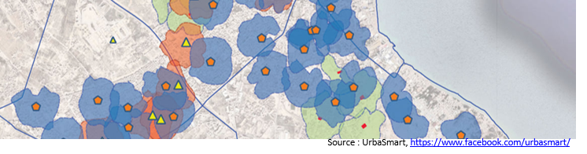
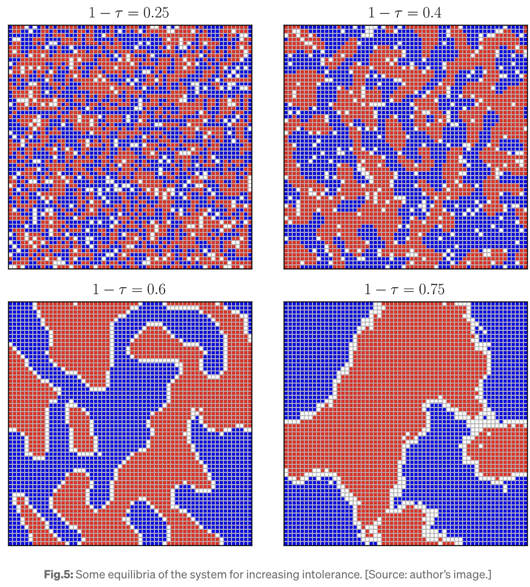

```{r}
library(ggplot2)
library(sf)
library(mapsf)

library(knitr)
library(dplyr)
library(car)
library(reshape2)
```


-----------------------------------------------------------------------

::: {.callout-note title="A propos de ce document"}
Ce support de cours a été créé pour la session 2025-26 du cours d'analyse spatiale des phénomènes sociaux destiné aux étudiants de géographie des universités Paris Cité et Paris 1 Panthéon-Sorbonne
:::


# EXO1 : MESURER LA CONCENTRATION SPATIALE

## Mise en place


On considère un monde composé de 48 positions spatiales, chacune d'entre elle étant occupée par une carte à jouer d'un jeu de 52 cartes dont on a retiré les rois. Cinq tirages différents ont été effectués au hasard.

```{r}
jeu1 <- readRDS("data1/space001.RDS")
jeu2 <- readRDS("data1/space002.RDS")
jeu3 <- readRDS("data1/space003.RDS")
jeu4 <- readRDS("data1/space004.RDS")
jeu5 <- readRDS("data1/space005.RDS")
```


On choisit l'un des cinq jeux comme monde et on le visualise: 

```{r}
# Choix du Monde
jeu <- jeu5

# Visualisation
par(mar=c(0,0,3,0), mfrow=c(1,2))

# Espace
plot(jeu$geometry, main="Espace")
text(jeu$geometry, jeu$ID)

# Société
plot(jeu$geometry, main="Société")
text(jeu$geometry, jeu$cards, col=jeu$col,cex=1.5)
```


Nous avons quatre familles d'individus correspondant à Pique, Coeur, Carreau et Trèfle. Proposez une méthode pour répondre à laquestion 

> Laquelle est la plus concentrée spatialement ? La plus dispersée ?

## Solution 1 : Point moyen,  distance-type et ellipse de dispersion

Vous avez normalement appris en licence quelques bases de **statistique spatiale**. Celle-ci propose notamment de calculer pour chaque distribution de points de coordonnées $(X_i,Y_i)$ le centre de gravité $G(X_g,Y_g)$ 


$X_g = \frac{\Sigma_{i=1}^n{X_i}}{n}$

$Y_g = \frac{\Sigma_{i=1}^n{X_i}}{n}$

On peut ensuite calculer l'écart-type de $X$ et $Y$ :

$\sigma_X = \frac{\Sigma_{i=1}^n{(X_i-X_g)^2}}{n-1}$

$\sigma_Y = \frac{\Sigma_{i=1}^n{(Y_i-Y_g)^2}}{n-1}$

Et finalement en déduire la distance-type $\sigma_{X,Y}$ de chaque point au centre de gravité par la formule :

$\sigma_{X,Y} = \sqrt{\sigma_X^2+\sigma_Y^2}$


Passons au calcul dans R. Il suffit pour cela d'utiliser la fonction moyenne (*mean*) et la fonction écart-type (*sd*) en les combinant avec la fonction *tapply()* qui permet d'effectuer le calcul par sous-tableaux en fonction de la variable décrivant la famille des cartes.

```{r}
# Identification des familles
col<-names(table(jeu$family))

# Calcul des centre de gravité
Xg<-tapply(jeu$X,INDEX=jeu$family,FUN=mean)
Yg<-tapply(jeu$Y,INDEX=jeu$family,FUN=mean)

# Calcul des écarts-types
X_ect<-tapply(jeu$X,INDEX=jeu$family,FUN=sd)
Y_ect<-tapply(jeu$Y,INDEX=jeu$family,FUN=sd)

# Calcul des distances-types
D_type <- sqrt(X_ect**2 + Y_ect**2)

# Assemblage des résultats
tabres <- cbind(Xg,Yg,X_ect, Y_ect,D_type)
tabres <- as.data.frame(tabres)

# Affichage des résultats
kable(tabres, digits=2)
```

On déduit facilement du tableau précédent la distribution la plus dispersée et la moins dispersée.


On peut ensuite visualiser le résultat à l'aide d'**ellipses de dispersions** qui permettent de repérer à la fois le centre de gravité et les zones de localisation les plus probables des points. Sans entrer dans les détails mathématiques, on peut voir ci-dessous comment les ellipses de dispersion correspondant aux intervalles de confiance 25%, 50% et 75% sont plus ou moins étendues.

```{r, fig.height=8,fig.width=6}
par(mfrow=c(2,2), mar=c(0,0,0,0))

ref <-1
fam <-row.names(tabres)[ref]
sel <- jeu[jeu$family==fam,]
plot(jeu$geometry, col="lightyellow",border="gray",lwd=0.2, cex=0.1)
dataEllipse(sel$X,sel$Y, 
            levels=c(0.25,0.5,0.75),
            lwd=c(0.5,2,0.5),
            ellipse.label = c("25%","50%","75%"),label.cex = 1,
            fill=TRUE,
            fill.alpha = 0.1,
            plot.points = F,
            add=T,
            center.pch = 4)
text(sel$X,sel$Y,fam,cex=1.5)


ref <-2
fam <-row.names(tabres)[ref]
sel <- jeu[jeu$family==fam,]
plot(jeu$geometry, col="lightyellow",border="gray",lwd=0.2, cex=0.1)
dataEllipse(sel$X,sel$Y, 
            levels=c(0.25,0.5,0.75),
            lwd=c(0.5,2,0.5),
            ellipse.label = c("25%","50%","75%"),label.cex = 1,
            fill=TRUE,
            fill.alpha = 0.1,
            plot.points = F,
            add=T,
            center.pch = 4)
text(sel$X,sel$Y,fam,cex=1.5)

ref <-3
fam <-row.names(tabres)[ref]
sel <- jeu[jeu$family==fam,]
plot(jeu$geometry, col="lightyellow",border="gray",lwd=0.2, cex=0.1)
dataEllipse(sel$X,sel$Y, 
            levels=c(0.25,0.5,0.75),
            lwd=c(0.5,2,0.5),
            ellipse.label = c("25%","50%","75%"),label.cex = 1,
            fill=TRUE,
            fill.alpha = 0.1,
            plot.points = F,
            add=T,
            center.pch = 4)
text(sel$X,sel$Y,fam,col="red", cex=1.5)

ref <-4
fam <-row.names(tabres)[ref]
sel <- jeu[jeu$family==fam,]
plot(jeu$geometry, col="lightyellow",border="gray",lwd=0.2, cex=0.1)
dataEllipse(sel$X,sel$Y, 
            levels=c(0.25,0.5,0.75),
            lwd=c(0.5,2,0.5),
            ellipse.label = c("25%","50%","75%"),label.cex = 1,
            fill=TRUE,
            fill.alpha = 0.1,
            plot.points = F,
            add=T,
            center.pch = 4)
text(sel$X,sel$Y,fam, col="red",cex=1.5)

```

- **Discussion** : La solution précédente est relativement complexe puisqu'elle fait appel à des notions statistiques pas forcément connues. Mais surtout elle comporte des hypothèses implicites concernant la distribution spatiale et l'éloignement des points. Elle se place en effet dans un **espace euclidien continu** et suppose que les distributions de X et de Y sont de nature **gaussienne**.  Or rien n'indique que ces deux hypothèses soient valides !


## Solution 2 : Distances et métriques

Supposons maintenant que l'on ne puisse pas se déplacer dans n'importe quelle direction mais seulement horizontalement et verticalement en passant d'un carreau au carreau voisin. On se trouve alors dans un espace ayant une géométrie particulière telle que la distance entre deux points est une **distance rectilinéaire** aussi appelée **distance de Manhattan** ou **distance city-block** : 

$D_{ij} = |X_i-X_j| + |Y_i-Y_j|$


Examinons la distribution des individus de la famille "Pique" :

```{r}
# Identification des familles
col<-names(table(jeu$family))

# Extraction
sel <- jeu[jeu$family==col[1],c("cards","X","Y")]

# Visualisation
par(mar=c(0,0,3,0),mfrow=c(1,1))
plot(jeu$geometry)
text(sel$geometry,sel$cards)

```

On construit un repère orthonormé où le point situé en bas à gauche correspond à l'origine $(0,0)$ et où chaque carreau a un côté de longueur 1. On en déduit les coordonnées de chacune des cartes de la famille en supposant qu'elles sont placées au centre de leur carreau :

```{r}
tab<-st_drop_geometry(sel)
kable(tab)
```

On en déduit la matrice de distance suivante :

```{r}
coo<-cbind(sel$X,sel$Y)
matdis<-dist(coo,method = "manhattan",upper = T)
matdis<-as.matrix(matdis)
row.names(matdis)<-sel$cards
colnames(matdis) <-sel$cards
diag(matdis)<-NA
matdis
```

Il est alors facile de calculer les paramètres de la **distribution des distances entre deux individus** différents de la famille pique. Il suffit de retirer du calcul la diagonale et de procéder à un résumé statistique des $12x11 = 132$ distances entre les paires d'individus composant cette famille.

```{r}
summary(as.vector(matdis))
```


On peut également déterminer combien de paires d'individus sont **voisins** (situées dans des cases voisines).

```{r}
table(matdis==1)
```

Et plus généralement on peut calculer la forme de la distribution des distances entre paires d'individus afin de déterminer la **distance modale** qui est le cas le plus fréquent.

```{r}
plot(as.factor(matdis), main = "Distribution des distances",
     xlab="Nombre de paires", ylab = "Distance de Manhattan", col="lightyellow")
```

- **Discussion** : Nous avons désormais une famille de solutions plus simples et plus concrètes pour mesurer la concentration. Mais quelle solution retenir pour comparer entre elles les familles : distance moyenne, distance médiane, distance modale, distance minimale, distance maximale ... Comme le montre bien la figure précédente, la distribution des distances entre les paires d'individus peut faire l'objet de résumés très différents et il n'existe pas de solution unique. On peut en effet imaginer le cas de **distributions concentrées localement et dispersées globalement**.

Considérez l'exemple suivant.

```{r}
X <- c(0.5,0.5,0.5,0.5,1.5,1.5,1.5,1.5,4.5,4.5,4.5,4.5,5.5,5.5,5.5,5.5)
Y <- c(0.5,1.5,6.5,7.5,0.5,1.5,6.5,7.5,0.5,1.5,6.5,7.5,0.5,1.5,6.5,7.5)
ID<-sel$cards

# Visualisation
par(mar=c(0,0,3,0),mfrow=c(1,1))
plot(jeu$geometry)
text(X,Y,ID)
```

```{r}
matdis2<-dist(cbind(X,Y),method = "manhattan", upper=T)
diag(matdis2)<-NA
summary(matdis2)
```

```{r}
plot(as.factor(matdis2), main = "Distribution des distances",
     xlab="Nombre de paires", ylab = "Distance de Manhattan", col="lightyellow")
```

- **Commentaire :** cette distribution est *globalement plus dispersée* que la précédente puisque la distance moyenne entre deux individus est de 5.86 contre 4.32. Mais elle est *localement plus concentrée* puisque chaque individu a systématiquement deux voisins


## Solution 3 : Graphe et composantes connexes

Une troisième solution (qui devrait rappeler les règles du jeu de go à ceux qui le connaissent) consiste à déterminer le degré de fragmentation de chaque famille en **composantes connexes**.  On considère désormais que deux individus d'une même famille sont reliés s'il existe un chemin les reliant qui ne passe que par des membres de la même famille. On va donc définir un **graphe de voisinage** entre les cellules et considérer que la relation est possible si des membres de la même famille se trouvent de part et d'autre.


Ceci revient à déterminer toutes les paires contigües $(C_{ij}=1)$ puis à vérifier si elles relie des individus similaires $(S_{ij}=1)$ pour déterminer si la relation entre eux est possible $(R_{ij}=1)$. On trouve 44 paires orientées soit 22 paires symétriques vérifiant les conditions.


```{r}
mat1 <-dist(cbind(jeu$X,jeu$Y), method="manhattan",upper = T)
mat1<-as.matrix(mat1)
mat1[mat1!=1]<-0
row.names(mat1)<-jeu$cards
colnames(mat1)<-jeu$cards
library(reshape2)
col1<-melt(mat1)
names(col1)<-c("i","j","Cij")
col1$i<-as.character(col1$i)
col1$j<-as.character(col1$j)
col1$ii<-substr(col1$i,nchar(col1$i),nchar(col1$i))
col1$jj<-substr(col1$j,nchar(col1$j),nchar(col1$j))
col1$Sij<-as.numeric(col1$ii==col1$jj)
col1$Rij<-col1$Sij*col1$Cij
col1<-col1 %>% filter(Rij ==1) %>% arrange(ii,jj,i,j) 
kable(col1)
```

On peut alors déterminer la famille qui dispose du plus grand nombre de relations de voisinage avec des membres de sa famille :

```{r}

table(col1$ii)
```

On peut visualiser ce résultat sous la forme d'un graphe :

```{r}
coo<-st_drop_geometry(jeu) %>% select(i=cards, Xi=X,Yi=Y)
col1$i<-as.character(col1$i)
col1<-col1 %>% left_join(coo)

coo<-st_drop_geometry(jeu) %>% select(j=cards, Xj=X,Yj=Y)
col1$j<-as.character(col1$j)
col1<-col1 %>% left_join(coo)

par(mar=c(0,0,2,0),mfrow=c(1,1))
plot(jeu$geometry, col="lightyellow",border="gray",lwd=0.3)
segments(x0 = col1$Xi,y0=col1$Yi, x1=col1$Xj,col1$Yj, col="lightblue",lwd=5)
text(jeu$geometry,jeu$cards,col=jeu$col,cex=1)


```


---

# EXO2 : DYNAMIQUES DE SEGREGATION ET D'OPINION


## Mise en place

Une quarantaine d'étudiants entrent dans une salle de cours comportant 6 rangées de 8 chaises. Sans dire un mot, les enseignants leurs remettent silencieusement une carte à jouer tiré d'un jeu de 52 cartes d'où les rois ont été retirés et leurs demandent de s'installer. Les enseignants procèdent à l'appel en suivant l'ordre des rangées et chaque étudiant indique la carte à jour qui lui a été attribuée, tandis que l'enseignant lui indique sa position spatiale :

- **Etudiant** : Je suis Albert Dupont et ma carte est le 8 de Pique.
- **Enseignant** : Vous occupez la place C07.


Après avoir saisi la position de tous les étudiants, les enseigants effectuent quelques manipulations sur leur ordinateur et affichent la carte suivante à l'écran. On notera qu'il existe un certain nombre de places vides qui vont jouer un rôle important dans les modèles de sérégation et de diffusion d'opinion. 

```{r}
library(sf)
library(mapsf)
# Chargement de la carte
map <-readRDS("data1/space005.RDS")

# Nombre de présent
n<-40

# Tirage au sort des positions
set.seed(666)
present<-runif(48)
z<-quantile(present,n/48)
map$occup<-as.factor(present<z)
levels(map$occup) <- c("vide","occupé")

par(mfrow=c(1,2))
# Coordonnées
# Attribut des individus
mf_map(map, type="base", col="white")
mf_label(map, var="ID", cex=1)
mf_layout(title = "Position spatiale", 
          scale = F,
          arrow = F, 
          credits="", 
          frame=T)

map2<-map[map$occup == "occupé",]
# Attribut des individus
mf_map(map, type="typo", var= "occup",pal=c("lightgray", "lightyellow"),leg_pos = NA)
mf_label(map2, var="cards", col=map2$col, cex=1.2)
mf_layout(title = "Position sociale", 
          scale = F,
          arrow = F, 
          credits="", 
          frame=T)
```


## Le modèle d'Axelrod

### Détermination des voisins

On détermine pour chaque cellule occupée par un individu la liste de ses voisins en notant leur couleur :

```{r}

mat<-dist(cbind(map2$X,map2$Y),method="manhattan",upper=T)
mat<-as.matrix(mat)
colnames(mat)<-map2$ID
row.names(mat)<-map2$ID
#mat[mat>1]<-0
tab<-melt(mat)
names(tab)<-c("i","j","Rij")
tab <- tab %>% filter(Rij<2)

coli<-data.frame(i=map2$ID,coli=map2$col)
colj<-data.frame(j=map2$ID,colj=map2$col)
tab <- tab %>% left_join(coli) %>% left_join(colj) %>% arrange(i,j)
head(tab,10)
```


- **Exemple** L'individu qui occupe la case C00 est noir et il possède un unique voisin rouge en C10. L'individu qui occupe la case C02 est rouge et il possède un voisin rouge et un voisin noir. L'individu qui occupe la case C03 est rouge avec deux voisins rouges et un voisin noir...

### Règle de changement

On adopte la règle du modèle d'Axelrod (qui est plus complexe que celui-ci) en supposant que chaque individu réalise au cours de chaque round une interaction tirée au hasard entre la sienne et celle de ses voisins et adopte cette opinion. Par exemple :

- l'individu situé en C00 est rouge avec un voisin noir. Il a donc 50% de chances de garder son opinion initiale (noir) et 50% celle de choisir l'opinion de son voisin (rouge).
- l'individu situé en C02 est rouge avec un voisin rouge et un voisin noir. Il a donc 67% de chances de rester rouge et 33% de devenir noir.
- l'individu situé en C03 est rouge avec deux voisins rouges et un voisin noir. Il a donc 75% de chances de rester rouge et 25% de devenir noir.

On voit donc que dans ce modèle, les individus ont une opinion qui varie en fonction de leur opinion initiale et de celle de leur voisin. Ils ont d'autant plus de chances de garder leur opinion qu'ils sont entourés d'individus ayant la même opinion. Et inversement d'autant moins de chance qu'ils sont entourés d'individus ayant des opinions différentes. 

### Simulation de la dynamique

> l'exercice est à faire en classe avec les étudiants. Mais on peut donner ici un exemple de résultat.


```{r, fig.height=9, fig.width=6}
# Archivage
step <- map2 %>% select(ID, cards, t0=col)

set.seed(42)
### STEP1 ###
# mutation
t <- tab %>% group_by(i) %>% summarise(col=sample(colj,1)) 
t1<-t
names(t1)<-c("ID","t1")
step <-left_join(step,t1)

# Recomposition de la table de voisinage
tab<-tab %>% select(i,j) 
names(t)<-c("i","coli")
tab<-left_join(tab,t)
names(t)<-c("j","colj")
tab<-left_join(tab,t)

### STEP2 ###
# mutation
t <- tab %>% group_by(i) %>% summarise(col=sample(colj,1)) 
t2<-t
names(t2)<-c("ID","t2")
step <-left_join(step,t2)

# Recomposition de la table de voisinage
tab<-tab %>% select(i,j) 
names(t)<-c("i","coli")
tab<-left_join(tab,t)
names(t)<-c("j","colj")
tab<-left_join(tab,t)

### STEP3 ###
# mutation
t <- tab %>% group_by(i) %>% summarise(col=sample(colj,1)) 
t3<-t
names(t3)<-c("ID","t3")
step <-left_join(step,t3)

# Recomposition de la table de voisinage
tab<-tab %>% select(i,j) 
names(t)<-c("i","coli")
tab<-left_join(tab,t)
names(t)<-c("j","colj")
tab<-left_join(tab,t)


### STEP4 ###
# mutation
t <- tab %>% group_by(i) %>% summarise(col=sample(colj,1)) 
t4<-t
names(t4)<-c("ID","t4")
step <-left_join(step,t4)

# Recomposition de la table de voisinage
tab<-tab %>% select(i,j) 
names(t)<-c("i","coli")
tab<-left_join(tab,t)
names(t)<-c("j","colj")
tab<-left_join(tab,t)


### STEP5 ###
# mutation
t <- tab %>% group_by(i) %>% summarise(col=sample(colj,1)) 
t5<-t
names(t5)<-c("ID","t5")
step <-left_join(step,t5)

# Recomposition de la table de voisinage
tab<-tab %>% select(i,j) 
names(t)<-c("i","coli")
tab<-left_join(tab,t)
names(t)<-c("j","colj")
tab<-left_join(tab,t)


### STEP6 ###
# mutation
t <- tab %>% group_by(i) %>% summarise(col=sample(colj,1)) 
t6<-t
names(t6)<-c("ID","t6")
step <-left_join(step,t6)

# Recomposition de la table de voisinage
tab<-tab %>% select(i,j) 
names(t)<-c("i","coli")
tab<-left_join(tab,t)
names(t)<-c("j","colj")
tab<-left_join(tab,t)


### STEP7 ###
# mutation
t <- tab %>% group_by(i) %>% summarise(col=sample(colj,1)) 
t7<-t
names(t7)<-c("ID","t7")
step <-left_join(step,t7)

# Recomposition de la table de voisinage
tab<-tab %>% select(i,j) 
names(t)<-c("i","coli")
tab<-left_join(tab,t)
names(t)<-c("j","colj")
tab<-left_join(tab,t)


### STEP8 ###
# mutation
t <- tab %>% group_by(i) %>% summarise(col=sample(colj,1)) 
t8<-t
names(t8)<-c("ID","t8")
step <-left_join(step,t8)

# Recomposition de la table de voisinage
tab<-tab %>% select(i,j) 
names(t)<-c("i","coli")
tab<-left_join(tab,t)
names(t)<-c("j","colj")
tab<-left_join(tab,t)


### STEP9 ###
# mutation
t <- tab %>% group_by(i) %>% summarise(col=sample(colj,1)) 
t9<-t
names(t9)<-c("ID","t9")
step <-left_join(step,t9)

# Recomposition de la table de voisinage
tab<-tab %>% select(i,j) 
names(t)<-c("i","coli")
tab<-left_join(tab,t)
names(t)<-c("j","colj")
tab<-left_join(tab,t)


### STEP10 ###
# mutation
t <- tab %>% group_by(i) %>% summarise(col=sample(colj,1)) 
t10<-t
names(t10)<-c("ID","t10")
step <-left_join(step,t10)

# Recomposition de la table de voisinage
tab<-tab %>% select(i,j) 
names(t)<-c("i","coli")
tab<-left_join(tab,t)
names(t)<-c("j","colj")
tab<-left_join(tab,t)


### STEP11 ###
# mutation
t <- tab %>% group_by(i) %>% summarise(col=sample(colj,1)) 
t11<-t
names(t11)<-c("ID","t11")
step <-left_join(step,t11)

# Recomposition de la table de voisinage
tab<-tab %>% select(i,j) 
names(t)<-c("i","coli")
tab<-left_join(tab,t)
names(t)<-c("j","colj")
tab<-left_join(tab,t)


### Visualisation

par(mfrow=c(3,4),mar=c(0,0,2,0))
plot(map$geometry,col="lightgray",main="t0")
plot(step$geometry,col=step$t0, add=T)
text(step$geometry,step$cards,col="white")

plot(map$geometry,col="lightgray",main="t1")
plot(step$geometry,col=step$t1, add=T)
text(step$geometry,step$cards,col="white")


plot(map$geometry,col="lightgray",main="t2")
plot(step$geometry,col=step$t2, add=T)
text(step$geometry,step$cards,col="white")

plot(map$geometry,col="lightgray",main="t3")
plot(step$geometry,col=step$t3, add=T)
text(step$geometry,step$cards,col="white")


plot(map$geometry,col="lightgray",main="t4")
plot(step$geometry,col=step$t4, add=T)
text(step$geometry,step$cards,col="white")

plot(map$geometry,col="lightgray",main="t5")
plot(step$geometry,col=step$t5, add=T)
text(step$geometry,step$cards,col="white")


plot(map$geometry,col="lightgray",main="t6")
plot(step$geometry,col=step$t6, add=T)
text(step$geometry,step$cards,col="white")


plot(map$geometry,col="lightgray",main="t7")
plot(step$geometry,col=step$t7, add=T)
text(step$geometry,step$cards,col="white")

plot(map$geometry,col="lightgray",main="t8")
plot(step$geometry,col=step$t8, add=T)
text(step$geometry,step$cards,col="white")


plot(map$geometry,col="lightgray",main="t9")
plot(step$geometry,col=step$t9, add=T)
text(step$geometry,step$cards,col="white")


plot(map$geometry,col="lightgray",main="t10")
plot(step$geometry,col=step$t10, add=T)
text(step$geometry,step$cards,col="white")


plot(map$geometry,col="lightgray",main="t11")
plot(step$geometry,col=step$t11, add=T)
text(step$geometry,step$cards,col="white")

```

- **Commentaire** : Par rapport à la situation initiale, on évolue rapidement vers une situation de ségrégation entre une région rouge et une région noire. Seule la zone frontière entre les deux régions continue à évoluer un peu et sert d'interface limitée où les deux formes d'opinion sont échangées. Certaines "îles" survivent un certain temps mais elles sont tôt ou tard absorbées et éliminées. 

## Le modèle de Schelling

Le modèle de Schelling est assez voisin de celui d'Axelrod dans ses résultats mais il repose sur des hypothèses différentes. En effet, dans le modèle d'Axelrod les individus sont immobiles et ce sont les opinions qui circulent de proche en proche. Au contraire, dans le modèle de Schelling les individus sont mobiles et se déplacent lorsqu'ils ne sont pas satisfait des attributs de leurs voisins. Ils vont alors occuper des places vacantes où ils trouveront un voisinage approprié.

Le modèle de Schelling est donc beaucoup plus proche des processus de ségrégation observée dans les espaces urbains et aboutissant à la formation de ghettos et de zones socialement homogènes.

### Règles du modèle de Schelling

En simplifiant à nouveau un peu, on peut résumer ainsi les règles du modèle de Thomas Schelling : 

1. Chaque individu est localisé dans une cellule
2. Certaines cellules sont vides
3. Les individus examinent les caractéristiques des individus localisés dans les cellules voisines.
4. Si la proportion de voisins différents est supérieur à un seuil \alpha, l'individu se déplace vers une cellule vide où le seuil est respecté. 


Supposons que le seuil \alpha soit égal à 0.70 c'est à dire qu'un individu accepte que 70% de ses voisins soient différents de lui. Combien y-a-t-il d'individus mécontents de la vosinage dans la configuration suivante  en supposant que l'on considère comme voisin uniquement ceux qui ont une frontière commune : 

```{r}
par(mfrow=c(1,1))
plot(map$geometry,col="lightgray",main="t0")
plot(step$geometry,col=step$t0, add=T)
text(step$geometry,step$cards,col="white")
```

Chaque étudiant évalue sa satisfaction par rapport à son voisinage et décide en fonction de cela de bouger ou non. Voici quelques exemples de calcul de la satisfaction et de la décision de bouger ou non. 

- Le 7 de coeur est rouge et possède un voisin rouge donc 0% de ses voisins sont différents : il ne bouge pas
- le 4 de couer possède deux voisins rouges et un voisins noir donc 33% de ses voisins sont différents : il ne bouge pas.
- Le 4 de pique possède un voisin rouge et un voisin noir donc 50% de ses voisins sont différents : il ne bouge pas.
- la dame de carreau possède trois voisins noir et un voisin rouge donc 75% de ses voisins sont différent : elle va bouger
- le 2 de pique possède trois voisins rouge et aucun voisin noir donc 100% de ses voisins sont différents : il va bouger


Le problème est que chaque déplacement d'un individu modifie la table de vosinage et remet en cause les calculs. On ne peut donc pas effectuer des changements simultanés comme dans le cas du modèle d'Axelrod. Il faut ici utiliser un modèle asynchrone où les individus insatisfaits se déplacent un par un et où chaque individu recalcule sa situation avant de se déplacer à son tour.


Supposons par exemple que la dame de carreau effectue un déplacement de C43 en C20 pour rejoindre la case située entre la dame de coeur et le neuf de carreau :

```{r}
step2 <- step
step2$geometry[step2$ID=="C43"]<-map$geometry[map$ID=="C20"]
step2$ID[step2$ID=="C43"]<-"C20"


par(mfrow=c(1,1))
plot(map$geometry,col="lightgray",main="t1")
plot(step2$geometry,col=step2$t0, add=T)
text(step2$geometry,step2$cards,col="white")
arrows(x0 = 4.5, y0=3.5,x1=2.5,y1=0.5,col="yellow",lwd=3)

```

Quelles sont les conséquences pour les individus situés :

- **au point de départ** 
  + Le 3 de carreau qui était satisfait (33% de voisins similaire) a désormais uniquement des voisins noir et va décider de partir
  + le 6 de pique qui était mécontent (100% de voisins différents) ne l'est plus et décide de rester
  
- **au point d'arrivée**
  + La dame de coeur qui était mécontente (100% de voisins différents) décide de rester
  + la dame de pique décide de partir ...
  + etc...
  
Cet exemple simple montre comment les dynamiques de ségrégation sont des systèmes complexes qui engendrent des processus cumulatifs.


### Outils de simulation

De nombreux programmes de simulation existent en ligne pour simuler l'évolution des modèles de Schelling. Voir par exemple [ce site](http://nifty.stanford.edu/2014/mccown-schelling-model-segregation/)

L'un des résultats principaux de ces modèles de simulation est de montrer qu'il n'est pas besoin d'introduire une forte volonté de ségrégation pour aboutir à des configurations très ségrégées. On s'en rend compte en jouant sur le paramètre \alpha. 




# EXO3 : ACCESSIBILITE, POTENTIEL, INTERACTION


## Préparation des données

On suppose que les dames et les valets correspondent à des commerces ou services pouvant desservir au départ 30 individus pour les dames et 15  pour les valets. Les autres cartes correspondent à un nombre de personnes intéressées par ces commerces ou services. On pourra vérifier que pour chaque famille de carte il y a 45 demandes (1+2+3+...+10) et 45 offres (15 + 30) de sorte que le marché est a priori équilibré. La question qui se pose est de savoir comment va s'opérer l'ajustement de l'offre et de la demande dans l'espace, sachant que les clients cherchent à minimiser la distance qui représente pour eux un coût. On considère deux situations différentes de distribution des clients et des commerçants en utilisant les cartes de la famille "♥"  et celle de la famille "♠". 

```{r, fig.width=8, fig.height=8}
trade <-map %>% filter(family=="♥")
trade$taille <- as.numeric(trade$level)
trade$taille[trade$level=="A"]<-1
trade$taille[trade$level=="D"]<-30
trade$taille[trade$level=="V"]<-15
trade$fonction = "demande"
trade$fonction[trade$level=="V"]<-"offre"
trade$fonction[trade$level=="D"]<-"offre"
trade1<-trade

trade <-map %>% filter(family=="♠")
trade$taille <- as.numeric(trade$level)
trade$taille[trade$level=="A"]<-1
trade$taille[trade$level=="D"]<-30
trade$taille[trade$level=="V"]<-15
trade$fonction = "demande"
trade$fonction[trade$level=="V"]<-"offre"
trade$fonction[trade$level=="D"]<-"offre"
trade2<-trade

par(mfrow=c(1,2))
mf_map(map, type="base",col="lightyellow")
mf_map(trade1,type="prop_typo",var=c("taille","fonction"),add=T, leg_pos = c("bottomright" ,"bottomleft"))
mf_label(trade1, var="taille",cex = 1)
mf_layout(title = "Offre et demande pour ♥ ", scale=F, credits = "", arrow=F, frame=T)

mf_map(map, type="base",col="lightyellow")
mf_map(trade2,type="prop_typo",var=c("taille","fonction"),add=T, leg_pos = c("bottomright" ,"bottomleft"))
mf_label(trade2, var="taille",cex = 1)
mf_layout(title = "Offre et demande pour ♠ ", scale=F, credits = "", arrow=F, frame=T)

```


- **Problème 1** : Essayez de répartir au mieux les déplacements des individus vers le service le plus proche tout en respectant les capacités maximales d'accueil des commerces ou des services. Quelle distribution spatiale vous semble la plus intéressante entre "♥"  et  "♠" ? Justifiez votre réponse. 

- **Problème 2** : En supposant qu'il s'agit de **services publics** (e.g. écoles) non soumis aux lois de la concurrence, quelles  améliorations pourriez vous proposer dans chacune des deux situations ? Quel en serait le coût ?

- **Problème 3** : En supposant qu'il s'agit de **commerces ou services privés** (e.g. pharmacies) soumises aux lois de la concurrence, quelles décisions pourraient prendre les acteurs pour augmenter leur part de marché ? Dans quelle mesure ces décisions seraient-elles également profitables aux clients ?


