```{r}
library(sf)
library(mapsf)

library(ggplot2)
library(LexisPlotR)
```


-----------------------------------------------------------------------

::: {.callout-note title="A propos de ce document"}
Ce support du cours "Analyse spatiale, formes et processus" a été créé pour la session 2025-26 du cours d'analyse spatiale des phénomènes sociaux destiné aux étudiant·es de géographie des universités Paris Cité et Paris 1 Panthéon-Sorbonne. 

:::


# QU'EST-CE QUE L'ANALYSE SPATIALE ?


## Des définitions fluctuantes


Le terme ***[analyse spatiale]{.mark}*** (en anglais *spatial analysis*) demeure largement employé par les spécialistes de géographie quantitative ou de géomatique. Mais son contenu est loin d'être clair. Il varie en effet dans le temps ou dans l'espace et constitue à cet égard un objet très intéressant d'épistémologie et d'histoire des sciences. En nous limitant aux auteurs francophones, examinons quelques définitions dans des dictionnaires de géographie et des encyclopédies publiées sur le web à différentes dates. Celles-ci étant souvent très longues, nous nous limitons au premier paragraphe (ou à l'introduction) censé fournir l'aspect le plus important du concept : 

::: {.callout-important title="Définition de l'analyse spatiale"}

- **Analyse :** "Le terme est employé en géographie quantitative pour désigner les opérations de programmation et de calcul permettant de traiter à l'ordinateur les données statistiques : analyse factorielle multivariée, mesure des fréquences de corrélation (sic)." (**George P., 1970**, *Dictionnaire de la géographie*, PUF, Paris)

- **Analyse de données spatiales :** "Ces pages constituent un manuel de *méthodes*. Elles présentent des outils utiles à l'*analyse des données spatiales*. Il ne s'agit pas d'un texte de géographie fondamentale. [...] Les méthodes quantitatives d'analyse invitent à la rigueur, à la précision, à la cohérence. Mais *l'outil n'est pas neutre*. Il influence la manière de penser l'analyse géographique, de formuler et vérifier une hypothèse, de construire l'indispensable théorie géographique sans laquelle il n'y a pas de science. Ainsi conduit-il à se dégager du contingent et de l'unique pour mettre en évidence le général, le modèle, la "loi". Il tend à envisager l'unique comme une réalisation aléatoire d'un processus plus général fait de la combinaison de déterminisme précis. Il invite à cherche le fondamental sous le contingent." (**Beguin H., 1979**, *Méthodes d'analyse géographique quantitative*, Litec, Paris. )

- **Analyse spatiale :** "Ensemble de méthodes mathématiques et statistiques visant à préciser la nature, la qualité et la quantité attachées aux lieux et aux relations qu'ils entretiennent - l'ensemble constituant l'espace -, en étudiants simultanément attributs et localisations. [...] Il arrive que l'expression soit affadie comme équivalent à l'analyse de tous les phénomènes dans l'espace, et qu'à la limite la géographie soit assimilée à l'analyse spatiale. C'est évidemment une erreur à éviter, l'analyse spatiale étant un ensemble de méthodes très exigeant,mais qui ne représente qu'une partie de la géographie et même de l'analyse géographique. [...]" (**Brunet et al., 1992**, *Les mots de la géographie : dictionnaire critique*, Reclus-Documentation française)

- **Analyse spatiale : ** "L'analyse spatiale est une étude formalisée de la configuration et des propriétés de l'espace des sociétés. Elle s'emploie à définir les composantes des disparités de la mise en espace de la surface de la Terre dans les relations horizontales entre lieux. Ces relations résultent de la manière dont, compte tenu de leurs caractéristiques anthropologiques, des formes de leur organisation sociale et de l'état des techniques, ces sociétés produisent de l'espace géographique. [...]" (**Saint-Julien T., 2003 ** in Levy J. & Lussault M., *Dictionnaire de la géographie et de l'espace des sociétés*, Belin, Paris. )


- **Analyse spatiale :** "L’analyse spatiale met en évidence des structures et des formes d’organisation spatiale récurrentes, que résument par exemple les modèles centre-périphérie, les champs d’interaction de type gravitaire, les trames urbaines hiérarchisées, les divers types de réseaux ou de territoires, etc. Elle analyse des processus qui sont à l’origine de ces structures, à travers des concepts comme ceux de distance, d’interaction spatiale, de portée spatiale, de polarisation, de centralité, de stratégie ou choix spatial, de territorialité… Des lois de la spatialité relient ces formes et ces processus, et sont intégrées dans des théories et des modèles du fonctionnement et de l’évolution des systèmes spatiaux.[...]" (**Pumain D., 2004**, in [Hypergeo](https://hypergeo.eu/analyse-spatiale){target=_blank})


- **Analyse spatiale** : "Les objets et phénomènes géographiques sont caractérisés par une certaine structure (ou organisation) spatiale [... :] gradient, discontinuité, régularité, structure en îlot ou structure aléatoire. La géométrie de ces structures spatiales dépend de plusieurs paramètres : - de la forme et de la nature des observations [...] ; - des processus les ayant générées [...] ; - de l’échelle d’analyse [...]. L’analyse spatiale consiste à décrire, mesurer et expliquer ces structures. [...]" (**Feuillet T. et al., 2019**, *Manuel de géographie quantitative*, Cursus, Armand Colin)


- **Analyse spatiale** : "En géographie, l’analyse spatiale est une démarche visant à systématiser les raisonnements géographiques en mobilisant des outils de formalisation, c’est-à-dire des modèles. Sur le plan théorique, il s’agit d’identifier les grandes configurations spatiales, en construisant les outils formels d’analyse de l’organisation de l’espace. Sur le plan pratique, l’analyse spatiale recourt notamment aux statistiques, aux mathématiques et à l’informatique. À ce titre elle relève, en tout cas à l’origine, d’une approche quantitative de la géographie. [...]" ([**Géoconfluences, 2024**, *Glossaire*](https://geoconfluences.ens-lyon.fr/glossaire/analyse-spatiale){target=_blank})
:::

En gros, on comprend qu'il s'agit d'espace, de société, de temps, de méthodes quantitatives, d'approches modélisatrice, de formes, d'interactions, ... Bref, rien de très clair ni d'ailleurs de très consensuel d'un auteur, d'une autrice à l'autre.  


## Forme et processus 

On y voit cependant plus clair si on tente de distinguer dans l'analyse spatiale ce qui relève de l'analyse des **[formes]{.mark}** et de celle des **[processus]{.mark}**. C'est à partir de cette distinction que T. Saint-Julien et D. Pumain ont organisé leur manuel sur l'analyse spatiale en deux volumes.


:::: {.columns}

::: {.column width="50%" .r-fit-text}
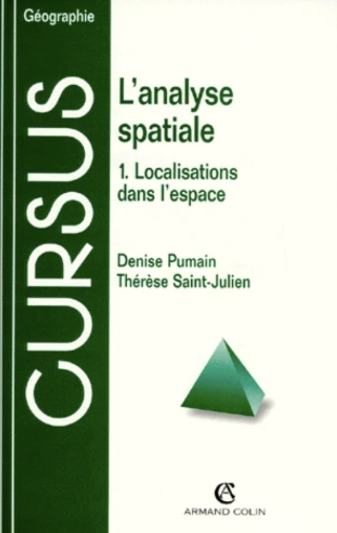{width=300}
:::


::: {.column width="50%" .r-fit-text}
{width=300}
:::

::::


C'est aussi cette approche qu'adoptent J.J. Bavoux et L. Chapelon dans leur dictionnaire d'analyse spatiale. Celui-ci est organisé en trois parties qui reprennent la distinction proposée par D. Pumain et T. Saint-Julien mais en y ajoutant un bloc conceptuel commun aux approches statiques et dynamiques. Leur définition de l'analyse spatiale est l'une des plus courtes et sans doute des plus efficaces. 


:::: {.columns layout="[ 0.4, 0.55 ]"}

::: {.column .r-fit-text}
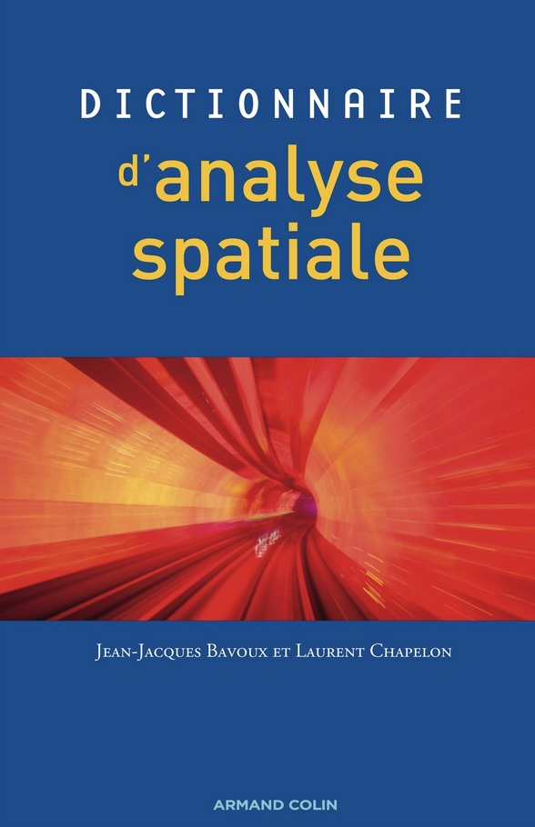{width=300}
:::


::: {.column .r-fit-text}

"**Analyse spatiale : Approches des localisations et interactions spatiales en tant que composante active des fonctionnements sociétaux**. Analyser quelque chose consiste à le décomposer pour rendre ses éléments intelligibles. [... *mais aussi * ...] examen minutieux et critique, diagnostic, expertise, application intellectuelle méthodique visant à expliquer et comprendre." (**Bavoux J.J., Chapelon L., 2015**, *Dictionnaire d'analyse spatiale*)
:::

::::

## L'exemple de la plage

En introduction d'un manuel d'introduction à la géographie paru en 1975, le géographe anglais P. Haggett qui est considéré comme un des fondateurs de l'analyse spatiale et de la nouvelle géographie prend l'exemple d'une plage pour expliquer les concepts fondamentaux de la géographie. Pour Haggett, la distinction entre géographie et analyse spatiale est loin d'être claire, point sur lequel il faudra revenir. 

:::: {.columns}

::: {.column width="50%" .r-fit-text}
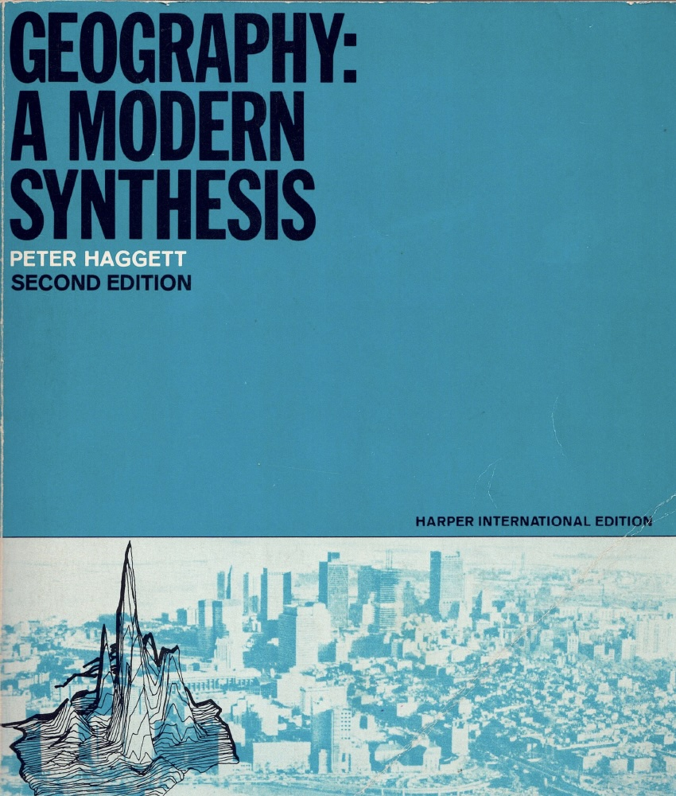{width=300}
:::


::: {.column width="50%" .r-fit-text}
{width=300}

:::

::::

Pour P. Haggett, la plage constitue un **microcosme** - on dirait aussi un **modèle** - pour l'analyse des phénomènes géographiques car il combine précisément des phénomènes physiques et humains, des formes et des processus et, serait-on tenté d'ajouter, des dimensions matérielles et idéelles. Nous reprenons ici quelques extraits de ce merveilleux chapitre introductif que tout géographe devrait avoir lu :

### Plage I : Observation

:::: {.columns}

::: {.column width="50%"}

{width=400}

:::

::: {.column width="5%" }

:::

::: {.column width="45%" .r-fit-text}

*"Ces photos n'ont pas été prises depuis le sol, mais depuis un hélicoptère, ce qui donne des images semblables à des cartes de la scène en dessous. Une photographie prise depuis un hélicoptère permet d'évaluer beaucoup plus précisément l'emplacement des personnes sur une plage qu'une photographie prise au sol. L'intérêt pour les emplacements dans l'espace est une caractéristique de la curiosité des géographes ; préciser l'emplacement avec exactitude est l'une des règles fondamentales du jeu géographique. Une description inexacte de l'emplacement fait grimacer un géographe, tout comme un linguiste grimacerait devant une prononciation erronée ou un historien devant une date inexacte."*

:::

::::


### Plage II : Régionalisation

:::: {.columns}

::: {.column width="50%" .r-fit-text}

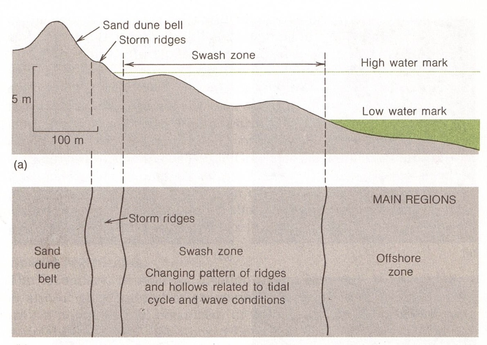{width=400}
:::

::: {.column width="5%" }

:::


::: {.column width="45%" .r-fit-text}
"***Région*** :  *une région est une portion de la surface terrestre qui présente des caractéristiques, naturelles ou artificielles, qui la distinguent des zones qui l'entourent. La figure montre une coupe transversale d'une plage typique divisée en zones de cette manière. Les géographes utilisent ce processus de dissection pour établir des ensembles de régions. Les régions sont un moyen rapide de décrire efficacement le caractère variable d'une zone.*"
:::

::::

### Plage III : Localisation

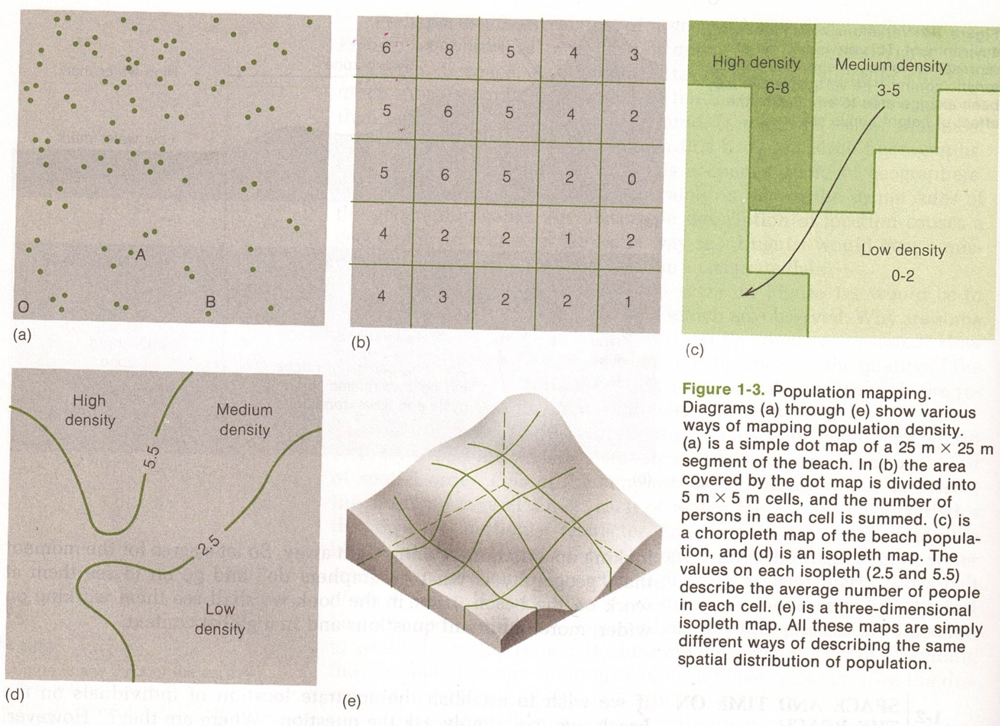{width=700}

*"La figure montre différentes façons de cartographier une population. Nous commençons par attribuer à chaque individu présent sur la plage un emplacement correspondant sur la carte, en représentant chaque personne par un point unique. Nous plaçons ensuite une grille sur les points. En comptant le nombre de points qui se trouvent dans chaque case carrée de la grille, nous pouvons traduire la distribution des points, ou des personnes, en un tableau de chiffres qui reflète la densité de la population."*


### Plage IV : Modélisation

:::: {.columns}

::: {.column width="40%" .r-fit-text}
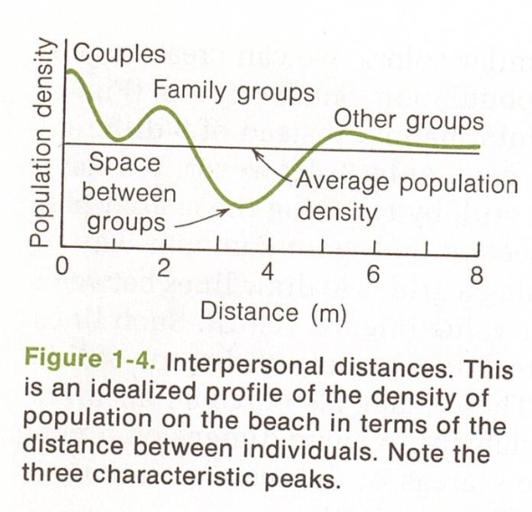{width=400}
:::

::: {.column width="5%" }

:::


::: {.column width="55%" .r-fit-text}

*"Pour déterminer l'espace interpersonnel, nous demandons « À combien de mètres se trouve une personne donnée de son voisin le plus proche, de son deuxième voisin le plus proche, de son troisième voisin le plus proche, et ainsi de suite ? ». Le résultat de l'analyse de la localisation relative d'une population sur une plage est présenté dans la figure 1-4. Les trois pics, proches de zéro, à 2 m et à 5 m, peuvent être interprétés comme étant liés à l'espace entre les couples moins préoccupés par la plage (sans parler de la géographie !) que par leur relation, aux groupes familiaux et aux étrangers."*
:::

::::


### Plage V : Dynamique

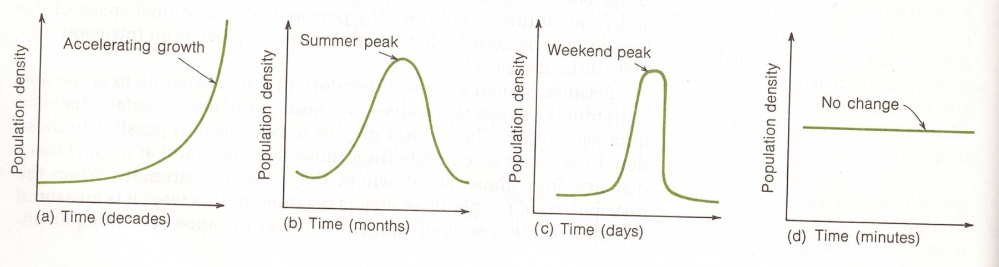{width=700}

*La scène illustrée est irréelle dans la mesure où elle fige, en un seul clic de l'obturateur de l'appareil photo, un motif en constante évolution. La photographie est statique, tandis que la scène réelle sur la plage est dynamique. Une photographie similaire prise à un autre moment montrerait une image différente.*


### Plage VI : Diffusion

:::: {.columns}

::: {.column width="50%" .r-fit-text}
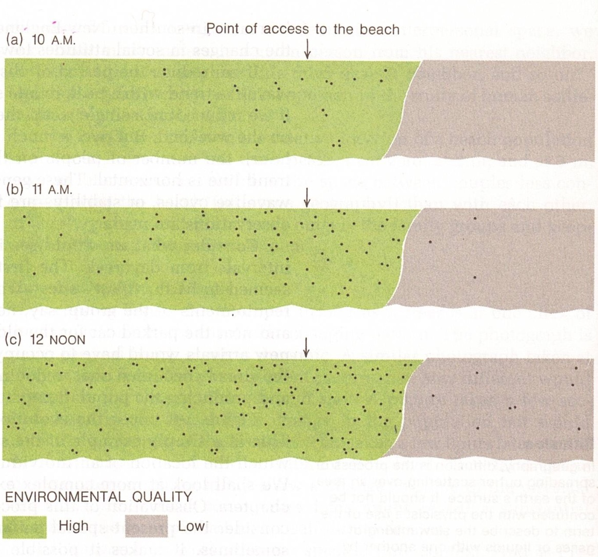{width=400}
:::

::: {.column width="5%" }

:::


::: {.column width="45%" .r-fit-text}
"***Diffusion spatiale*** :  *Étapes du modèle de diffusion des personnes arrivant sur une plage déserte à différents moments de la matinée. Notez comment le processus de remplissage est lié au point d'accès à la plage et aux différences dans la qualité de l'environnement de la plage.*"

:::

::::


### Plage VII : À vous de jouer !

Peter Haggett notait à juste titre que l'analyse d'une **photographie** donnait une image fausse parce que **statique** des processus de localisation dans l'espace qui font nécessairement intervenir le temps. Il aurait certainement adoré savoir qu'il existe désormais des enregistrements de plage fournissant des **films** montrant la **dynamique** de l'occupation d'une place sur des temps longs et presque continus, à l'instar de la webcam de l'hôtel Neptune à Rostock 


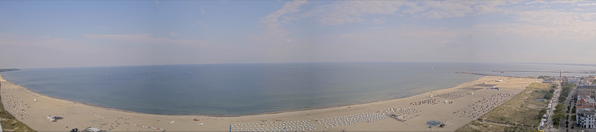{width=700}

<a href="https://hotel-neptun.panomax.com/" target="_blank">Cliquez ici pour accéder à la webcam de l'hôtel Neptune </a>


# MINIMUM THÉORIQUE 

On retiendra de ce qui précède le fait que la vocation de l'analyse spatiale n'est **pas simplement de décrire** mais aussi de **théoriser les relations entre des individus dans l'espace et le temps**. Cela suppose de se doter non seulement d'outils descriptifs - c'est la partie la plus simple - mais aussi de concepts et d'hypothèses nécessairement sujets à débat - c'est le plus difficile. 

Surtout, il paraît essentiel d'accepter que l'analyse spatiale ne soit pas la propriété exclusive des géographes mais un domaine de recherche transdisciplinaire partagé avec d'autres sciences sociales (économie, sociologie, histoire, psychologie, ...), d'autres sciences de la vie (écologie, géologie, biologie, météorologie) et enfin et surtout des sciences plus abstraites telles que les mathématiques ou la philosophie...


## Population-Espace-Temps

Voici un exemple de formulation théorique de l'analyse spatiale à partir d'un nombre limité d'axiomes permettant de décrire l'**évolution d'une ou plusieurs populations localisées à l'intérieur d'un monde au cours du temps**. 


- **Axiome 1** : Il existe un **monde** à l'intérieur duquel des **individus** interagissent dans le **temps** et l'**espace**.
    + **Axiome 1.1** : Les individus qui composent le monde forment une **population** dénombrable munie d'attributs. Il peut y avoir plusieurs sous-populations à l'intérieur d'un monde, les différences portant sur leurs attributs. 
    + **Axiome 1.2** : Le temps qui **ordonne** les événements se produisant à l'intérieur du monde. Il est a priori continu mais peut-être segmenté en **intervalles de temps**. Le temps peut également être découpé en **périodes** qui organisent les récits historiques produits par les individus.  
    + **Axiome 1.3** : L'espace à l'intérieur duquel se **localisent** les individus est découpable et également a priori continu, mais il peut être décomposé en un nombre fini de **mailles** à des fins d'analyse. Il peut aussi être organisé en **lieux** qui sont des territoires réels ou imaginaires produits par les individus. 
    
- **Axiome 2** : Les individus localisés à l'intérieur du monde suivent des **trajectoires** qui peuvent être décrites par des **événements** de différents types parmi lesquels
  +  **2.1 Apparition** : naissance d'un nouvel individu
  +  **2.2 Disparition** : disparition d'un individu
  +  **2.3 Mutation** : changement de position sociale d'un individu indépendant de sa localisation
  +  **2.4 Mobilité** : changement de position spatiale d'un individu indépendant de ses autres attributs
  
- **Axiome 3** : les individus **interagissent** dans le temps et l'espace lorsque leurs trajectoires se rencontrent. Ces interactions modifient la structure du monde.   
  + **3.1 : Structure** : description du monde à un instant *t* permettant de définir des interactions potentielles
  + **3.2 : Dynamique** : description du monde au cours d'une période passée *[t-1,t]* permettant d'examiner les interactions effectivement réalisées.

- **Axiome 4** : Toute **description du monde** produite par des individus localisés à l'intérieur de celui-ci est nécessairement **incomplète** et **partiale**.
  + **4.1 : Incomplétude** : Conséquence des deux [théorèmes de Gödel](https://fr.wikipedia.org/wiki/Th%C3%A9or%C3%A8mes_d%27incompl%C3%A9tude_de_G%C3%B6del){target=_blank}, un système axiomatique de description du monde ne peut être validé qu'à l'extérieur de celui-ci.
  + **4.2 : Partialité** : Dès lors qu'il n'existe pas de théorie unique, différents groupes d'individus peuvent proposer des descriptions du monde concurrentes sans qu'il soit possible de trancher en faveur de l'une plutôt que l'autre.


## Interaction et temps

Une interaction est une relation qui se réalise à un instant donné ou pour une période donnée et qui modifie l'état d'un système social ou spatial. Une interaction implique donc plusieurs choses :

### Temps linéaire ou temps cyclique ?

Une interaction est nécessairement inscrite dans une **histoire** ce qui implique une conception du temps, que celui-ci soit linéaire ou cyclique. 

- Ainsi en **temps linéaire** la découverte de l'Amérique par Christophe Colomb correspond à une interaction entre deux groupes sociaux (les Européens et les Amérindiens) et deux ensembles de lieux (l'Ancien Monde et le Nouveau Monde). 

- En **temps cyclique**, on pourrait prendre l'exemple des marées qui sont déclenchées par l'alignement de la Terre et de la Lune à intervalles réguliers.

### Temps et population

 **La population** : Entendue comme un ensemble d'**individus**, une population est caractérisée par des **interactions sociales**, c'est-à-dire des relations qui se nouent entre certains des individus à un moment donné et/ou pour une période donnée. Ces interactions contribuent à l'évolution, la transformation, la reproduction et dans certains cas la disparition de la population concernée.

> **Rmq1** : Les populations concernées par les populations ne sont pas forcément humaines. On peut tout à fait appliquer le concept à des populations animales ou végétales. L'un des cas les plus connus est celui des fourmis qui ont souvent servi de modèles pour la simulation de systèmes complexes et la création d'algorithmes.

> **Rmq2** : Il existe des modèles d'interaction entre deux ou plusieurs populations. L'un des plus connus est le modèle de Voltera-Lotka aussi connu sous le nom de **modèle proie-prédateur** dont vous trouverez une présentation [ici](https://www.youtube.com/watch?v=M0nRWcF1WJw){target=_blank}.

[{width=400 fig-align="left"}](https://www.youtube.com/watch?v=M0nRWcF1WJw)

### Le diagramme de Lexis

On peut tout à fait imaginer des modèles d'interaction sociale ne faisant intervenir que le temps. Mais nous verrons par la suite que l'inverse n'est pas vrai et que tout modèle d'interaction spatiale implique obligatoirement la prise en compte du temps.

Le **diagramme de Lexis** utilisé en démographie permet d'illustrer le cas d'interactions sociales se déroulant uniquement dans le temps et qui dépendent à la fois du temps historique (date d'un événement) et du temps individuel (âge de la personne). Prenons par exemple quatre géographes français parisiens et demandons-nous s'ils ont eu l'occasion de se rencontrer au cours de leur vie et de débattre en face à face.

::: {.callout-important title="Paul, Emmanuel, Pierre et Christian (1) : interactions temporelles ?"}


Les notices Wikipedia nous indiquent ceci :

-   [Paul Vidal de la
    Blache](https://fr.wikipedia.org/wiki/Paul_Vidal_de_La_Blache){target=_blank} (22
    janvier 1845 - 5 mars 1918)

-   [Emmanuel de
    Martonne](https://fr.wikipedia.org/wiki/Emmanuel_de_Martonne){target=_blank} (1er
    avril 1873 - 24 juillet 1955)

-   [Pierre Georges](https://fr.wikipedia.org/wiki/Pierre_George){target=_blank} (11
    octobre 1909 - 11 septembre 2006)

-   [Christian
    Grataloup](https://fr.wikipedia.org/wiki/Christian_Grataloup){target=_blank} (12
    avril 1951 - présent)

On peut alors représenter la ligne de vie de chacun sur le diagramme de Lexis qui permet de croiser le temps historique (année, en abscisse) et le temps individuel (âge, en ordonnée) :

:::: {.columns}
::: {.column width="60%"}

```{r}
library(LexisPlotR)
lg<-lexis_grid(year_start = 1840, year_end = 2020, age_start = 0, age_end = 100, delta = 10,lwd = 0.5)
lg2<-lexis_lifeline(lg=lg, birth=c("1845-01-22","1873-04-01","1909-10-11","1951-04-12"),
               exit = c("1918-04-05","1955-07-24","2006-09-11",NA),
               colour = c("red","orange","green","blue"), 
               lwd=2)
lg2 + ggtitle("Diagramme de Lexis : lignes de vie de quatre géographes français", subtitle = 'Vidal (rouge), de Martonne (orange), George (vert), Grataloup (bleu)')

```
:::

::: {.column width="40%" .r-fit-text .smaller}
**Commentaire :** Paul Vidal de la Blache a pu dialoguer largement avec Emmanuel de Martonne dont il a fait son héritier spirituel. Les opportunités d'interaction correspondent à la possibilité de relier deux lignes de vie par une droite verticale. Mais il faut également que l'âge autorise l'interaction. Ainsi, Pierre Georges est certes contemporain de Paul Vidal de la Blache, mais il n'a que 9 ans au moment de la mort de ce dernier. Il a en revanche pu interagir avec Emmanuel de Martonne et rencontrer Christian Grataloup, etc. Est-ce que ce dernier a pu interagir avec de Martonne ?
:::

::::

Ce mécanisme de recouvrement des lignes de vie est selon le sociologue Georges Simmel @simmel1950 un mécanisme essentiel de reproduction des sociétés, y compris celles dont les membres sont astreints au célibat comme le clergé catholique. Dès lors que les membres successifs d'une société partagent un temps de vie suffisant, ils peuvent échanger et transmettre des idées ou des pratiques.

:::

## Interaction et espace-temps

Si l'on peut imaginer des interactions sociales se déroulant dans le temps sans faire intervenir l'espace, l'inverse est plus difficile à concevoir voire impossible. Les interactions spatiales qui constituent le coeur de l'analyse spatiale n'ont en effet de sens que si la **distance** séparant deux lieux constitue un **frein** aux interactions entre les individus **au cours de leur existence**. 

::: {.callout-important title="Paul, Emmanuel, Pierre et Christian (2) :  interactions spatiales ?"}
Emmanuel de Martonne, Pierre Georges ou Christian Grataloup ont tous fréquenté au cours de leur vie l'Institut de Géographie localisé 191 rue Saint-Jacques et achevé en 1924. Ils ont peut-être même occupé les mêmes bureaux ou enseigné dans les mêmes amphithéâtres. Mais cette proximité spatiale n'aurait en aucun cas permis qu'ils ne se rencontrent s'ils n'avaient pas vécu également à la même époque.
:::

**L'interaction spatiale est donc toujours une interaction spatio-temporelle**. Toute géographie est en réalité une *time-geography*. Nous allons illustrer ce point à travers une version revisitée du conte de Cendrillon. 


::: {.callout-important title="Cendrillon et le Prince Charmant : interactions spatio-temporelles ?"}

**Exemple (simple) de *time-geography*** : Le monde se réduit à une route unique de 70 lieues (une lieue fait environ 4 km). Cendrillon (en bleu) réside au point n°20 dispose d'un carrosse qui lui permet de franchir 20 lieux en 12 heures. Le Prince Charmant (en rose) réside au point n°50. Il n'est pas très sportif et peut franchir 5 lieux en 12 heures. Ils sont donc situés à 30 lieux de distance l'un de l'autre. Chacun d'eux part de chez lui à minuit et doit impérativement rentrer à son domicile avant le lendemain à minuit. Pourront-ils se rencontrer ? Supposons maintenant que le Prince charmant ait réussi à voler le carrosse de son père...


:::: {.columns}
::: {.column width="50%"}


```{r}
x1 <- c(20,40,20,0,20)
y1 <- c(0,12,24,12,0)
pol1<-cbind(x1,y1)

x2 <- c(50,55,50,45,50)
y2 <- c(0,12,24,12,0)
pol2<-cbind(x2,y2)

x3 <- c(35,40,35,30,35)
y3 <- c(9,12,15,12,9)
pol3<-cbind(x3,y3)

par(mar=c(4,4,4,4))
plot(rbind(pol1,pol2), cex=0.01,
     xlim=c(0,70),
     ylim=c(0,24),
     ylab = "Temps : en heures",
     xlab = "Espace : en lieues",
     main = "Rencontre impossible")

polygon(pol1, col="lightblue")
polygon(pol2, col="pink")
grid(,nx = 16, ny=24)
```

- **Commentaire** : Les losanges bleus et roses indiquent la portion d'espace-temps que chacun peut parcourir en assurant le retour à son domicile dans un délai de 24h. On voit que la rencontre est impossible car **les deux espaces-temps n'ont pas d'intersection commune**. 

:::


::: {.column width="50%"}


```{r}
x1 <- c(20,40,20,0,20)
y1 <- c(0,12,24,12,0)
pol1<-cbind(x1,y1)

x2 <- c(50,70,50,30,50)
y2 <- c(0,12,24,12,0)
pol2<-cbind(x2,y2)

x3 <- c(35,40,35,30,35)
y3 <- c(9,12,15,12,9)
pol3<-cbind(x3,y3)

par(mar=c(4,4,4,4))
plot(rbind(pol1,pol2), cex=0.01,
     xlim=c(0,70),
     ylim=c(0,24),
     ylab = "Temps : en heures",
     xlab = "Espace : en lieues",
     main = "Rencontre possible")

polygon(pol1, col="lightblue")
polygon(pol2, col="pink")
polygon(pol3, col="yellow",lwd=2)
grid(,nx = 16, ny=24)
```

- **Commentaire** : Les deux espaces temps se recoupent désormais et indiquent (en jaune) la zone de l'espace-temps où Cendrillon et le Prince peuvent se retrouver. Spatialement, il s'agit de la zone comprise entre les kilomètres 30 et 40. Le point de rencontre optimal est le kilomètre 25 où ils pourront passer six heures ensemble, de 9h à 15h avant de devoir retourner à leur domicile. 
:::
:::

:::


## Interactions et distances spatiales

### *"L'espace ne pose pas forcément un problème intéressant à la société"* (J. Levy, 1986)

On a coutume de dire que l'analyse spatiale est l'étude de l'influence de la distance sur le fonctionnement des sociétés humaines. Certains ajoutant même que "*si la distance n'existait pas, la géographie n'existerait pas*". Plus subtilement, Jacques Levy dans un chapitre de l'ouvrage *Espaces, Jeux et Enjeux* (1986) s'est interrogé sur l'évolution du rôle de la distance dans l'histoire humaine et a proposé un schéma théorique en trois étapes correspondant à trois types de sociétés : 

- **Sociétés pré-géographiques** : ce sont des sociétés à faibles capacités de déplacement et pour lesquelles les localisations sont quasi-impératives. Elles ne peuvent pas s'éloigner de plus d'une certaine distance d'un point de référence constitué par une ressource matérielle (ex. un point d'eau) ou symbolique (ex. un lieu de culte). Dès, lors les différentes sociétés ne se rencontreront jamais et **le fait qu'elles soient plus ou moins proches ou éloignées n'a aucune importance**. Chaque société est en quelque sorte une **monade** isolée du reste du monde, comme dans le roman de science-fiction de Robert Sylverberg, [Les monades urbaines (1971)](https://fr.wikipedia.org/wiki/Les_Monades_urbaines){target=_blank}. 

::: {.callout-tip title="Les monades urbaines de R. Sylverberg (1971) : un monde pré-géographique ?"}

:::: {.columns}
::: {.column width="30%"}
{width=100}
:::

::: {.column width="65%"}
Les monades urbaines sont un monde pré-géographique au sens où aucune communication ne doit exister entre les tours qui forment des mondes autonomes. Mais on peut indiquer - sans pour autant dévoiler l'intrigue - que cette règle va être transgressée et provoquer une transformation radicale. 

Il est intéressant de noter que dans ce roman l'espace continue à jouer un rôle mais uniquement dans le sens vertical. Les monades sont en effet des tours où la hiérarchie sociale très stricte est directement liée à l'étage dans lequel les individus résident ou travaillent. 
:::

:::

:::

- **Sociétés post-géographiques** : ce sont des sociétés dotées de moyens de communication instantanés, gratuits et indépendant de l'éloignement spatial des personnes qui souhaitent échanger. On peut s'en faire une image en supposant que chaque individu dispose d'un pouvoir de télépathie et dispose d'un annuaire complet de l'ensemble des autres individus qui composent la population à un instant donné (ce qui ne correspond pas à la situation actuelle des communications par internet ou téléphone mobile où un tel annuaire n'existe pas et où le coût de communication n'est pas nul). Une telle société peut également accéder à des ressources ou échanger celles-ci pour un coût de transport nul. Les interactions demeurent a priori tributaires du temps (on ne peut pas forcément échanger avec plusieurs personnes à la fois et certains individus naissent ou meurent). Elles demeurent également a priori tributaires des attributs des individus (tous les individus ne parlent pas forcément la même langue, ne partagent pas forcément les mêmes valeurs, ...) et de leur compétition pour les ressources (création de monopoles ou d'oligopoles). En bref, il peut demeurer dans ces sociétés une démographie, une histoire, une sociologie, une économie ... mais quelle est l'utilité d'une géographie ? **Dès lors que les coûts de communication ou de transport sont uniformément nuls, la position des individus ou des ressources dans l'espace n'a aucune importance**. Dans le domaine de la science fiction, cette idée d'abolition de la distance est illustrée dans de nombreux romans parmi lesquels on peut citer le roman de Philip K Dick [Ubik (1966)](https://fr.wikipedia.org/wiki/Ubik){target=_blank} qui, comme son nom le suggère, étudie l'effet de l'**ubiquité** sur le fonctionnement d'une société.


::: {.callout-tip title="Ubik de P.K. Dick (1966): un monde post-géographique ?"}

:::: {.columns}
::: {.column width="30%"}
{width=100}
:::

::: {.column width="65%"}
Le roman de Philip K. Dick est sans doute l'un des chefs-d'oeuvre les plus effrayants de la science-fiction car il imagine l'existence de *télépathes* qui peuvent non seulement communiquer instantanément dans l'espace mais aussi de déplacer dans le temps et ainsi en modifier l'histoire. L'abolition simultanée des deux formes de distances (dans l'espace et le temps) aboutit à des conséquences cauchemardesques qu'on se gardera de dévoiler ici. 
:::

:::

:::

- **Sociétés géographiques** : Elles constitueraient donc selon Jacques Lévy **une étape intermédiaire** de l'histoire des sociétés humaines au cours de laquelle les localisations ne sont plus impératives (sociétés pré-géographiques) mais où l'éloignement des individus dans l'espace demeure une contrainte significative à la réalisation d'interactions sociales (entre individus) ou économiques (entre individus et ressources). 

Cette vision ternaire et dialectique -probablement issue de la formation marxiste de l'auteur- peut déboucher sur une représentation plus complexe de l'histoire humaine dans laquelle co-existerait chacune des formes pures décrites par J. Levy selon les types d'interaction considérés. Les interactions amoureuses pourraient demeurer par exemple fortement déterminées par la proximité spatiale alors que les interactions économiques seraient de moins en moins liées à la proximité. Mais le passage d'un stade à un autre ne serait pas nécessairement inéluctable et la fameuse "marche de l'histoire" pourrait connaître des retours en arrière voire obéir à des cycles. Qu'il suffise sur ce point de rappeler les nombreuses théories qui ont surgi après la fin de la Guerre Froide, au temps d'une supposée "mondialisation heureuse" pour prophétiser la "*fin de la géographie*" (O'Brien, 1992), la "*mort de la distance*" (F. Cairncross, 1998) et l'avènement d'un "*monde plat*" débarrassé de la "*tyrannie de la distance et des frontières*" (T. Friedman, 2005).


## La contrainte chorotaxique

Si la distance géographique pose un problème aux sociétés humaines - et justifie l'existence de géographes - c'est fondamentalement en raison de la **contrainte chorotaxique** définie par Henry Reymond par le fait que **deux objets ou deux individus ne peuvent pas occuper le même point de l'espace au même moment** (Isnard H., Racine J.B., Reymond H., 1981). Dès lors qu'une société procède à une première implantation en un lieu donné, elle réduit le nombre de choix pour des implantations ultérieures (rappelons que dans notre axiomatique provisoire le nombre de lieux est *fini*). Cela signifie que pour le choix d'une seconde implantation, la société disposera très précisément de trois solutions :

1. **Remplacer** la première implantation en la détruisant. 
2. **Juxtaposer** la seconde implantation à la première, que ce soit verticalement ou horizontalement, en créant une relation de *contiguïté*.
3. **Espacer** la seconde implantation en l'**éloignant** de la première d'une certaine distance.


::: {.callout-important title="Axiomatique d'un monde fini et discret"}
**Remarque** : Cette axiomatique est très proche de celle qui a été proposée au début de ce cours dans la mesure où elle suppose bien l'existence d'un **monde fini** doté d'une **population finie** qui agit dans un **temps discret** (actions successives par intervalles de temps) et d'un **espace discret** (nombre fini de localisations possibles). Les règles que déduit H. Reymond ne sont donc valables que dans le cadre de ces conditions de finitude et n'auraient sans doute pas de sens dans un monde infini où les phénomènes seraient continus dans l'espace comme dans le temps. 
:::

H. Reymond déduit trois conséquences de la contrainte chorotaxique que nous allons discuter successivement.

### Une obligation : l'espacement

Le fait de ne pas pouvoir implanter deux choses en un même point de l'espace au même moment oblige donc les sociétés à prendre des décisions en matière d'implantations de logements, d'activités économiques, de commerces, de services...

Ces décisions peuvent dans certains cas être prises librement par les individus, mais elles sont également l'objet de **règles** qui limitent les possibilités de choix et peuvent faire l'objet de **sanctions** par une autorité politique ou administrative. Elles peuvent évidemment faire l'objet de **conflits** lorsque plusieurs individus sont en concurrence pour une même implantation. Bref, **l'espace est politique** ce qui en soit n'est pas un scoop. Mais permet de rappeler le lien profond qui unit la géographie et le droit. Les **lois de l'espace** que formule l'analyse spatiale peuvent être d'ordre économique (décroissance des interactions en fonction du coût de transport) mais aussi sociologique (formation de ghetto) et juridique (interdiction d'implanter une pharmacie à moins d'une certaine distance d'une autre).

Bref, il faut espacer mais comment s'y prendre ? Et cela justifie-t-il de faire appel à un corps de spécialistes appelés *géographes, aménageurs, architectes ou urbanistes* ?
  
### Une liberté : la disposition

L'espacement est un problème, mais un problème qui possède généralement plusieurs solutions (rappelons la célèbre devise des Shadoks en la corrigeant légèrement : "*s'il n'y a pas de solution -* ***ou s'il y en a une seule*** - *il n'y a pas de problème !*"). La question est alors de savoir dans quelle mesure telle ou telle solution se révèle plus avantageuse pour tel individu, tel groupe d'individu ou la société dans son ensemble. En d'autres termes, comment évaluer une disposition et la déclarer préférable à une autre ? Quelle norme mettre en œuvre ? Comment concilier les intérêts éventuellement contradictoires d'individus ou de groupes d'individus ?


::: {.callout-important title="Distribution des activités et services de Goose-City en 1840 et 1850"}


Dans cet exemple inspiré de Lucky Luke (*Des barbelés sur la prairie*) et tiré d'un [vieux cours d'analyse spatiale de Claude Grasland](http://grasland.script.univ-paris-diderot.fr/go303/intro/doc_int.htm){target=_blank}, on avait imaginé un groupe de pionniers qui partent à la conquête de l'Ouest américain et s'implantent après avoir massacré les populations autochtones au nom de la "civilisation"... 

:::: {.columns}
::: {.column width="45%"}

Chacun a reçu une parcelle de forme carrée où la plupart ont implanté une ferme. Mais certaines parcelles ont été réservées à l'implantation de commerces ou de services indispensables à la population décrits dans le tableau ci-dessous
:::

::: {.column width="10%"}
:::

::: {.column width="45%"}
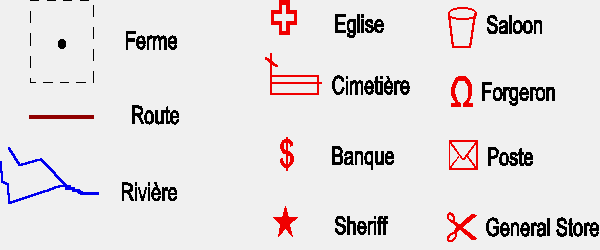{width=300}
:::

Lors de leur arrivée en 1840, les pionniers ont tiré au hasard la disposition des fermes et des activités car ils avaient lu des ouvrages religieux qui annonçaient l'avènement d'un monde plat débarrassé de la tyrannie de la distance et annonçaient la mort de la géographie. Tous les géographes avaient donc été brûlés en place publique sur un bûcher composé de cartes. Mais dix ans après on avait observé des changements dans la répartition des fermes et des activités car quelques problèmes étaient apparus...

:::


:::: {.columns}
::: {.column width="45%"}
- **Situation en 1840**

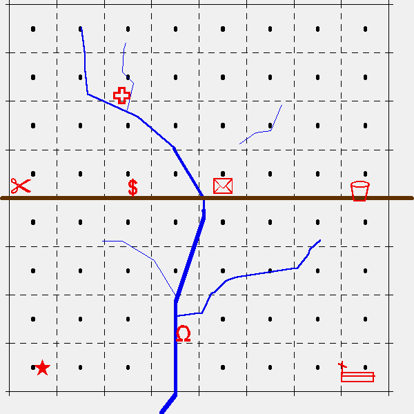
:::

::: {.column width="10%"}
:::

::: {.column width="45%"}
- **Situation en 1850**

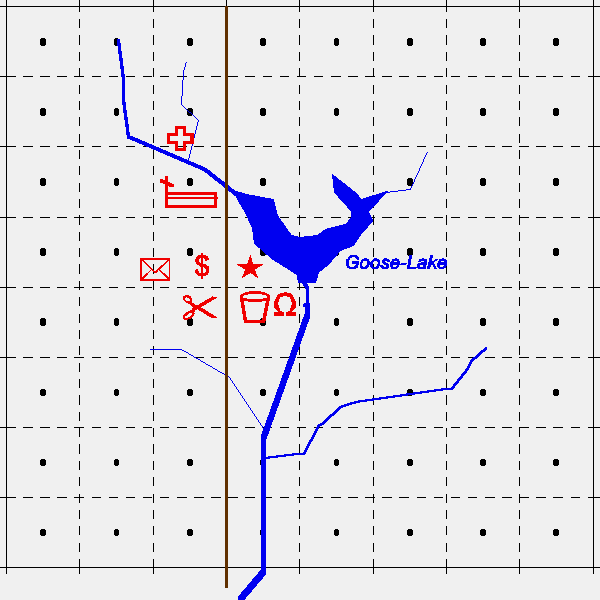
:::

:::

:::


### Une puissance : la surface

La troisième conséquence tirée par H. Reymond de la contrainte chorotaxique réside dans le fait que la répartition bi-dimensionnelle des activités augmente la possibilité de trouver des arrangements multiples. On peut illustrer ceci par l'exemple très simple de la répartition de 7 villages dans une plaine homogène ou une vallée de montagne plus ou moins large.


::: {.callout-important title="Comment combiner proximité et éloignement"}

Dans cet exemple théorique, il s'agit de disposer sept villages en fonction de deux demandes d'espacement :

1. Chaque village veut être situé à au moins 10 kilomètres du plus proche afin de disposer d'un territoire (*finage*) suffisant pour ses activités.
2. Chaque village veut pouvoir échanger facilement avec les six autres et en être aussi proche que possible tout en respectant la règle de distance minimale

Comme le montrent les cartes-ci-dessous, la seconde règle aboutit à des solutions plus satisfaisantes dans un espace à deux dimensions (plaine homogène) que dans un espace à une dimension (vallée étroite).

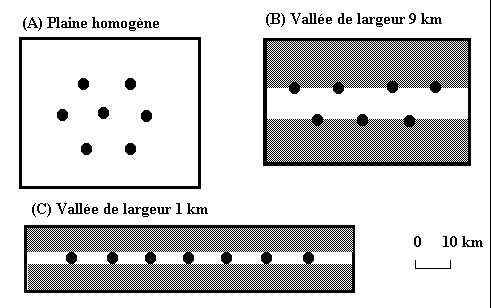

:::

On pourrait ajouter à la démonstration proposée par H. Reymond que la liberté serait encore accrue dans un espace à trois dimensions comme on peut le faire dans les espaces urbains denses en jouant sur la verticalité.


## Conclusion : Les lois de l'espace

L'exemple de Goose-City conduit à s'interroger sur l'existence de lois de l'espace. Deux points de vue s'opposent - apparemment - à ce sujet, illustrés par deux textes de R. Brunet et J. Levy


::: {.callout-important title="Deux points de vue sur l'existence de lois de l'espace"}

:::: {.columns}
::: {.column width="47%"}
**"On ne fait pas ce qu'on veut de et dans l'espace" (Roger Brunet, 1990) :**

La production de l'espace conserve […]une double détermination, générale et locale. Tout le problème de la recherche sur l'espace géographique est de faire le tri entre les lois et les règles, ce qui vaut à l'échelle mondiale et ce qui est propre à des modes de production, des cultures ou quoi que ce soit d'équivalent qui régionalise l'espace - et le temps. La géographie a d'abord vu le foisonnement de situations uniques, c'était même sa fonction d'exploratrice. Puis elle a cherché, à partir de là, à regrouper en types formels ce qui semblait se ressembler; faute de méthode, ce fut sa période ingrate. Elle a tendance maintenant à chercher des lois, et à évaluer des écarts aux lois; c'est aussi pour retrouver l'unique en l'appréciant mieux. Elle y reprend sel et miel. Ce faisant, elle a cru pouvoir observer que, non seulement les sociétés ont leurs lois, au sens strict et au sens large, mais encore l'espace a les siennes propres. Ces lois sont de nature topologique ou, plus largement, physique, même s'agissant de phénomènes sociaux. Leur découverte a donné lieu à une abondante littérature, et à d'infinis raffinements techniques. Au point qu'elles n'ont pas échappé aux phénomènes classiques d'aliénation et de réification, certains chercheurs s'acharnant autour des équations en perdant de vue toute relation avec les processus réels. Comme l'espace lui-même, les lois de l'espace n'ont de réalité que dans la mesure où elles expriment des relations sociales, où elles ont une logique sociale. Elles concernant des populations concrètes, leurs échanges et leurs œuvres. La géographie se déploie ici entre deux aliénations: chercher des lois sans s'interroger sur les pratiques qu'elles recouvrent, des lois comme immanentes ou célestes; ou nier toute loi de l'espace parce qu'il n'y aurait de loi que de la société, ou même de l'économie, voire du politique, non moins réifiées à leur tour. Mais on ne fait pas ce que l'on veut de et dans l'espace. Densité, distance, diffusion et quelques autres phénomènes sont spécifiquement phénomènes de l'espace. Bien entendu, quand ils concernant l'espace géographique tout entier, et pas seulement le relief ou la couverture végétale, ils n'existent qu'à travers les relations sociales; ils n'en ont pas moins leurs lois et leurs effets propres, dont les sociétés ont le plus grand intérêt à tenir compte. Il est assez d'échecs d'implantation pour le rappeler. 

Source : R. Brunet, *Mondes Nouveaux / Géographie Universelle tome I*, Hachette-Reclus, 1990, p. 79

:::

::: {.column width="5%"}
:::

::: {.column width="47%"}
**"La spatialité ne peut être définie en soi, indépendamment du "contenu" de réel qui l'organise" (Jacques Lévy, 1986)**

Axiome 1 : L'espace est une catégorie correspondant, selon la tradition marxiste, à un mode d'existence de la matière. La spatialité ne peut être définie en soi, indépendamment du "contenu" de réel qui l'organise. 


Axiome 2 : L'espace social, c'est-à-dire la répartition des phénomènes sociaux selon les deux dimensions courbes de la surface terrestre ne pose pas forcément un problème intéressant à la société. Si les localisations sont rendues quasi impératives par l'absence de maîtrise des hommes sur leurs conditions de vie, on est en présence d'une société pré-spatiale ; si, à l'inverse, la liberté d'allouer des éléments de la société ici ou là est totale, si l'ubiquité matérielle (transports) ou immatérielle (télécommunications) génère une totale isotropie, on peut dire que la société est de nature post-spatiale. On posera donc que c'est dans la phase transitoire entre ces deux situations extrêmes que prend sens une approche scientifique de l'espace social.


Axiome 3 : Une fois rejeté le primat de l'économique, du sociologique ou du politique dans l'explication des faits sociaux (on ne peut comprendre les rapports marchands sans se référer aux rapports sociaux, ni ces derniers sans reconnaître l'existence d'un pouvoir politique), force est de reconnaître qu'il ne peut y avoir de hiérarchie entre les sciences sociales dès lors que chacune d'entre elles est capable de prendre en compte l'ensemble du réel social, la généralité des phénomènes qui constituent une société.


Axiome 4 : Il n'est pas possible d'isoler un ensemble de "choses" de la société telles que nous puissions comprendre leur fonctionnement sans faire entrer le reste de la société dans notre raisonnement. Toutes les sciences sociales sont donc à la fois totales et partielles ; elles représentent une dimension qui est aussi un problème - une liberté et des contraintes, des choix et un enjeu - pour la société qui pousse certains de ses membres à y réfléchir.

Source : J. Lévy, "L’espace et le politique : quelles rencontres ? " in Brunet R., Auriac F., 1986, *Espaces, jeux et enjeux*, Fayard-Diderot, Paris, pp. 251-268

:::


:::

:::


#### Références {.unnumbered}

Chapelon L., 2014, "Accessibilité", [Hypergeo, encyclopédie en
ligne](https://hypergeo.eu/accessibilite/){target=_blank}

Pumain D., Saint-Julien T., 2010, *Analyse spatiale : les
localisations*, Paris : Cursus Armand Colin, p.31.

::: {#refs}
:::