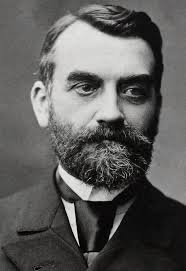
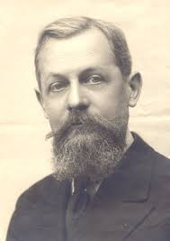
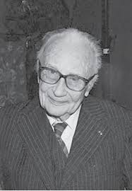
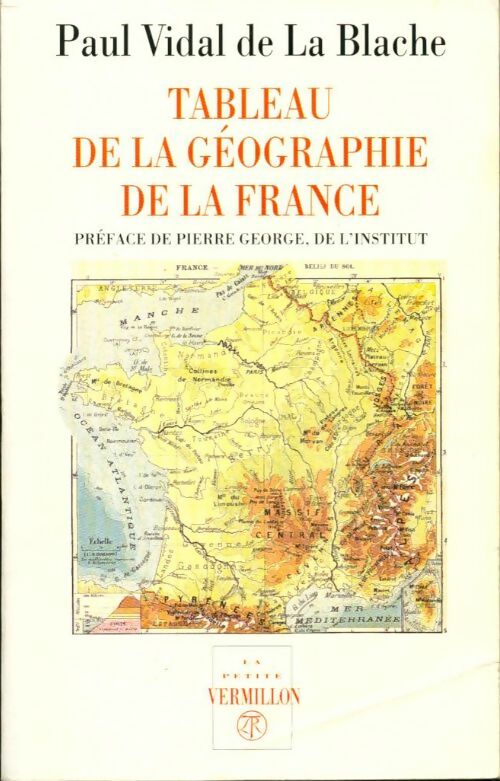
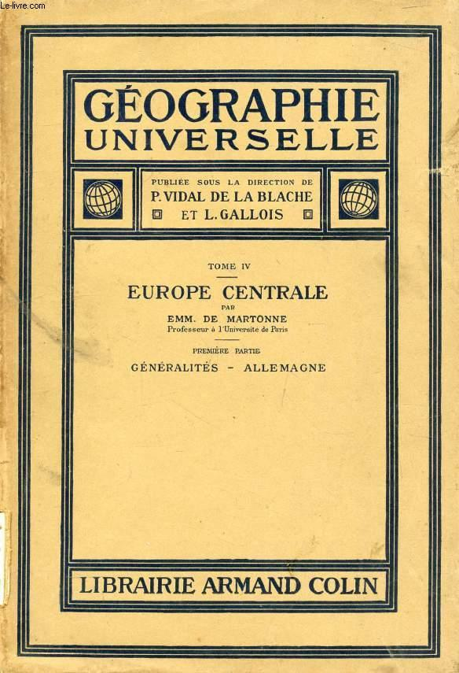
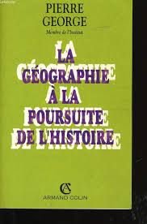
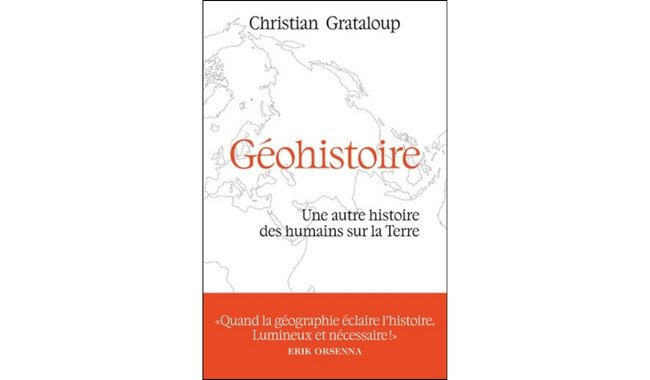

```{r}
library(knitr)
library(ggplot2)
```


# AXIOMATIQUE


##  Il existe une population ...

- **Axiome 1** : Il existe un **monde** à l'intéreur duquel des **individus** interagissent dans le **temps** et l'**espace**.

## ... dénombrable ...

- **Axiome 2** : Ce monde est **fini** dans chacune de ses trois dimensions :
    + **Axiome 2.1** : Les individus qui compose le monde forment une **population** dénombrable munie d'attributs.
    + **Axiome 2.2** : Le temps qui **ordonne** les évènements se produisant à l'intérieur du monde est segmentable en **intervalles de temps** ou périodes. 
    + **Axiome 2.3** : L'espace à l'intérieur duquel interagisse les individus est découpable en un nombre fini de **lieux** constituant une grille ou une régionalisation.
    
## ... changeante ...

- **Axiome 3** : Les **trajectoires** des individus peuvent être décrits par des **événements** de différents types parmi lesquels
  +  **3.1 Apparition** : naissance d'un nouvel individu
  +  **3.2 Disprition** : disparition d'un individu
  +  **3.3 Mutation** : changement d'attribut social
  +  **3.4 Mobilité** : changement de position spatiale

## ... interagissante ...

- **Axiome 4** : les **interactions** entre les individus sont à la fois cause et conséquence des événements qui modifient la **structure** et la **dyamique** du monde.  
  + **4.1 : Structure** : description du monde à un instant *t* permettant de définir des interactions potentielles
  + **4.2 : Dynamique** : description du monde au cours d'une période passée *[t-1,t]* permettant d'examiner les interactions effectivement réalisées.

## ... ayant une représentation d'elle-même. 

- **Axiome 5** : Toute **description du monde**produite par des individus localisés à l'intérieur de celui-ci est nécessairement **incomplète** et **partiale**.
  + **5.1 : Incomplétude** : Conséquence des deux [théorèmes de Gödel](https://fr.wikipedia.org/wiki/Th%C3%A9or%C3%A8mes_d%27incompl%C3%A9tude_de_G%C3%B6del), un système axiomatique de description du monde ne peut être validé qu'à l'extérieur de celui-ci.
  + **5.2 : Partialité** : Dès lors qu'il nexiste pas de théorie unique, différents groupes d'individus peuvent proposer des descriptions du monde concurrente sans qu'il soit possible de trancher en faveur de l'une plutôt que l'autre.


# TEMPS


## Individus et temps

On peut tout à fait imaginer des modèles d'interaction sociale ne faisant intervenir que le temps. Mais nous verrons par la suite que l'inverse n'est pas vrai et que tout modèle d'interaction spatiale implique obligatoirement la prise en compte du temps.

Le **diagramme de Lexis** utilisé en démographie permet d'illustrer le cas d'interactions sociales se déroulant uniquement dans le temps et qui dépendent à la fois du temps historique (date d'un événement) et du temps individuel (âge de la personne). Prenons par exemple quatre géographes français parisiens et demandons-nous s'ils ont eu l'occasion de se rencontrer au cours de leur vie et de débattre en face à face.

## Quatre géographes parisiens ...

{height=100} [Paul Vidal de la Blache](https://fr.wikipedia.org/wiki/Paul_Vidal_de_La_Blache){target=_blank} (22 janvier 1845 - 5 mars 1918)

{height=100} [Emmanuel de Martonne](https://fr.wikipedia.org/wiki/Emmanuel_de_Martonne){target=_blank} (1er avril 1873 - 24 juillet 1955)

{height=100} [Pierre Georges](https://fr.wikipedia.org/wiki/Pierre_George){target=_blank} (11 octobre 1909 - 11 septembre 2006)

{height=100}[Christian Grataloup](https://fr.wikipedia.org/wiki/Christian_Grataloup){target=_blank} (12 avril 1951 - présent)


## Diagramme de Lexis

```{r}
library(LexisPlotR)
lg<-lexis_grid(year_start = 1840, year_end = 2020, age_start = 0, age_end = 100, delta = 10,lwd = 0.5)
lg2<-lexis_lifeline(lg=lg, birth=c("1845-01-22","1873-04-01","1909-10-11","1951-04-12"),
               exit = c("1918-04-05","1955-07-24","2006-09-11",NA),
               colour = c("red","orange","green","blue"), 
               lwd=2)
lg2 + ggtitle("Diagramme de Lexis : lignes de vie de quatre géographes français", subtitle = 'Vidal (rouge), de Martonne (orange), George (vert), Grataloup (bleu)')

```


## Ont-ils pu se rencontrer ? 


- **Paul & Emmanuel** :  Paul Vidal de la Blache a pu dialoguer largement avec Emmanuel de Martonne dont il a fait son héritier spirituel. Les opportunités d'interaction correspondent à la possibilité de relier deux lignes de vie par une droite verticale. Mais il faut également que l'âge autorise l'interaction. 

- **Pierre et Paul ** : Pierre Georges est certes contemporain de Paul Vidal de la Blache, mais il n'a que 9 ans au moment de la mort de ce dernier. 

- **Emmanuel, Pierre, et Christian ** :  Pierre Georges a en revanche pu interagir avec Emmanuel de Martonne et rencontrer Christian Grataloup, etc. Est-ce que ce dernier a pu interagir avec Emmanuel de Martonne ?


## Quels modes de transmission ?

{height=250}
{height=250}
{height=250}
{height=250}


{height=250}
{height=250}
{height=250}
{height=250}


# ESPACE-TEMPS


## Problème n°1

**Exemple (simple) de *time-geography*** : Le monde se réduit à une route unique de 70 lieues (une lieue fait environ 4 km). Cendrillon (en bleu) réside au point n°20 dispose d'un carrosse qui lui permet de franchir 20 lieux en 12 heures. Le Prince Charmant (en rose) réside au point n°50. Il n'est pas très sportif et peut franchir 5 lieux en 12 heures. Ils sont donc situés à 30 lieux de distance l'un de l'autre. Chacun d'eux part de chez lui à minuit et doit impérativement rentrer à son domicile avant le lendemain à minuit. 

## Solution n°1


```{r}
x1 <- c(20,40,20,0,20)
y1 <- c(0,12,24,12,0)
pol1<-cbind(x1,y1)

x2 <- c(50,55,50,45,50)
y2 <- c(0,12,24,12,0)
pol2<-cbind(x2,y2)

x3 <- c(35,40,35,30,35)
y3 <- c(9,12,15,12,9)
pol3<-cbind(x3,y3)

par(mar=c(4,4,4,4), mfrow=c(1,1))
plot(rbind(pol1,pol2), cex=0.01,
     xlim=c(0,70),
     ylim=c(0,24),
     ylab = "Temps : en heures",
     xlab = "Espace : en lieues",
     main = "Rencontre impossible")

polygon(pol1, col="lightblue")
polygon(pol2, col="pink")
grid(,nx = 16, ny=24)
```


## Problème n°2

Supposons maintenant que le Prince charmant ait réussi à voler le carrosse de son père...


## Solution n°2


```{r}
x1 <- c(20,40,20,0,20)
y1 <- c(0,12,24,12,0)
pol1<-cbind(x1,y1)

x2 <- c(50,70,50,30,50)
y2 <- c(0,12,24,12,0)
pol2<-cbind(x2,y2)

x3 <- c(35,40,35,30,35)
y3 <- c(9,12,15,12,9)
pol3<-cbind(x3,y3)

par(mar=c(4,4,4,4), mfrow=c(1,1))
plot(rbind(pol1,pol2), cex=0.01,
     xlim=c(0,70),
     ylim=c(0,24),
     ylab = "Temps : en heures",
     xlab = "Espace : en lieues",
     main = "Rencontre possible")

polygon(pol1, col="lightblue")
polygon(pol2, col="pink")
polygon(pol3, col="yellow",lwd=2)
grid(,nx = 16, ny=24)
```

