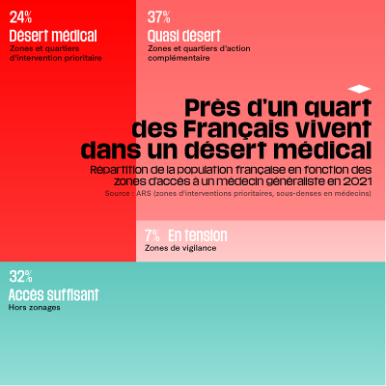
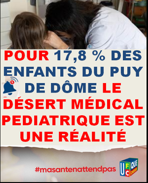
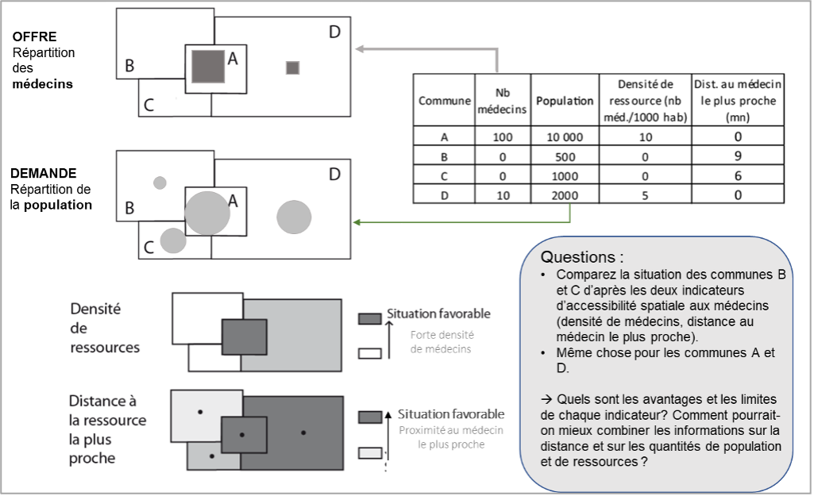
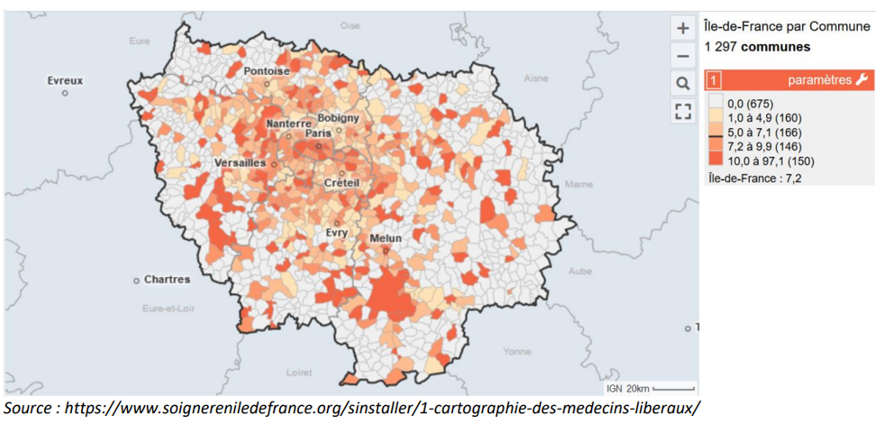
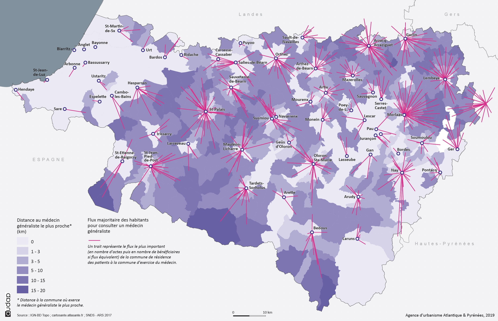
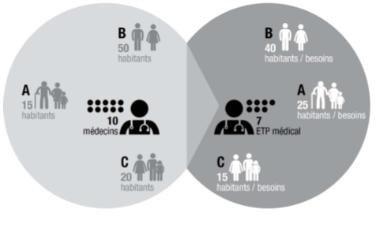
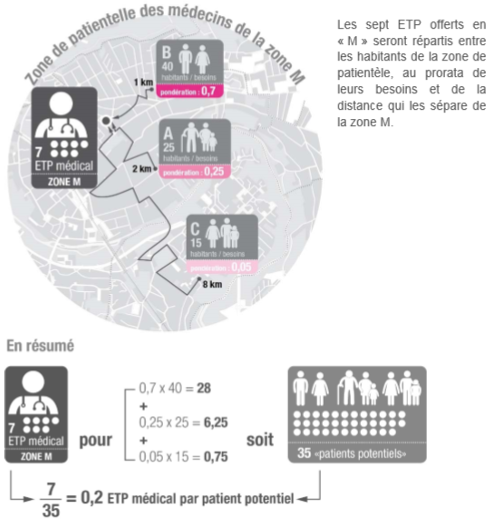
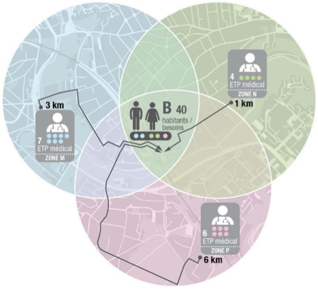
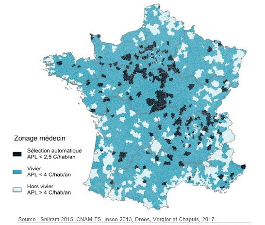

```{r}
library(knitr)
```


# Un débat public

## Une bataille de chiffres ...

:::: {.columns}

::: {.column width="50%"}



:::

::: {.column width="50%"}



:::

::::


## Des rivalités entre régions 

:::: {.columns}

::: {.column width="50%" .r-fit-text}

- **L'Île-de-France est désormais le premier désert médical de France ! »**  (*La Tribune, 15 décembre 2023*)

Lorsqu’on évoque le concept de « désert médical », affleurent à l'esprit des images d'Épinal de régions françaises rurales, éloignées des métropoles, faiblement peuplées. Bref, bien qu'elle comporte de nombreux territoires ruraux, tout sauf l'Île-de-France.

Pourtant en  2022, l'union régionale des professionnels de santé (URPS) a publié les chiffres de l'accès à la médecine : **plus de 60% des habitants de l'Île-de-France vivent dans un désert médical**. 

:::

::: {.column width="50%" .r-fit-text}

- **« 1 h 30 de route : la vie dans un désert médical »**  (*Ouest France, 17 novembre 2023*)

En France, selon un rapport sénatorial remis en 2022, plus de 30 % de la population vit dans un désert médical.

Selon l’Insee, une grande partie du territoire compte désormais moins de 275 praticiens pour 100 000 habitants avec des situations particulièrement alarmantes dans l’Eure, qui recense 165 praticiens pour 100 000 habitants, ou l’Ain avec 175 pour 100 000 habitants. À l’inverse, les mieux dotés sont Paris, avec 888 praticiens pour 100 000 habitants, les Hautes-Alpes avec 503 et les Alpes-Maritimes avec 461.
:::

::::

## Une bataille de de définitions

:::: {.columns}

::: {.column width="50%" .r-fit-text}

- **L'Île-de-France est désormais le premier désert médical de France ! »**  (*La Tribune, 15 décembre 2023*)

Mais qu'entend-on précisément par « désert médical » ? Cette notion a un sens très précis, elle renvoie aux **zones au sein desquelles le nombre de consultations possibles, par an et par habitant, est inférieur à 2,5.**  

:::

::: {.column width="50%" .r-fit-text}

- **« 1 h 30 de route : la vie dans un désert médical »**  (*Ouest France, 17 novembre 2023*)

Marie-Amélie Jiraud se souvient qu’elle n’en menait « pas large » au volant de sa voiture. Fiévreuse, courbaturée, somnolente, l’élève aide-soignante de 33 ans a pris la route, « shootée au Doliprane », pour **se rendre à un rendez-vous chez le médecin, le seul trouvé au débotté, «à une heure et quart » de chez elle**, à Clermont-Ferrand (Puy-de-Dôme)

:::

::::

# Quels indicateurs ?


## Deux indicateurs simples



## Carte de densité



## Carte d'accessibilité




# La méthode APL


## 1. Calcul de l'offre et la demande

:::: {.columns}

::: {.column width="50%" .r-fit-text}

  

:::

::: {.column width="50%" .r-fit-text}


- **Demande** : les personnes âgées et les enfants de moins de 5 ans ont par exemple une consommation de soins plus élevée que les adultes plus jeunes. 1 enfant de moins de 5 ans comptera pour 1,27, 1 jeune de 15 à 19 ans comptera pour 0,51, tandis qu’1 personne âgée de 85 à 89 ans comptera pour 2,84.

- **Offre** : D’autre part, l’évaluation du niveau de l’offre en médecins généralistes est affinée en calculant des « équivalents temps-plein »  

:::

::::


## 2. Répartition de l’offre

:::: {.columns}

::: {.column width="50%" .r-fit-text}

  

:::

::: {.column width="50%" .r-fit-text}

- des   **zones de patientèle**  sont tracées autour de chaque professionnel de santé (dans un rayon de 15 minutes maximum de temps d’accès autour du médecin). 

- **L’offre** produite par un médecin **est répartie** au sein des patients de cette zone de patientèle **au prorata des poids de population mais aussi de la distance** qui sépare les individus de ce médecin.  Ici, par exemple, la zone A située à 1 km du médecin recevra un poids de 0,7, la zone B située à 2 km recevra un poids de 0,25 et la zone C à 8 km un poids de 0,05.

:::

::::


## 3.	Bilan des offres disponibles

:::: {.columns}

::: {.column width="50%" .r-fit-text}

  

:::

::: {.column width="50%" .r-fit-text}

- La dernière étape consiste à **additionner le nombre de temps médical reçu (ETP) par les habitants** de la zone depuis tous les offreurs de soins qui leur sont accessibles (ici, zones M, N et P). 

Ainsi, finalement, chaque habitant de la zone B dispose de 0,5 ETP médical potentiellement accessible. Ou autrement dit, il y a 0,5 **médecins « potentiellement accessibles »** pour chaque habitant de la zone B.

:::

::::

## 4.	Résultat et ... réactions !


:::: {.columns}

::: {.column width="50%" .r-fit-text}

  

:::

::: {.column width="50%" .r-fit-text}

La présentation de la carte a fait l’objet de vives réactions. A titre d’exemple, la Fédération nationale des centres de santé (FNCS) a publié le 2 août 2017 un communiqué de presse assez virulent à ce propos (« Un zonage qui renforce les inégalités sociales de santé »). En effet, si l’APL apporte des innovations méthodologiques intéressantes pour proposer une analyse des inégalités d’accès aux médecins généralistes sur tout le territoire français, l’application de la méthodologie nationale produit une « sélection automatique » de communes en décalage assez profond avec la photographie des inégalités socio-territoriales appréhendées habituellement.

- Source : **Mangeney C., Grémy I., 2018**, *Les déserts médicaux en Ile-de-France, rapport de l’ORS Ile-de-France*, 131 p. 

:::

::::


