```{r}
library(sf)
library(mapsf)
library(dplyr)
library(knitr)

library(ggplot2)
library(plotly)
library(LexisPlotR)

library(kableExtra)
```


-----------------------------------------------------------------------

::: {.callout-note title="A propos de ce document"}
Ce support de cours est la reprise d'un cours d'analyse spatiale donné par C. Grasland en 1998 aux étudiants de master de l'Université Paris 7. On a conservé ici la forme originale avec un nombre minime de modifications.
:::

# Introduction

Bien qu’elle joue un rôle central dans la définition de la géographie contemporaine, la notion d’interaction spatiale est excessivement difficile à définir tant les définitions qui ont pu en être proposé sont variées. On peut toutefois tenter d’esquisser une classification de ces définitions afin de distinguer ce qui constitue le cœur de la notion , ce qui renvoie à des extensions de celle-ci et les problèmes théoriques qu’elle soulève.
 


## Les lois de Ravenstein  et le modèle gravitaire 

Une définition très fréquente dans la littérature anglo-saxonne réduit la notion d’interaction spatiale au phénomène de **décroissance des flux avec la distance**. L’observation des migrations à la fin du XIXe siècle a conduit très tôt différents auteurs à mettre en évidence des lois empiriques (Ravenstein) qui ont ensuite été rapprochées par analogie des lois de la gravitation universelle. Les **modèles gravitaires** qui font dépendre le volume d’interaction entre deux lieux de la masse des lieux émetteur et récepteur ainsi que de l’inverse du carré de la distance qui les séparent (Stewart) peuvent être considérés comme les précurseurs de formalisations théoriques plus générales des flux rassemblées actuellement sous le terme de modèles d’interaction spatiale.
    
## Modèles de position et modèles d'interaction

Si les modèles d’interaction spatiale stricto sensu ont trait à l’étude des flux effectifs qui s’établissent entre des unités territoriales au cours d’une période de temps, de nombreux auteurs tendent à leur rattacher un ensemble de **modèles de position** (Fustier) qui décrivent non pas les relations entre deux lieux mais la position relative d’un lieu par rapport aux autres. Le calcul du **potentiel** d’un lieu se fonde certes sur la prise en compte d’une hypothèse d’interaction spatiale (forme de la décroissance de la probabilité de relation avec la distance) mais il s’agit fondamentalement d’une mesure d’accessibilité visant à évaluer la variation de la quantité d’opportunités de relation en fonction de la position. Les **modèles de Reilly et de Huff** qui visent à déterminer les aires de marché théoriques d’un ensemble de lieux centraux se rattachent également à la catégorie des modèles de position puisqu’ils visent à décrire les lieux (appartenance à une zone de marché) et non pas directement les relations entre les lieux.
    
## Interaction spatiale et interaction territoriale

Les premiers modèles d’interaction et de position ont longtemps postulé l’existence d’une relation mathématique simple entre l’éloignement physique des lieux (mesuré par une métrique continue) et le volume ou l’intensité des relations qui s’établissait ou qui pouvait s’établir entre eux. Les **fonctions d’interaction spatiale** les plus utilisées pour décrire l’influence de la distance demeurent les fonctions puissance négative (dites, de Paréto) et les fonctions exponentielles négatives. Le postulat de l’unicité de la distance introduite dans les modèles d’interaction spatiale et de la continuité de la fonction d’interaction spatiale décrivant la décroissance des relations avec la distance n’a été remis en cause qu’assez tardivement. Même si l’on s’est avisé très tôt que de nombreux phénomènes étaient mieux décrits par des distances exprimés en kilomètres sur réseau, en temps ou en coût que par la simple prise en compte de la distance euclidienne, on observe chez de nombreux auteurs une répugnance manifeste à l’introduction simultanée de plusieurs mesures d’éloignement dans les modèles d’interaction spatiale. Les phénomènes de barrière, qui sont en fait le signe de l’expression de l’influence de l’appartenance territoriale des lieux ont longtemps été considéré comme des exceptions au lois de l’interaction spatiale dont l’étude n’était envisagé que dans le cadre de l’analyse des résidus de ces modèles. Cette **appartenance territoriale** peut pourtant être considérée comme l’expression d’une mesure de proximité discrète dont l’expression la plus simple est une métrique booléenne prenant la valeur 0 si deux lieux appartiennent à la même maille territoriale et la valeur 1 si ils sont séparés par une limite de maille territoriale. On peut désigner sous le terme d’interaction territoriale le fait que, deux lieux appartenant à une même maille territoriale ont en moyenne plus de relation que deux lieux appartenant à deux mailles différentes. L’**interaction territoriale** apparaît alors comme une forme particulière de l’interaction spatiale définie plus généralement comme le fait que deux lieux spatialement proches ont en moyenne plus de relation que deux lieux spatialement éloignés.
    
## Interaction spatiale et autocorrélation spatiale

Pour de nombreux auteurs, la définition de l’interaction spatiale comme étude de l’influence de la proximité spatiale des lieux sur l’intensité des relations qui peuvent se constituer entre eux ne renvoie pas obligatoirement à l ‘étude des flux effectifs (modèles d’interaction) ou potentiels (modèles de position). Si l’on donne au terme relation un sens quelconque, la notion d’interaction spatiale peut aussi bien désigner l’existence de relations causales dans l’espace (ce qui se passe en un lieu exerce une influence sur ce qui passe dans les autres lieux et qui varie en fonction de leur proximité), l’existence de processus de diffusion spatiale (une innovation qui apparaît en un lieu à de fortes chances de se propager vers les lieux proches, que la proximité soit mesurée de façon continue ou de façon hiérarchique), voire l’existence de formes d’autocorrélation spatiale (i.e. le fait que deux lieux proches se ressemblent plus que deux lieux éloignés). Même s’il existe des liens logiques entre tous ces champs d’analyse (les flux peuvent être à l’origine de processus de diffusion qui engendrent des formes spatiales qui vont rétroagir sur l’intensité des flux, etc.) on peut penser qu’une définition aussi extensive de l’interaction spatiale reviendrait à en faire un synonyme du terme analyse spatiale voire de la géographie dans son ensemble.
    
## Interaction spatiale et interaction sociale

L’expression de relations entre les lieux qui sous-tend l’ensemble des définitions proposées de l’interaction spatiale constitue sans nul doute un point d’achoppement central qui explique en grande partie les réactions hostiles qu’ont suscité et que suscitent encore les modèles d’interaction spatiale. Si cette notion de relation entre les lieux ne suscite pas de difficultés particulières en géographie physique, où elle peut renvoyer à des phénomènes concrets tels que le déplacement de masses d’air ou le transfert d’une charge solide par les cours d’eau, il n’en va pas de même en géographie humaine lorsque l’on prétend décrire des phénomènes sociaux à l’aide de lois globales du comportement humain. En géographie humaine, les relations entre lieux, qu’ils s’agissent de villes, de régions ou d’état ont en effet alors trait à des agrégats sociaux ou économiques localisés, le plus souvent hétérogènes, composés d’individus (personnes, ménages, entreprises,…) ne disposant pas des mêmes revenus, des mêmes capacités de mobilité, de la même information sur les opportunités de relation distantes. Les modèles d’interaction spatiale postulent alors, le plus souvent implicitement, une double hypothèse de pertinence des agrégats sociaux et économiques constitués et d’existence d’un comportement moyen permettant de résumer celui des individus qui composent ces agrégats. Du coup, les modèles d’interaction spatiale postulent également l’hypothèse d’une indépendance relative des déterminants spatiaux de l’interaction (attributs de localisation des individus et des groupes) par rapports à d’autres déterminants sociaux ou économiques (attributs individuels ou collectifs indépendants de la position spatiale). Si cette hypothèse n’est pas vérifiée – ce qui est le cas le plus fréquent – on risque d’imputer aux différences de position spatiale l’effet d’autres formes de différences de position à l’intérieur de la société et d’opérer une confusion dans l’interprétation des phénomènes. Plutôt que de considérer les phénomènes d’interaction spatiale comme une composante exogène du comportement social, il semble plus intéressant de considérer au contraire qu’elles en constituent une résultante globale qu’il est intéressant de considérer comme telle. Les justifications les plus pertinentes des modèles d’interaction spatiale sont précisément celles qui démystifient l’effet de la distance et rattachent son influence à des processus économiques (Reilly), sociologiques (Stouffer) ou cognitifs (Hägerstrand).


## Limitation du cours au cas des matrices de flux

Dans le cadre de ce travail, nous avons choisi de nous limiter à l'étude des modèles d'interaction spatiale dans leur définition la plus restrictive, c'est-à-dire la modélisation des flux (variable dépendante) à l'aide d'un ensemble de trois variables explicatives décrivant respectivement les capacités d'émission des lieux d'origines, les capacités de réception des lieux de destination et un ensemble de variables d'interaction définissant la proximité des lieux et dont l'un au moins a trait à leur proximité géographique (spatiale ou territoriale).

Après avoir défini dans un premier temps (1) la forme générale d'un modèle d'interaction spatiale ne comportant qu'un seul facteur d'éloignement spatial (métrique continue définissant la distance mesurée en temps, coût ou kilomètre), nous examinerons les enseignements qui peuvent être tirés de l'analyse des résidus de ces modèles (2), notamment en ce qui concerne la présence de variables de proximité territoriale (barrières) conduisant à remettre en cause les hypothèses initiales du modèle et à introduire simultanément dans les modèles d'interaction deux formes de proximité géographique différentes (qualitatives ou quantitatives) qui définissent une nouvelle gamme de modèles d'interaction géographique incorporant à la fois des hypothèses spatiales et territoriales. Nous montrerons enfin en conclusion comment de tels modèles s'inscrivent dans le cadre encore plus général des modèles d'interaction sociétale où des facteurs géographiques, sociologiques et économiques peuvent et probablement doivent être combinés simultanément, ce qu'autorisent les nouvelles méthodes d'ajustement statistique mises au point depuis une dizaine d'année (régression poissonienne et méthode du maximum de vraisemblance). Ces modèles soulèvent incidemment le problème difficile de l'articulation des niveaux d'observation et d'organisation de la vie en société, que ces niveaux soient sociaux ou territoriaux.


# FORME GENERALE D'UN MODELE D'INTERACTION SPATIALE

    .
En accord avec Fotheringham et O’Kelly (1989) on peut donner une définition très générale d’un modèle d’interaction comme la mise en relation de quatre ensembles de variables :
     
     

$F = f(E,A,I)$
     
avec

- $F$ : une ou plusieurs matrices de dimension [m.n] décrivant les échanges entre m lieux d’origine et n lieux de destinations
- $E$ : un ou plusieurs vecteurs de dimension [m] décrivant les capacités d’émission des lieux d’origines.
- $A$ : un ou plusieurs vecteurs de dimension [n] décrivant les capacités d’attraction des lieux de destination.
- $I$ : une ou plusieurs matrices de dimension [m.n] décrivant le degré de séparation des lieux d’origines et de destination.

L’essence des modèles d’interaction est donc de relier les valeurs de la matrice de relation F avec les valeurs correspondantes des matrices E, A et I sous différentes hypothèses. Différentes familles de modèles peuvent donc être définies en fonction du nombre et de la nature des variables (matrices ou vecteurs) contenues dans les ensembles F, E, A et I.
     

Les différentes étapes de la construction d'un modèle d'interaction spatiale sont les suivantes :

1. Choix de la matrice d'interaction (F)
2. Choix des facteurs d'émission (E) et de réception (F)
3. Choix des facteurs d'éloignement (D)
4. Choix de la fonction de décroissance des interactions en fonction de la distance f(D)
5. Choix de la forme générale du modèle et des contraintes
6. Choix du critère d'ajustement et détermination des paramètres à estimer
     

## Choix de la matrice d'interaction (F)

La nature de la matrice F décrivant les flux entre les lieux conditionne en premier lieu la nature des modèles qui pourront être élaboré.

### Matrice carrée ou rectangulaire
     
Le cas le plus fréquent est celui de l’analyse d’une matrice carrée où il y a identité entre les lieux d’origines et les lieux de destination. C’est par exemple le cas lorsque l’on étudie les échanges de marchandise entre les régions françaises ou le nombre d’avions et de trains entre les villes européennes de plus de 200 000 habitants.
         
         
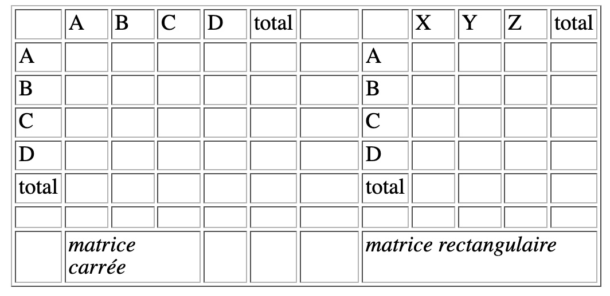{width=400}

   

Mais il peut également arriver que les flux étudiés concernent des matrices rectangulaire où lieux d’origine et de destination sont différents. C’est par exemple le cas lorsque l’on étudie les flux de marchandise des régions françaises vers les régions belges (sans étudier les relations intra-France ou intra-Belgique) ou bien lorsque l’on étudie les déplacements des étudiants depuis leur lieu de résidence (36000 communes) vers leur lieu d’étude (les sites universitaires).
         

- **N.B.** La distinction matrice carrée / matrice rectangulaire a donc trait non pas au nombre de lignes et de colonnes (il peut arriver qu’une matrice " rectangulaire " comporte le même nombre de lieux d’origine et de destination) mais à l’équivalence ou non des deux listes de lieux d’origine et de destination.
         
         

Les deux types de matrices de flux soulèvent des problèmes d’interprétation et d’analyse de natures différentes. En effet, les matrices rectangulaire sont souvent associées à des problèmes d’allocation de ressources ou d’accessibilité tandis que les matrices carrés se rattachent plus directement à des problèmes d’interaction ou d’équilibre des échanges. Seules ces dernières seront considérées dans le cadre de ce travail.
         
       

### Diagonale vide ou diagonale pleine (matrices carrées)

Dans le cas des matrices carrés, il faut également opérer une distinction essentielle entre les matrices à diagonale pleines, pour lesquelles le flux d’une unité spatiale vers elle-même est définie et les matrices à diagonale vides pour lesquelles ce flux n’est pas défini.
         
      
         
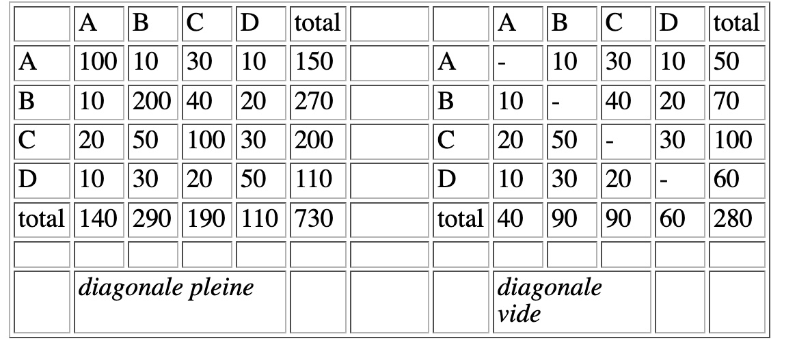{width=400}

     
         
    

Dans le cas d’une matrice d’échanges migratoires, par exemple, le fait de ne pas renseigner la diagonale signifie que l’on ne considère comme migrants que les individus ayant franchi les limites d’une maille territoriale. Ceci revient à dissocier la probabilité générale de migration en deux composantes indépendantes, le choix d’une destination à l’intérieur de sa propre maille territoriale et le choix d’une destination localisée dans une autre maille territoriale. Or, ce postulat d’indépendance entre les probabilités de migration intra-maille et inter-maille n’est généralement pas vérifié, les taux de migrations variant le plus souvent en fonction inverse de la population ou de la superficie des unités spatiales.
         

Pour autant, la prise en compte des migrations intra-maille (étude d’une matrice à diagonale pleine) soulève toute une série de difficultés tant sur le plan théorique que sur le plan statistique. La diagonale peut en effet correspondre soit à l’ensemble de la population demeurée dans la maille au cours de la période de temps étudiée, soit à la population ayant effectuée un déplacement à l’intérieur de la maille. Mais dans ce dernier cas, l’effectif de migrant dépend du choix d’un maillage interne dont la finesse va conditionner le nombre de migrant intra-maille (e.g. étude des migrations intra-régionales à l’aide d’un découpage départemental, cantonal, communal, domiciliaire, etc). D’un point de vue statistique, la prise en compte des flux intra-maille pose également problème dans la mesure où les distances internes sont généralement difficiles à évaluer et où les biais introduits par cette estimation imparfaite vont d’autant plus se répercuter sur l’ensemble du modèle que les effectifs des flux intra-maille sont généralement très supérieurs à ceux des flux inter-mailles. Seuls des modèles complexes, articulant plusieurs niveaux d’analyse permettent donc de traiter valablement le cas des matrices à diagonale pleine.
         
         

Dans le cadre de cette étude, on se limitera donc à l’étude des modèles d’interaction portant sur des matrices carrées à diagonale vide, tout en soulignant qu’il se fondent sur une hypothèse forte d’indépendance entre le choix des destinations intra-maille et inter-mailles.
         
         
         

### Agrégation ou désagrégation des flux en sous-populations

Qu’elles concernent des marchandises ou des individus, les matrices de flux ont souvent trait à des agrégats (de population, de marchandise) qui peuvent être segmentés en sous-populations (ce terme étant pris au sens statistique et non pas au sens démographique). En amont de toute modélisation de l’interaction spatiale, il faut donc se demander si l’hypothèse d’homogénéité du comportement de l’agrégat est valide et si, au contraire, il n’y aurait pas avantage à segmenter le modèle d’interaction spatiale en autant de sous-modèle qu’il y a de sous-populations.

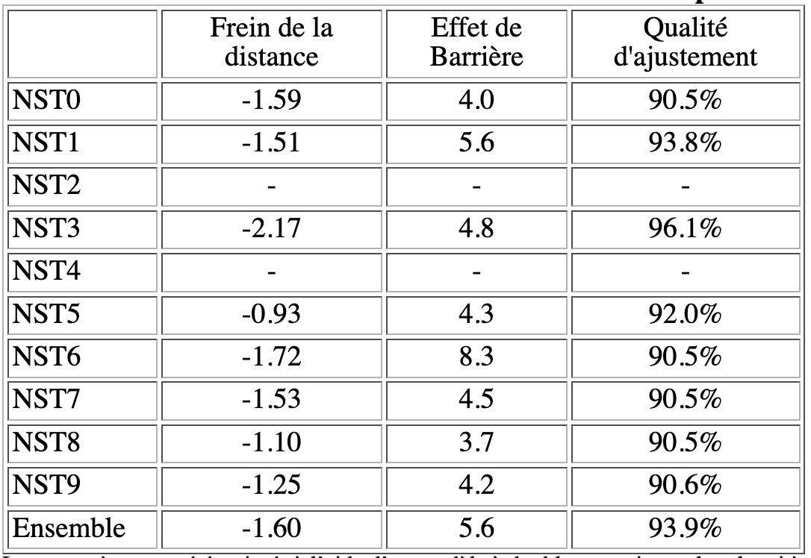{width=400}


>Les paramètres ont été estimés à l’aide d’un modèle à double contrainte selon  le critère de minimisation du Chi-2 (Source : Robert D., Sebire V., Grasland C., Calzada C., 1996)

         
         

Dans le cadre d’une étude sur les échanges de marchandises entre les régions de France et de Belgique en 1989, on a pu définir les valeurs moyennes du frein de la distance (-1.6 pour une fonction parétienne) et de l’effet de barrière subi au franchissement de la frontière (réduction relative des flux internationaux par 5.6, comparativement aux flux intra-nationaux). Mais ces deux paramètres obtenus tous types de marchandises confondus subissent des variations importantes lorsque l’on effectue les mêmes calculs par types de produits (NST), les produits pondéreux à faible valeur ajoutée subissant davantage le frein de la distance et l’effet de barrière que les produits à forte valeur ajoutée.
         


Le choix d’une modélisation agrégée ou désagrégée par sous-populations dépend fondamentalement des hypothèses faites sur la nature des flux étudiés et sur les relations d’indépendance ou au contraire de concurrence et de substitutions possibles entre les déplacements des différentes sous-population. En tous les cas, l’hypothèse de l’existence d’un comportement moyen indépendant de celui des sous-population doit dans tous les cas être discutée et critiquée lorsque l’information disponible le permet.

## Choix des facteurs d'émission (E) et de réception (R)
 

### Variables exogènes caractérisant les lieux d’émission et de réception

         
Les modèles d’interaction spatiale ayant une vocation prédictive privilégient comme facteur d’émission ou de réception des variables exogènes au modèle d’interaction spatiale, c’est-à-dire ne supposant pas une connaissance préalable de la matrice des flux. L’exemple le plus classique est celui de l’emploi de la population totale comme variable censée refléter les capacités d’émission et de réception des lieux dans les modèles d’interaction spatiale décrivant les flux migratoires entre des villes, des régions ou des pays.

On remarquera toutefois qu’il existe une dissymétrie entre les justification théoriques de l’emploi de la population comme mesure des capacités d’émission et de réception dans les modèles migratoires. En tant que capacité d’émission (facteur " push "), la population reflète le nombre d’individus soumis au risque de migrer, ce qui ne soulève pas de difficultés particulière, tout au moins dans les pays où la liberté de déplacement est garantie à tous les citoyens. Le choix de cette même population comme capacité de réception (facteur " pull ") est beaucoup moins évident puisque ce qu’il s’agit de déterminer est la capacité d’accueil des migrants qui dépend de nombreux facteurs (emplois disponibles, logements libres, image de marque, etc.). Ce n’est donc qu’au prix d’une hypothèse assez forte de proportionnalité entre les capacités d’accueil et la taille du lieu de destination que l’on peut utiliser la même variable comme facteur d’émission et de réception.

Cette dissymétrie saute davantage aux yeux lorsque l’on étudie un phénomène tel que les navettes domicile-travail. Il est alors évident que la capacité d’émission doit être définie comme la population active au lieu de résidence et la capacité de réception comme le nombre d’emploi disponibles, soit deux quantités de nature tout à fait différente.

Plus généralement, l’hypothèse de stricte proportionnalité entre les variables décrivant les capacités d’émission ou de réception des lieux et la quantité de flux qu’ils engendrent peut être soumise à critique et de nombreux modèles d’interaction spatiale préconisent l’emploi de paramètres d’élasticité (exposants variables) afin de tenir compte d’effets possibles de non linéarité. L’emploi de ces exposants n’est toutefois pleinement justifié que si les lieux émetteurs et récepteurs correspondent à des entités spatiales pertinentes pour lesquelles la taille peut être un facteur déterminant des capacités d’émission et de réception (villes, pays). Il est beaucoup plus discutable sur le plan théorique lorsque les entités spatiales sont un simple cadre arbitraire d’observation du phénomène (régions, unités de recensement).
         
         

Il existe une dissymétrie conceptuelle entre les variables susceptibles de refléter les capacités d’émission et de réception, leur identité constituant a priori un cas exceptionnel. L’hypothèse de proportionnalité entre ces variables et la quantité de flux générée n’est pas obligatoire et des exposants peuvent être introduits pour tenir compte d’effets de taille non linéaires.
         
         
         

### Variables endogènes définies par les sommes marginales de la matrice des flux

         

Les modèles d’interaction spatiale à vocation descriptive ou explicative recourent fréquemment aux sommes marginales de la matrice des flux pour définir les capacités d’émission et de réception des lieux. On note habituellement $O_i$ la somme des flux ayant pour origine le lieu i et $D_j$ la somme des flux ayant pour destination le lieu j.
         
$O_i = \sum_j F_{ij}$

$D_j = \sum_i F_{ij}$

         

Les vecteurs $O$ et $D$ correspondent alors à des variables endogènes du modèle puisqu’ils supposent une connaissance au moins partielle de la matrice des flux. De tels modèles ne permettent donc pas directement de prévoir l’évolution globale des échanges, mais autorisent une reconstitution conditionnelles des échanges entre les lieux (affectation des flux entre les couples origine-destination), une fois connus ou estimés les facteurs de génération des échanges. En d’autres termes, les modèles d’interaction spatiale utilisant les sommes marginales des flux comme capacité d’émission et de réception ne constituent qu’un sous-modèle dans une démarche prédictive et ils imposent le recours à d’autres sous-modèles préalables pour estimer l’évolution des capacités marginales d’émission et de réception au cours du temps.

En règle générale, l’introduction des sommes marginales dans un modèle d’interaction spatiale se traduit par l’apparition de contraintes de conservation des flux portant sur les origines, les destinations ou les deux à la fois . Dans ce cas, l’ajout d’autres variables exogènes est le plus souvent superflu, leurs effets étant absorbé par les contraintes de conservation du modèle.
         

Les modèles d’interaction spatiale utilisant les sommes marginales de la matrice des flux comme capacités d’émission et de réception des lieux correspondent à une classe particulière de modèles dont la vocation est davantage descriptive et explicative que prédictive. Ils peuvent toutefois faire partie d’une chaîne de modèle prédictifs, à condition que l’évolution des sommes marginales au cours du temps soient elles-mêmes estimées à l’aide de variables exogènes.
         
         

### Variables d’environnement (opportunités intermédiaires et opportunités groupées)
     
Le fait de ne prendre en compte que les caractéristiques de site dans la définition des capacités d’émission et de réception des lieux a été critiqué par de nombreux auteurs qui proposent d’introduire dans les modèles d’interaction spatiale des variables d’environnement ayant trait à la situation des lieux. En effet, la quantité de flux émis par un lieu i vers un lieu j dépend non seulement des caractéristiques propres de ces deux lieux, mais également de l’influence d’autres lieux k, l, m … susceptibles d’attirer les flux en provenance du lieu i ou de saturer les opportunités d’accueil du lieu j. Ces phénomènes d’interaction systémique peuvent être pris en charge par la forme du modèle (introduction de contraintes) mais ils peuvent également être introduits sous la forme de variables spécifiques d’environnement.

Le sociologue S. Stouffer (1940) a par exemple montré que la décroissance des flux en fonction de la distance pourrait être interprété comme l’effet de la présence d’**opportunités interposées**, que l’on peut modéliser à l’aide d’un processus d’examen séquentiel d’examen des destinations possibles classées par distance croissante. Dans ce cas, l’effet de la distance ne correspond pas à un effet mécanique (continu) mais à un modèle de choix discret de nature séquentielle (ordinal). A titre d’exemple, deux individus physiquement éloignés mais séparés par un désert auront selon Stouffer plus de chance d’entrer en relation que deux individus physiquement proches mais séparés par une zone densément peuplé. Il conviendrait donc de substituer aux mesures habituelles de distance une mesure du nombre d’opportunités interposées, censées mieux décrire le comportement migratoire.

La théorie des opportunités groupées de A.S. Fotheringham (Fotheringham & O Kelly, 1989, Stilwell & Congdom, Chap. 4, 1991) part de prémices similaires et aboutit à une conclusion de portée plus générale sur les effets de l’agrégation et de l’autocorrélation spatiale.


         
         
Supposons qu'un migrant localisé en i se trouve à la même distance d’opportunités 1..7 de poids équivalent. Il a a priori autant de chance de choisir l’une ou l’autre de ces destinations. Mais si les opportunités 4 à 7 sont spatialement proches et forment un cluster, cela peut contribuer à les rendre plus attractives (effet d’agglomération) ou moins attractives (effet de compétition). L’introduction de variables d’environnement décrivant la situation relative d’un lieux permet précisément de mesurer ces effets et de déterminer dans quels sens ils influent sur la distribution des flux.
         
         

- **N.B.** On considère de plus en plus que la définition des capacités d’émission et de réception des lieux ne doit pas se limiter aux caractéristiques de site mais peut également prendre en compte des effets de situation. De nouvelles formulations des modèles d’interaction spatiale permettent de prendre en compte ces effets systémiques, soit par l’ajout de contrainte, soit par l’introduction de nouvelles variables d’éloignement (Stouffer), d’émission ou de réception (Fotheringham)


     
## Choix des facteurs d'éloignement (D)

Le choix d’une (ou de plusieurs) matrices d’éloignement constitue probablement l’étape la plus importante dans la formalisation d’un modèle d’interaction spatiale. C’est en effet l’introduction d’un facteur d’éloignement spatial ou territorial dans l’explication et la modélisation des échanges qui constituent l’apport décisif de ce type de modèles par rapport à des approches de type économique (flux de marchandises) ou sociologiques (déplacement de personnes).qui vont privilégier d’autres déterminants de l’interaction (complémentarité, identité, concurrence, etc.). On observera toutefois que, d’un strict point de vue mathématiques, il n’y a pas de différence véritable entre les mesures de proximité spatiale et les mesures de proximité sociale ou de complémentarité économique. Des modèles d’interaction complexe peuvent donc tout à fait combiner des métriques relevant de champs disciplinaires différents, lorsque la nature du phénomène le justifie.

Même en s’en tenant provisoirement aux mesures de proximité spatiale, il faut insister sur la diversité des solutions possibles pour mesurer l’éloignement de deux lieux et sur les conséquences du choix d’une métrique plutôt que d’une autre en terme de performance des modèles (qualité d’ajustement) et de signification des résultats obtenus.

Comme il est difficile de brosser un portrait exhaustif des solutions possibles (le choix de la métrique dépendant de la nature du phénomène étudié) on se bornera à évoquer sur un exemple précis, celui des migrations en Tchécoslovaquie, la diversité des choix qui peuvent se présenter.
     
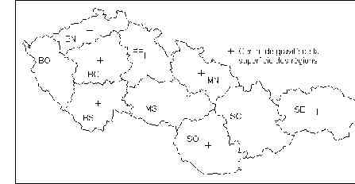{width=400}    
  


     
     

### distance entre centres représentatifs des unités spatiales

On peut tout d’abord observer que le problème de la mesure des distances entre les unités spatiales se posent de façon très différentes selon que l’on a affaire à des unités spatiales de type ponctuelles (assimilable à des points à un certain niveau d’observation) telles que les villes ou selon que l’on a affaire à des unités aréales (issues d’une partition exhaustive de l’espace par un maillage) telles que des régions ou des Etats. Dans le premier cas, l’erreur commise en assimilant l’ensemble des individus contenus dans l’unité spatiale à un point représentatif est négligeable alors que dans le second on doit considérer que la mesure d’éloignement entre les deux régions est une valeur moyenne qui peut avoir une variance assez forte.

        Dans le cas des migrations tchécoslovaques, les individus qui partent d’une région vers une autre peuvent théoriquement partir de n’importe quel point de la première et arriver en n’importe quel point de la seconde. Une première solution pour mesurer la distance entre deux régions consiste à assimiler chaque population régionale à une masse unique localisée au centre géométrique des polygones définissant les régions et à calculer la distance euclidienne entre ces centres géométriques (Tableau 3) Cette méthode présente l’avantage de ne nécessiter aucune information autre que le contour des unités territoriales.

        Si l’information le permet, on pourrait substituer au centre géométrique de la superficie un point jugé plus représentatif tel que le chef-lieu de la région ou la localisation de la ville la plus importante.

        On pourrait également utiliser le centre de gravité de la population plutôt que celui de la superficie, afin de tenir compte de l’inégal répartition de la population à l’intérieur des régions et du caractère éventuellement excentré du chef-lieu. Mais ceci implique que l’on connaisse la distribution de la population à un niveau plus fin que celui des régions (par exemple celui des 114 districts dans le cas tchécoslovaque). Or, si tel est le cas, il vaut mieux abandonner la méthode centroïde et recourir à une mesure plus précise de la distribution des distances entre les habitants.
         

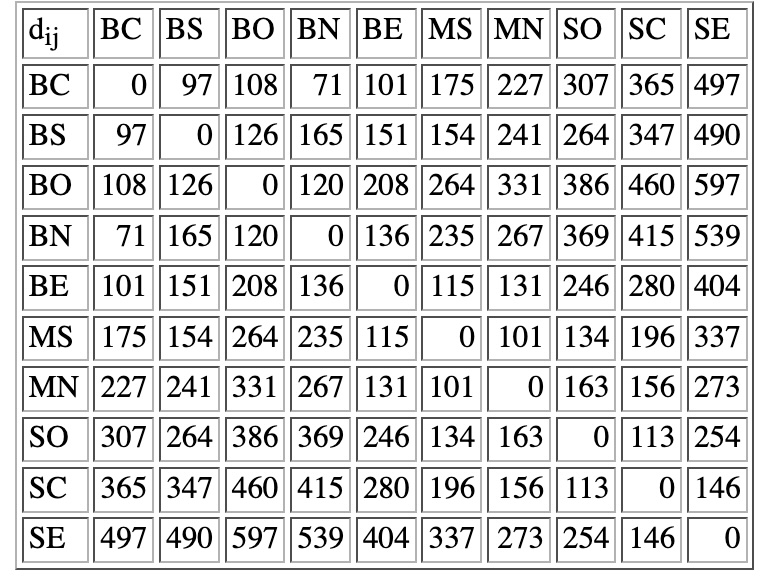{width=400}
      

### distance moyenne entre les populations

         
La distance moyenne entre les habitants de deux régions peut en effet être estimée à l’aide d’une moyenne pondérée des distances entre unités de taille inférieures qui composent les régions. Ainsi, si une région A se compose de n districts $1..i..n$ et une région B de m districts $1..j..m$, la distance moyenne entre les habitants des régions A et B peut être estimée par la formule suivante :

$d(A,B) = \frac{\sum_{i \in{A}} \sum_{j \in{B}} P_i.P_j.d_{ij}}{\sum_{i \in{A}} \sum_{j \in{B}} P_i.P_j}$
         


La précision sera d’autant plus grande que les unités servant de base au calcul sont de petite taille. Dans le Tableau suivant on a utilisé la distribution de la population des 114 districts en 1989 pour estimer la distance moyenne entre les habitants des 10 régions. Des différences significatives apparaissent entre cette distance et la précédente. Ainsi, la distance moyenne entre les habitants de Bohême-centre et de Bohême-nord est de 86 km alors que la distance entre leurs centres de gravité n’était que de 71 km (-17%). L’écart s’explique par l’allongement de la région de Bohême-nord. Inversement la distance moyenne entre les populations de Moravie-Nord et de Slovaquie-Centre est de 123 km alors que la distance entre les centres géométriques des deux régions est de 156 km (+26%). L’erreur est cette fois-ci imputable à la localisation de la population de Moravie-Nord dont le centre de gravité est situé beaucoup plus au nord-est que le centre géométrique de la région. A partir de la même information (distance entre les districts qui composent les régions), on pourrait également calculer une distance minimum, une distance maximum, une distance médiane, etc.
         
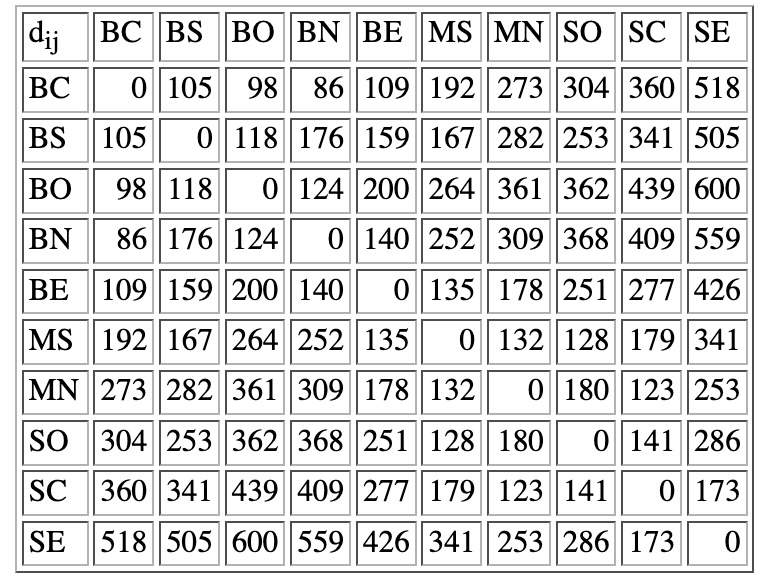{width=400}
     

### Distance topologique entre les mailles (k-contiguïté)

         
La distance topologique de plus court chemin se fonde sur l’examen du graphe de contiguïté des régions. Deux régions sont situées à une distance topologique de 1 si elles ont une limite administrative commune. Elles sont situées à une distance topologique de 2 si il faut traverser au moins deux limites administratives pour aller de l’une à l’autre, etc. Différentes formules mathématiques permettent de calculer l’ensemble des distances topologiques de plus court chemin à partir du relevé de la simple matrice des contiguïtés d’ordre 1 . Dans le cas de la Tchécoslovaquie l’analyse des contiguïtés permet de calculer la matrice de distance topologique de plus court chemin présentée dans le Tableau 5. La valeur maximale est de 4 (distance entre la Slovaquie orientale et les régions de Bohême-centre, Bohême-ouest ou Bohême-nord).


{width=400}


       

De prime abord, une métrique topologique semble moins intéressante qu’une métrique continue et paraît soumis à toute une série de biais (imprécision, forme des unités territoriales pouvant introduire des raccordements sur quelques kilomètres de frontière) mais l’expérience montre qu’elle donne souvent des résultats équivalents voire supérieurs à ceux des métriques euclidiennes (en terme de qualité d’ajustement des flux migratoires). Ce résultat étonnant semble lié au fait que les maillages territoriaux ne sont généralement pas des constructions arbitraires et qu’ils possèdent des propriétés démographiques (variation de la superficie en fonction de la densité), sociologiques (cohésion sociale) et économiques (cohérence du système productif) qui peuvent en faire de bons marqueurs des proximités territoriales entre les lieux. Il est donc souvent intéressant de confronter leurs résultats à ceux des métriques euclidiennes, voire de combiner les deux à l’intérieur d’un même modèle.
         
         

### Transformation ordinale d’une métrique continue
     

On peut déduire toute une série d’autres mesures de distances à partir des précédentes. Ainsi, la distance euclidienne entre les centres géométrique des régions peut-être transformée en distance ordinale. Pour chaque région, on remplace la distance aux autres régions par un rang, calculé en fonction de l’ordre des distances aux autres régions. Cette matrice présente toutefois le défaut d’être dissymétrique. Ainsi, la région la plus proche de la Bohême-Sud est la Bohême-Centre ($d_{ij}=1$) alors que, en sens inverse, la région la plus proche de la Bohême-Centre est la Bohême-Nord et que la Bohême-Sud n’arrive qu’en deuxième position ($d_{ij}=2$). Si l’on veut conserver à la distance sa propriété de symétrie, on effectuera la moyenne des rangs dans les deux directions, ce qui donne une distance ordinale symétrique. On pourrait naturellement calculer la distance ordinale symétrique à partir d’une autre matrice initiale de distance kilométrique.

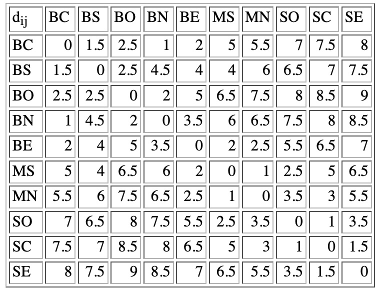{width=400}


L’intérêt théorique de la distance ordinale, symétrique ou non, est de restituer, dans une certaine mesure, les hypothèses de Stouffer sur le rôle des opportunités intermédiaires dans la décroissance des flux avec la distance. En effet, cette métrique définit l’éloignement de deux régions non pas de façon absolue mais de façon relative, tenant compte de la position des autres régions, plus proches ou plus éloignées. Elle ne restitue toutefois que très partiellement les hypothèses de Stouffer puisqu’elle ne prend pas en compte la population des régions dans le calcul des éloignements relatifs.

## Choix de la fonction de décroissance des interactions en fonction de la distance f(D)


### Fonction exponentielle et fonction puissance (Paréto)

         
Le choix d’une mesure d’éloignement (que l’on appellera distance par commodité d’écriture) ne préjuge pas de la forme de son effet sur les interactions. Inspirés d’analogies avec la physique newtownienne (modèle gravitaire) ou l’électricité (potentiel), les premiers modèles d’interaction spatiale utilisaient essentiellement des fonctions puissance négative à exposant entier, la décroissance des flux avec la distance étant censée obéir à une loi de type $1/d_{ij}$ ou $1/d_{ij}^2$. Il est toutefois rapidement apparu aux observateurs des phénomènes d’interaction que les paramètres empiriques optimaux pouvaient prendre des valeurs non entières et qu’il n’y avait pas de raisons théoriques justifiant une stricte analogie entre les phénomènes physiques et les phénomènes sociaux ou économiques. On a donc proposé d’utiliser des fonctions paramétriques de décroissance des interactions avec la distance, les deux plus fréquentes étant la fonction puissance négative (dite aussi de Paréto) et la fonction exponentielle négative.

- $I_{ij} = exp(-\alpha.d_{ij})$ : fonction d’interaction spatiale exponentielle

- $I_{ij} = d_{ij}^{-\alpha}$ : fonction d’interaction spatiale puissance (parétienne)

Le paramètre $\alpha$ , généralement appelé frein de la distance, n’est pas fixé a priori et est estimée empiriquement de manière à maximiser la qualité de l’ajustement (modèle gravitaire) ou à assurer une contrainte de conservation du coût total de déplacement à l’intérieur du système (modèle de Wilson).

Ces modèles sont au demeurant formellement identiques puisque, si l’on remplace la distance par son logaritme, le modèle de Paréto correspond à un modèle exponentiel . Inversement, le modèle exponentiel correspond à un modèle de Paréto si l’on remplace la distance par son exponentielle.On peut donc passer du modèle exponentiel au modèle puissance par une simple transformation (exponentielle ou logarithmique) de la matrice de distance, c’est-à-dire par l’introduction d’une hypothèse sur le rôle additif ou multiplicatif de la distance sur la décroissance des probabilités de relation entre les migrants. Les études empiriques sur les migrations de population montrent que, d’une manière générale, le modèle exponentiel décrit mieux le comportement des migrants à longue distance, tandis que le modèle puissance décrit mieux le comportement des migrants à longue distance. De ce fait, certains auteurs préconisent d’effectuer la moyenne des deux modèles après estimation séparée (Poulain M., 1981).
         

Au total, s’il semble exister un consensus pour utiliser des fonctions d’interaction spatiale à paramètres variables plutôt qu’à valeurs fixes, le choix d’une forme parétienne ou d’une forme exponentielle demeure un objet de débat. De nombreux auteurs considèrent toutefois qu’il s’agit d’un faux problème et qu’il faut utiliser le modèle fournissant la meilleur description de la situation observée.
         
         

### Influence du choix du facteur d’éloignement et de la forme de la fonction d’interaction spatiale sur les résultats.

         
Pour illustrer l’influence du choix de la distance et de la fonction d’interaction spatiale sur les résultats de la modélisation, nous avons appliqué les quatre distances définies précédemment et les deux fonctions d’interaction spatiale (exponentielle et Paréto) à l’exemple des migrations entre les 10 régions de Tchécoslovaquie en 1961-1965. Dans chaque cas, l’ajustement a été effectué à l’aide d’un modèle d’interaction spatiale multiplicatif à double contrainte et le paramètre de frein de la distance retenu est celui qui correspond à la qualité d’ajustement la meilleure pour le critère de minimisation du chi-deux.
         
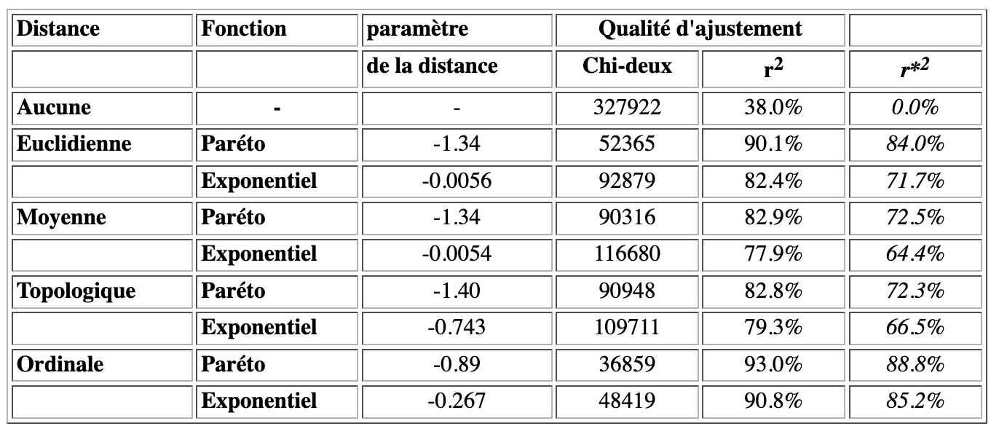{width=700}
       

Le calcul du modèle aléatoire (double contrainte sans effet de la distance) montre que les différences de capacité d’émission et de réception des régions expliquent à elle seules 38% des écarts au modèle de répartition homogène des flux. Quelles que soient la distance ou la fonction d’interaction spatiale retenue, l’introduction d’une fonction d’interaction spatiale permet d’améliorer considérablement la qualité d’ajustement ($r^2 > 75\%$). Dans tous les cas, l’utilisation de la fonction puissance donne des résultats meilleurs que la fonction exponentielle, ce qui est conforme aux résultats empiriques obtenus par d’autres auteurs sur les migrations à moyenne et longue distance.

On aurait cependant tord de considérer que la qualité d’ajustement suffit à trancher entre plusieurs hypothèses de modélisation (choix des distances et de la forme de la fonction d’interaction). Dans l’exemple tchécoslovaque, il existe en effet un facteur latent (effet de barrière migratoire entre les régions des deux républiques tchèques et slovaques) qui est mieux pris en charge par certaines métriques que part d’autres, mais moins en raison de leur qualité intrinsèque qu’en raison précisément de leurs défauts et des déformations qu’elles imposent par rapport aux distances réelles entre les habitants. Le fait que la distance euclidienne entre centre géométrique décrivent mieux les flux que la distance moyenne entre habitant n’a pas d’autre explication et son emploi dans le cadre d’un modèle d’interaction spatiale enrichi conduirait à sous-estimer la valeur de l’effet de barrière entre les deux républiques.
         
         

### Autres fonctions d’interaction spatiale
     
Si la plupart des phénomènes d’interaction spatiale peuvent être correctement décrit à l’aides des familles de fonction parétienne et exponentielle, il peut arriver que l’on soit amener à recourir à des formes plus complexes. Ainsi, lorsque l’on étudie l’intensité des relations aériennes entre les villes françaises ou européennes, on n’observe pas une fonction monotone de décroissance des relations avec la distance en raison de la concurrence du rail et de la route pour les déplacements à courte et moyenne distance. Il est alors nécessaire d’utiliser une fonction d’interaction spatiale plus complexe qui va croître de 0 à 500-1000 kilomètres puis décroître plus ou moins régulièrement.

D’une manière générale, on peut proposer une généralisation des fonctions parétiennes et exponentielles à l’aide de modèles polynomiaux utilisant soit la distance (modèles exponentiel) soit le logarithme de celle-ci (modèles parétiens).


- $I_{ij} = exp[a_0 + a_1.d_{ij} + a_2.d_{ij}^2+ ... + a_n.d_{ij}^n]$ (fonction exponentielle généralisée)

- $I_{ij} = exp[a_0 + a_1.log(d_{ij}) + a_2.log(d_{ij})^2+ ... + a_n.log(d_{ij})^n]$ (fonction puissance géénralisée)


On peut également combiner les deux formes de modèles dans des fonction paréto-exponentielles qui sont en fait l’expression de polynômes combinant distance et logarithmes de la distance dans une fonction complexe … On ne doit pas perdre de vue que les modèles les plus utiles à l’analyse sont ceux qui comportent un nombre limité de paramètres interprétables et comparables. L’emploi d’une fonction d’interaction spatiale complexe (comportant plusieurs paramètres) n’est donc justifié que si la nature des données empiriques le justifie.

## Choix de la forme générale du modèle et des contraintes

En se limitant au cas simple où l’on se propose de mettre en relation une matrice de flux homogène avec un unique facteur d’émission, un unique facteur de réception et un unique facteur d’éloignement, on peut définir trois grandes familles de modèles (sans contraintes, à simple contrainte, à double contrainte) et deux cas particuliers (modèles de Wilson et Tobler).

### Modèle multiplicatif sans contrainte (gravitaire)

         
Les modèles d’interaction spatiale gravitaire correspondent à une classe particulière de modèles multiplicatifs que l’on désigne abusivement sous l’appellation de modèles sans contrainte (unconstrained models) mais qui incorporent en fait le plus souvent une hypothèse de conservation du total général des flux. L’hypothèse générale des modèles de ce type est l’existence d’une relation multiplicative entre les différents facteurs décrivant les capacités d’émission ou de réception des lieux et leur degré d’éloignement. Soit un modèle du type :
         

**Modèle multiplicatif "sans contrainte "(conservation du total général)**

$F^*_{ij} = k. f_1(E_i) . f_2(R_j) . f_3(d_{ij})$

avec

$k = \frac{\sum_i\sum_j F_{ij} }{\sum_i\sum_j f_1(E_i) . f_2(R_j) . f_3(d_{ij}}$

Le paramètre k assure la conservation du total général des flux en imposant que la somme des flux observés ($F$) soit égale à la somme des flux estimés ($F^*$). Différentes formulations peuvent être proposées selon les hypothèses faites sur les fonctions décrivant l’effet des facteurs d’émission, de réception et d’éloignement. On peut distinguer des modèles gravitaires simples ne comportant qu’un seul paramètre (frein de la distance) et des modèles gravitaires enrichis comportant autant paramètres qu’il y a de facteurs explicatifs (frein de la distance, capacités d’émission, capacités de réception).
         

- **Modèle gravitaire simple - Puissance**

$F^*_{ij} = k. E_i . R_j . d_{ij}^{-\alpha}$                                       

- **Modèle gravitaire simple - Exponentiel**

$F^*_{ij} = k. E_i . R_j . exp( -\alpha.d_{ij})$  
               

- **Modèle gravitaire enrichi - Puissance**

$F^*_{ij} = k. (E_i)^{\beta_1} . (R_j)^{\beta_2} . d_{ij}^{-\alpha}$                                       

- **Modèle gravitaire enrichi - Exponentiel**

$F^*_{ij} = k. (E_i)^{\beta_1} . (R_j)^{\beta_2} . exp( -\alpha.d_{ij})$  


Toutes une série de variantes peuvent être introduites selon le degré de complexité introduit dans les fonctions f1, f2, f3 (nombre de paramètres, forme) et selon le nombre de variables introduites dans chaque sous-ensemble explicatif (émission, réception éloignement).
         

Il n’en demeure pas moins que la caractéristique essentielle de ce type de modèle est de ne faire dépendre l’intensité des flux entre deux lieux que de leurs caractéristiques propres et de ne pas prendre en compte l’influence potentielle des autres lieux et les effets systémiques qui y sont associés.
         
         

### Modèles multiplicatifs à simple contrainte

         
Les modèles à simple contrainte introduisent une contrainte de conservation des sommes marginales de la matrice des flux qui porte soit sur les flux émis (contrainte de conservation des origines), soit sur les flux reçus (contrainte de conservation des destinations) par chaque lieu. Dans la pratique, ceci revient à supposer connu les sommes originales O ou D et à les utiliser en lieu et place des facteurs d’émission E ou de réception R. Un vecteur de paramètre $a_1..a_n$ (origines) ou $b_1…b_n$ (destinations) permet alors d’assurer la contrainte de conservation des sommes marginales. La forme générale des modèles à simple contrainte est donc la suivante :
         
         

-**Modèle multiplicatif à simple contrainte de conservation des origines**

$F^*_{ij} = a_i . O_i . f_2(R_j) . f_3(d_{ij})$ 

avec

$a_i = \frac{1}{\sum_j f_2(R_j) . f_3(d_{ij})}$

-**Modèle multiplicatif à simple contrainte de conservation des destinations**

$F^*_{ij} = b_j . D_j . f_1(E_i) . f_3(d_{ij})$ 

avec

$a_i = \frac{1}{\sum_i  f_1(E_i) . f_3(d_{ij})}$


Les modèles à simple contrainte sont les plus utilisés dans les études opérationnelles car ils permettent de modéliser plus précisément les interactions que les modèles sans contraintes, sans pour autant nécessiter une information aussi complète que les modèles à double contrainte. Malgré la symétrie apparente des deux variantes, il existe des différences importantes dans les hypothèses sous-jacentes à ces deux modèles ainsi que dans leurs domaines d’application. Les anglo-saxons les distinguent d’ailleurs sous les appellations de " production-constrained models" et " attraction-constrained models ". (Voir par exemple, Fotheringham & O’Kelly, 1989).

De loin les plus utilisés en recherche opérationnelle (planification urbaine, géomarketing, transports, …), les modèles à simple contrainte sont considérés par de nombreux auteurs comme les plus intéressants en terme de qualité et de quantité d’information restituée. Le choix d’une contrainte portant sur les origines ou sur les destinations n’est pas indifférent : il dépend étroitement de la problématique et de l’information disponible.
         
         

### modèle multiplicatif à double contrainte (conservation des origines ou des destinations)

         
Les modèles à double contrainte assurent la conservation simultanée des sommes en lignes et des sommes en colonnes de la matrice des flux. Supposant connue ces sommes en ligne et en colonnes, ils excluent de ce fait la présence de tout autre facteur décrivant les capacités d’émission et de réception des lieux, puisque l’effet de ces derniers serait absorbé par les vecteurs de paramètres a et b qui assurent le respect des contraintes. Estimés de façon itérative (à une constante près) ces vecteurs de paramètres ne peuvent être obtenus de façon analytique et le temps de calcul nécessaire à l’ajustement de modèle à double contrainte est généralement beaucoup plus élevé que pour les modèles sans contraintes ou les modèles à simple contrainte.
         

- **Modèle multiplicatif à double contrainte de conservation des origines et destinations**
        
$F^*_{ij} = a_i . O_i . b_j . D_j . f_3(d_{ij})$ 

avec

$a_i = \frac{1}{\sum_j b_j . D_j . f_3(d_{ij})}$

et

$b_j = \frac{1}{\sum_i a_i . O_i . f_3(d_{ij})}$

les deux vecteurs de paramètres étant estimés de façon itérative à une constante près.

Bien qu’ils fournissent en général des ajustements de qualité sensiblement supérieure aux modèles sans contraintes ou aux modèles à simple contrainte, les modèles à double contrainte n’ont en général pas vocation à servir directement d’outil de prévision ou de planification puisqu’ils supposent connu une quantité d’information beaucoup plus élevée que les précédents (la qualité d’ajustement ne faisant que traduire mécaniquement le poids plus important des variables endogènes dans ce type de modèle).
         
L’intérêt principal des modèles à double contrainte est l’étude des déterminants de l’interaction spatiale proprement dite, c’est-à-dire du choix des destinations toutes choses égales quant aux capacités d’émission et de réception des lieux. Prenant en compte des effets systémiques (par exemple, le fait que les migrants localisés dans des zones périphériques peuvent être amenés à parcourir en moyenne des distances plus importantes que des migrants localisés dans les zones centrales), ces modèles sont particulièrement utiles lorsque l’on cherche à mettre en évidence l’effet de déterminants spatiaux multiples affectant à des degrés divers le choix des migrants. Nous verrons en particulier dans la seconde partie de ce travail qu’ils permettent de mettre à jour l’existence d’interaction entre des facteurs quantitatifs (distance) et qualitatifs (appartenance territoriale) de localisation géographique.
         
         

### Le modèle entropique de Wilson

         
Sans entrer dans les détails de ses présupposés théoriques (entropie), on peut dire que le modèle de Wilson (1967) est une variante des modèles d’interaction spatiale multiplicatifs à double contrainte où la fonction d’interaction spatiale est de type exponentiel et où la valeur du paramètre de frein de la distance est déterminé par l’introduction d’une contrainte supplémentaire de conservation de l’énergie disponible à l’intérieur du système.
         

- **Modèle multiplicatif à double contrainte de Wilson**

$F^*_{ij} = a_i . O_i . b_j . D_j . exp(-\alpha . d_{ij})$ 

avec

$a_i = \frac{1}{\sum_j b_j . D_j . exp(-\alpha . d_{ij})}$

et

$b_j = \frac{1}{\sum_i a_i . O_i . exp(-\alpha . d_{ij})}$

les deux vecteurs de paramètres étant estimés de façon itérative à une constante près)

*$\alpha$ est la valeur (unique) du frein de la distance assurant la conservation du coût total de déplacement C définie par :

$C = \sum_i \sum_j  (F_{ij} . d_{ij}) = \sum_i \sum_j  (F_{ij}^* . d_{ij})$
         

L’importance du modèle de Wilson tient moins à ses caractéristiques propres (on peut considérer qu’il s’agit d’un cas particulier de modèle multiplicatif à double contrainte) qu’aux recherches qu’il a suscité et aux fondements théoriques proposés par l’auteur pour lier les états macroscopiques et microscopiques d’un système d’interaction. La discussion de ces questions dépassant toutefois le cadre de cet exposé, nous n’y entrerons pas et renvoyons le lecteur aux très nombreux travaux qui ont été consacrés au modèles de Wilson (voir en particulier la synthèse de Senior, 1979).
         
         

### Le modèle additif de Tobler
     
Bien qu’il ait suscité peu de recherches, le modèle proposé par W. Tobler est probablement d’une importance théorique aussi grande, si ce n’est plus grande que celui de Wilson. Modèle à double contrainte utilisant une fonction parétienne d’exposant fixe ($1/d_{ij}$), le modèle de Tobler présente la particularité d’utiliser une formulation additive dans la définition de la relation entre les facteurs " push " et les facteurs " pull ".
         
        
- ***Modèle additif à double contrainte de Tobler (version originale)**

$F_{ij}^* = \frac{(A_i + B_j)}{d_{ij}}$

avec

A et B, deux vecteurs de paramètres estimés à une constante près et assurant la conservation de la somme des flux émis et reçus par chaque unité territoriale et décrivant respectivement les facteurs " push " et " pull ".

         

Cette différence en apparence minime (choix d’une forme additive plutôt que multiplicative) a en fait des conséquences théoriques très profondes qui ont été discutés de façon détaillées par Dorigo & Tobler (1983) et qui donnent au modèle de Tobler des propriétés remarquables, notamment en ce qui concerne la question de la désagrégation des matrices de flux en unité spatiales de tailles de plus en plus réduites et l’établissement de représentations cartographiques des champs de transfert (analyse de la composante dissymétrique des flux).

Malheureusement ce modèle demeure à ce jour peu étudié et la plupart des auteurs de manuel sur l’interaction spatiale se contentent d’un coup de chapeau rituel aux qualités intrinsèques du modèle de Tobler, sans chercher véritablement à en approfondir les hypothèses et à les confronter à celles des modèles d’interaction de type multiplicatif.

## Choix du critère d'ajustement et détermination des paramètres à estimer

En se limitant au cas simple où le modèle comporte un seul paramètre à estimer (le frein de la distance ou de la fonction de côut généralisé), nous allons discuter quelques solutions proposés pour déterminer la valeur optimale du paramètre et mesurer la qualité d'ajustement globale d'un modèle d'interaction spatiale

### Les solutions statistiques classiques fondées sur la linéarisation

Les solutions statistiques classiques au problème de l'ajustement consistent à se ramener à un problème d'ajustement linéaire ou non-linéaire fondé sur le critère des moindres carrés.

Si l'on prend l'exemple du modèle multiplicatif sans contrainte dans sa variante gravitaire enrichie  on voit que la transformation logarithmique permet d'écrire l'équation sous la forme d'un modèle de régression linéaire :

- **forme exponentielle**

$log(F^*_{ij})= log(k) + \beta_1.log(E_i ) + \beta_2.log(R_j) + \alpha .(d_{ij})$   
       
- **forme puissance**     

$log(F^*_{ij})= log(k) + \beta_1.log(E_i ) + \beta_2.log(R_j) + \alpha .log(d_{ij})$  
  
Le critère de minimisation (implicite) est alors la somme des différences élevées au carré entre les logarithmes des flux observés et des flux estimés, la qualité de l'ajustement étant mesurée par le coefficient de détermination de la régression multiple. Si l'on souhaite utiliser un modèle gravitaire simple (sans exposant sur les facteurs d'émission et de réception, on peut également utiliser une autre transformation qui amène à une équation de régression simple :

- **forme exponentielle**

$log(\frac{F_{ij}}{E_i . R_j})^*= log(k) + \alpha .d_{ij}$   
       
- **forme puissance** 

$log(\frac{F_{ij}}{E_i . R_j})^*= log(k) + \alpha .log(d_{ij})$   

Le critère de minimisation est alors différent puisqu'il s'agit de la minimisation non plus du logarithme des flux mais du logarithme de l'intensité des flux (définie comme le rapport entre le flux observé et le produit des capacités d'émission et de réception).

Ces deux solutions ont l'avantage d'une très grande simplicité de mise en oeuvre et autorisent toute une série d'enrichissements du modèle (il est fracile d'introduire plusieurs facteurs explicatifs d'émission, de réception ou d'éloignement si leurs effets sont supposés multiplicatifs), mais elles achoppent sur plusieurs difficultés pratiques et théoriques qui conduisent actuellement à leur abandon par la plupart des spécialistes des modèles d'interaction spatiale :

1. Les flux nuls ne peuvent pas être introduits dans des modèles de ce type (le logarithme de 0 n'étant pas défini) et il faut opter pour une solution arbitraire consistant soit à les retirer de l'analyse, soit à leur donner une valeur minimum.

2. La contrainte de conservation du total des flux n'est plus assurée par le paramètre k (puisque la minismisation se fait sur le logarithme des flux ou de leur intensité et non pas sur les flux eux-mêmes) ce qui oblige à une correction ex post du modèle et qui introduit une nouvelle forme d'arbitraire.

3. La minimisation sur le logarithme des flux (ou de leur intensité) conduit à accorder une importance considérable aux petits flux dans l'ajustement du modèle, alors que les flux de faibles intensité sont ceux pour lesquels l'incertitude de mesure est la plus forte. On risque alors d'obtenir une mauvaise estimation des flux les plus importants (ce qui est gênant dans le cadre d'un modèle de prévision) et de subir des biais liés à la présence de points-individus exceptionnels (sans parler des problèmes d'autocorrélation et d'hétéroscédasticité des résidus).

4. les modèles de régression logarithmique ne sont applicables facilement qu'au cas des modèles sans containte mais ils sont beaucoup plus difficile à mettre en oeuvre pour la réalisation de modèles à simple ou double contraintes.

Au total, les ajustements par régression log-linéaire constituent aujourd'hui une étape dépassée et des méthodes équivalentes mais beaucoup plus puissantes (régression poissonnienne) constitue des alternatives beaucoup plus puissantes et tout aussi faciles d'emploi.
         

### L'approche heuristique de M. Poulain (critère du Chi-2)

Bien qu'elle soit davantage heuristique que statistique, l'approche suggérée par M. Poulain au début des années 1980 a constitué une étape importante et toujours d'actualité dans les recherches sur l'ajustement des modèles d'interaction spatiale.

Partant d'une observation empirique sur les mouvements migratoires en Belgique, M. Poulain avait constaté qu'il était possible d'estimer l'ordre de grandeur de l'incertitude de mesure des flux migratoires en comparant deux sources différentes : celle fournie par le lieu de destination et celle fournie par le lieu d'origine des migrants. La Belgique est en effet un pays doté d'un registre de migration, de sorte que tout déplacement est enregistré à la fois au lieu de départ et au lieu d'arrivée. Ainsi, le flux Anvers-Bruxelles peut-être connu soit par le dépouillement du registre des migrants qui ont déclaré leur départ d'Anvers, soit par le dépouillement du registre des migrants qui ont déclaré leur arrivée à Bruxelles. Or, il existe de nombreux cas de non-coïncidence entre les deux flux puisqu'un migrant peut changer d'avis après avoir fait sa déclaration ou bien peut effectuer une déclaration fausse ou imprécise. Il arrive ainsi fréquemment qu'un migrant se déplaçant vers une commune de banlieue d'une grande ville n'indique pas cette commune précise mais le nom de la ville-centre dont elle dépend.

La comparaison d'un échantillon de flux décrits par les deux sources a permis à M. Poulain d'établir que les différences entre les deux sources étaient proportionnelles au racine carré de la valeur du flux, ce qui est un résultat classique mais important puisqu'il indique que l'erreur relative est de son côté inversement proportionnelle à la racine carrée de la taille du flux (un flux de 4 personnes sera connu avec une incertitude 2 fois plus forte qu'un flux de 16 personnes).

Partant de ce résultat (dont il faudrait examiner s'il est généralisable à d'autres types de flux), M. Poulain a conclu que le critère d'ajustement le plus logique était celui qui ferait jouer aux flux un rôle inversement proportionnel à leur erreur de mesure, ce qui revient au vu des résultats empiriques à utiliser le critère de minimisation du chi-deux de la différence entre flux observés et flux estimés. L'erreur du modèle est donc définie par la somme du chi-2 de l'erreur sur chacun des flux observés et estimés :


$ERR(Mod) =  \sum_i \sum_j \frac{(F_{ij} - F^*_{ij})^2}{F^*_{ij}}$

Pour exprimer la qualité d'ajustement sous la forme d'un coefficient de détermination variant entre 0 et 1, on peut définir une erreur maximale correspondant à un modèle de référence. M. Poulain utilise comme référence le modèle de flux moyen qui est bien adapté au cas des modèles sans contraintes mais qui serait plus discutable dans le cas de modèles à simple ou double contrainte.

$ERR(Max) =  \sum_i \sum_j \frac{(F_{ij} - F^*_{ij})^2}{\bar{F}}$

avec $\bar{F}$ = moyenne des flux

La qualité d'ajustement est alors définie comme la part de l'incertitude initiale (erreur maximale) qui a été réduite par le modèle utilisée :

$AJU(Mod, Max) = \frac{ERR(Max) - ERR(Mod)}{ERR(Max)}$

Plus généralement, lorsque l'on introduit successivement plusieurs variables explicatives (1,2,...z) dans un modèle d'interaction spatiale (modèles 1, 2, ...z) on peut peut mesurer la contribution relative de l'ajout d'une variable supplémentaire à la réduction de l'incertitude non prise en compte par les modèles précédents :

$AJU(Mod_k, Mod_{k-1}) = \frac{ERR(Mod_{k-1}) - ERR(Mod_k)}{ERR(Mod_{k-1})}$


Ainsi, si l'on veut mesurer les apports respectifs des masses et de la distance dans un modèle de type gravitaire on définira trois modèles successifs correspondant à l'absence de variable explicative ($Mod_0$), à la présence des masses ($Mod_1$) et à la présence des masses et de la distance ($Mod_2$). Et on calculera les coefficients d'ajustement correspondant aux passages successifs du modèle 0 au modèle 1 (pouvoir explicatif des masses) puis du modèle 1 au modèle 2 (pouvoir explicatif de la distance toutes choses égales quant aux masses) et pas simplement du modèle 0 au modèle 2 (pouvoir explicatif conjoint des masses et de la distance).
         

### Les solutions statistiques modernes : maximisation de l'entropie et régression poissonienne

Dans une perspective plus théorique que celle proposée par M. Poulain, de nombreux auteurs ont cherché à fonder le choix du critère d'ajustement sur la nature du processus générateur des flux, ce qui est la solution la plus satisfaisante puisqu'elle permet (en théorie) d'adapter le choix du critère à la nature probabiliste du phénomène considéré.

Si la première approche de ce type revient aux travaux de Wilson sur la maximisation de l'entropie sous contrainte, elle a depuis lors été généralisée par des auteurs tels que Fotheringham & O Kelly (1989) et surtout dans l'ouvrage de référence de Sen & Smith (1995). La solution proposée par Wilson correspond en effet à un corpus particulier d'hypothèse sur la distribution des flux, issu d'une analogie avec la physique, qui n'est pas nécessairement vérifié dans les situations concrètes d'application des modèles d'interaction spatiale. La notion d'entropie et les travaux équivalents de la synergétiques se fonde sur l'hypothèse non nécessairement vérifiée que la probabilité macroscopique d'état du système dépend de la distribution la plus probable des micro-états de celui-ci. Or cette hypothèse n'est valide que si le processus générateur des flux est de type poissonien, sans effets d'agrégation (ensemble de flux liés à une même date) ou d'autocorrélation temporelle (influence des flux passés sur les flux futurs).

La solution proposée par Wilson revient dans la pratique à l'ajustement d'un modèle de régression poissonienne selon le critère du maximum de vraisemblance (Flowerdew) mais elle constitue un cas particulier d'un corpus plus général de solution où la distribution des flux pourrait dépendre d'un processus générateur quelconque et suivre d'autres lois que la loi de Poisson (par exemple une loi binomiale négative). Des recherches sont en cours (Calzada C., d'Aubigny G., Grasland C., Viho G., Vincent J.M.) pour mettre au point de nouveaux outils d'ajustement adaptés à ces hypothèses et vérifier leur adéquation sur des données empiriques.

Sans entrer dans plus de détail on notera que les approches statistiques modernes fondées sur la régression poissonienne (ou ses variantes) et le critère du maximum de vraisemblance présentent des avantages certains par rapport aux méthodes antérieures :

1. L'introduction des contraintes (simple, double) est une simple conséquence du choix des variables explicatives introduites dans le modèle, c'est-à-dire de l'information disponible. Elle est donc beaucoup plus naturelle et beaucoup plus claire.

2. L'examen de la réduction de la déviance en fonction du nombre de facteurs explicatifs introduits dans le modèle permet d'assigner à chaque paramètre un niveau de significativité partiel, analogue aux coefficients de régression multiples. On peut donc déterminer quelles variables explicatives jouent un rôle significatif dans l'explication du phénomène et lesquelles doivent être retirées. Elle permet également de déterminer si le modèle est "complet", c'est-à-dire si des variables latentes restent à découvrir ou non.

3. La (relative) simplicité de la technique de régression poissonnienne permet d'ajuster des modèles complexes où les déterminants de l'interaction sont multiples et où leurs effets respectifs sont contrôlés réciproquement. On peut donc mesurer l'effet de chaque facteur explicatif (distance, capacités d'émission ou de réception) toutes choses égales quant à celui des autres, ce qui est extrêmement utile d'un point de vue théorique et d'un point de vue pratique (Cf. Bröcker & Rohweder). 


# 4.2 INTERPRETATION DES RESIDUS DES MODELES D'INTERACTION SPATIALE


L'analyse des résidus d'un modèle d'interaction spatiale est généralement très riche d'enseignement à condition d'être menée correctement. Elle peut en particulier conduire à mettre en évidence une mauvaise spécification des hypothèses des modèles d'interaction spatiale et amener à en proposer des versions enrichies. On examinera successivement dans ce chapitre :

1. Les critères de définition des résidus
2. Les coefficients d'attraction et de mobilité résiduelle
3. Les enseignements tirés de la cartographie des résidus
4. Les coefficients de barrière
5. Les coefficients d'interaction territoriale.

     

## Critères de définition des résidus

Les résidus des modèles d'interaction spatiale relèvent certes tout d'abord d'une interprétation proprement statistique visant à déterminer si le modèle retenu n'est pas biaisé par des phénomènes d'autocorrélation ou d'hétéroscédasticité. En fonction de la forme du modèle retenu et de son type d'ajustement, il sera opportun de vérifier à l'aide de méthodes appropriés si de tels phénomènes se produient et si des solutions proprement statistiques permettent d'y remédier.

Mais à supposer que de tels problèmes soit résolu, il reste encore à examiner si la distribution spatiale (et non pas statistique) des résidus n'est pas en mesure de révéler l'existence de variables explicatives latentes dont la manifestation serait une autocorrélation spatiale des résidus. Si tel est le cas, on aura la preuve manifeste que la mesure de proximité spatiale retenue n'épuise pas l'ensemble des phénomènes d'interaction pouvant être imputé à la localisation géographique et il faudra alors modifier ou compléter le modèle.

La cartographie et plus généralement l'analyse spatiale de la distribution des résidus constitue donc une étape indispensable dans toute démarche d'élaboration d'un modèle d'interaction spatiale et il est surprenant que si peu d'études en fassent cas. En nous limitant à l'analyse d'un exemple précis, celui des migrations entre les 10 régions de Tchécoslovaquie au cours de la période 1961-65, nous allons montrer combien cette démarche peut se révéler riche d'enseignements.

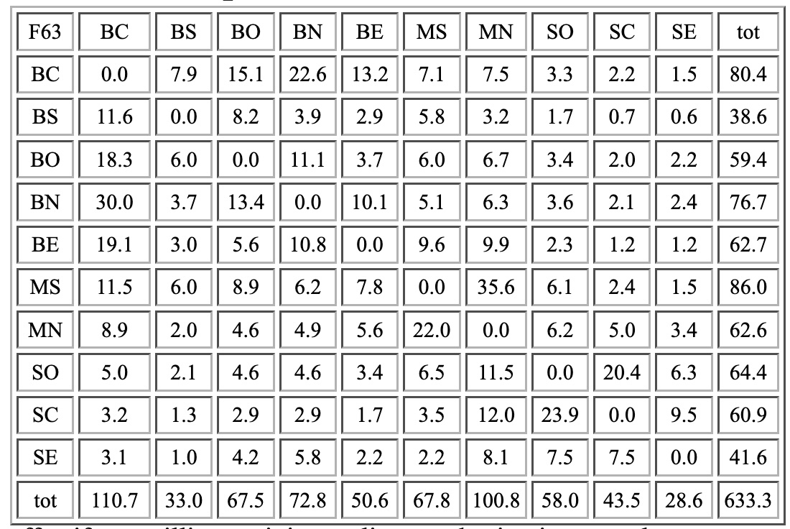{width=400}
Effectifs en milliers, origine en ligne et destination en colonne.
     

### Détermination de la matrice des flux estimés

Une fois déterminé la forme d'un modèle d'interaction spatiale  et fixés les paramètres à estimer en fonction des contraintes et du critère d'ajustement retenu, il est possible de calculer pour chaque couple origine-destination une matrice des flux estimés (notée $F^*$) dont les valeurs pourront être comparées à celles de la matrice des flux observés (notée $F$).

Dans l'exemple des migrations en Tchécoslovaquie au cours de la période 1961-1965 nous avons choisi d'analyser les résultats de deux modèles qui mobilisent la même information (somme des origines, somme des destinations, distance moyenne entre les habitants), utilisent le même critère d'ajustement (minimisation du chi-2 des différences entre flux observés et estimés)  mais imposent des contraintes de conservation des flux qui sont différentes (modèle sans contrainte et modèle à double contrainte).

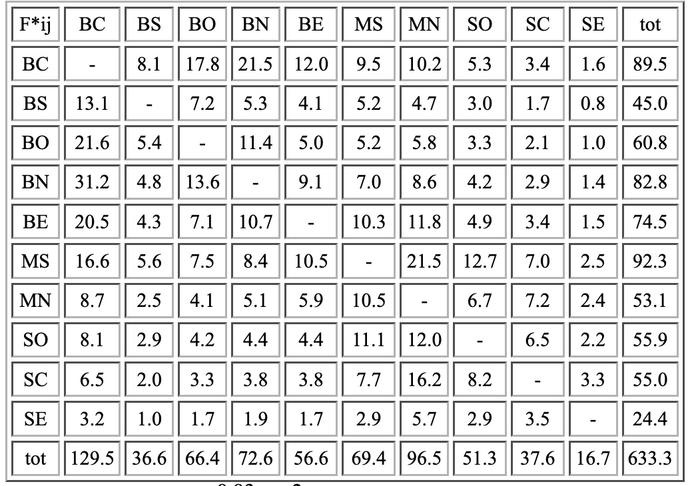{width=400}
$F^*_{ij}= k. O_i . D_j . d_{ij}^{-0.93}   (r^2 = 69.4\%)$


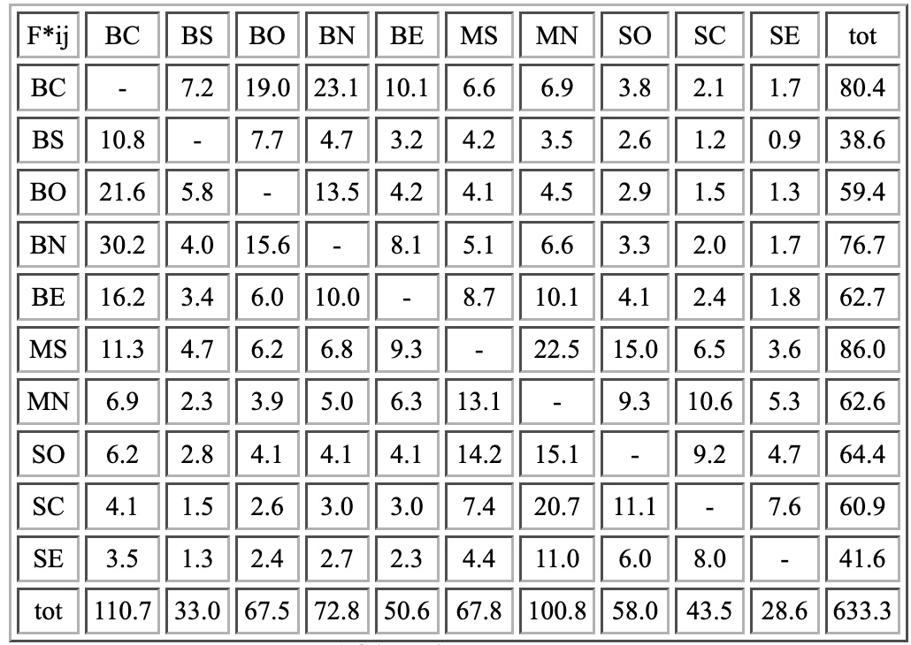{width=400}
$F^*_{ij}= a_i. O_i . b_j. D_j . d_{ij}^{-1.34}   (r^2 = 82.9\%)$


   
### Détermination de la matrice des flux résiduels bruts (R1)

La première définition que l'on peut proposer des résidus (R1) est la différence entre le flux observé et le flux estimé, c'est-à-dire la soustraction terme à terme des éléments de la matrices de flux observés et de celle des flux estimés, calcul étendu aux sommes marginales de ces matrices. Appliqué au cas des migrations entre les 10 régions de Tchécoslovaquie au cours de la période 1961-65, on aboutit aux résultats suivants :
     
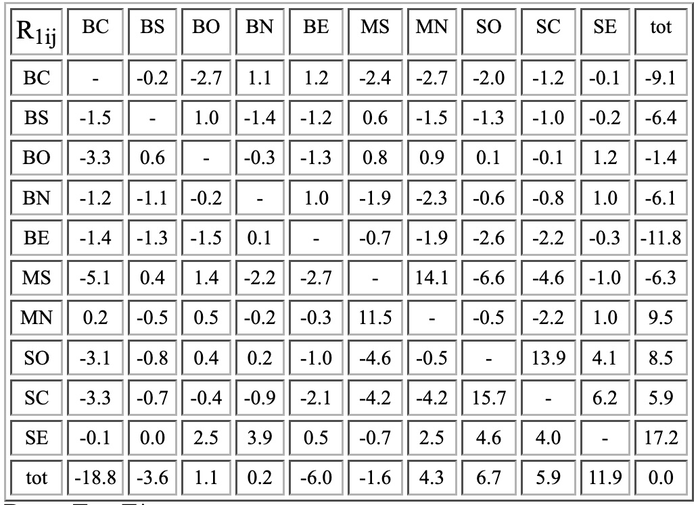{width=400}
$R1_{ij}= F_{ij} - F^*_{ij}$


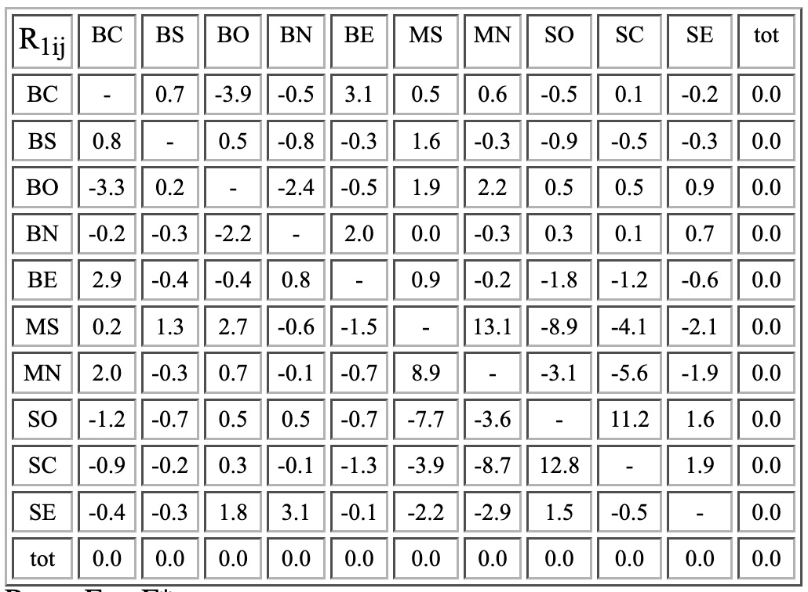{width=400}
$R1_{ij}= F_{ij} - F^*_{ij}$


La comparaison des matrices de résidus bruts obtenus à l'aide de deux modèles utilisant la même information mais partant d'hypothèses de contrainte différentes se révèle riche d'enseignement.
     
Les résidus du modèle sans contrainte apparaissent globalement plus élevés en valeur absolue que ceux du modèle à double contrainte, ce qui ne fait que refléter les différences de qualité d'ajustement des deux modèles (respectivement 69% et 83%)

Le signe des résidus est généralement le même dans chacun des deux modèles, mais des exceptions notables apparaissent. Ainsi, le flux migratoire dirigé de Bohême Sud vers Bohême-Centre apparaît sur-estimé par le modèle sans contrainte (résidu négatif de 1500 migrants) alors qu'il est sous-estimé par le modèle à double contrainte (résidu positif de 800 migrants). L'interprétation des résultats sera donc différentes puisque dans le premier cas on considérera que le flux migratoire observé est plus faible que prévu (ce qui peut s'interpréter comme un effet barrière) alors que dans le secont on considérera qu'il est plus fort que prévu (ce qui peut s'interpréter comme un effet de préférence ou d'intégration).

Les sommes marginales de la matrice des résidus bruts  sont nulles dans le cas du modèle à double contrainte (par définition) alors qu'elles peuvent être positives ou négatives dans le cas d'un modèle sans contrainte. La somme totale des résidus est toutefois nulle dans les deux cas puisque le modèle dit "sans-contrainte" impose en fait la conservation du total général des flux. Le modèle sans contrainte autorise un certain nombre d'interprétations des sommes marginales (en terme d'attractivité ou de mobilité résiduelle) qui sont par définition absentes de l'analyse des résidus d'un modèle à double contrainte.

### Détermination de la matrice des  flux résiduels relatifs (R2)
     

Si l'on s'en tient à la première définition qui a été proposée des résidus, on risque de privilégier dans l'analyse des résultats les écarts affectant les flux migratoires les plus important, c'est-à-dire ceux qui concernent la relation entre les régions les plus peuplées et/ou les relations entre les régions les plus proches. Mais on pourrait également considérer qu'une différence entre flux observé et flux estimé n'a pas le même sens selon le volume du flux observé ou estimé auquel elle s'applique.

Ainsi, dans le cas du modèle à double contrainte, on constate que la région de Bohême-Centre a, selon les hypothèses retenues,  un déficit de migration de 500 migrants vers la Bohême Nord et de 200 migrants vers la Slovaquie Orientale. Mais le volume théorique des flux estimés est de 23100 migrants vers la première région contre seulement 1700 vers la seconde. Le déficit relatif de migration apparaît donc négligeable dans le premier cas (-2%) et beaucoup plus conséquent dans le second (-11%) ce qui n'était pas du tout reflété par la simple prise en considération des résidus bruts.

L'interprétation des résidus d'un même modèle (ici, le modèle à double contrainte) sera donc sensiblement différente selon que l'on s'intéresse aux différences absolues ou aux différences relatives entre flux observés et flux estimés.


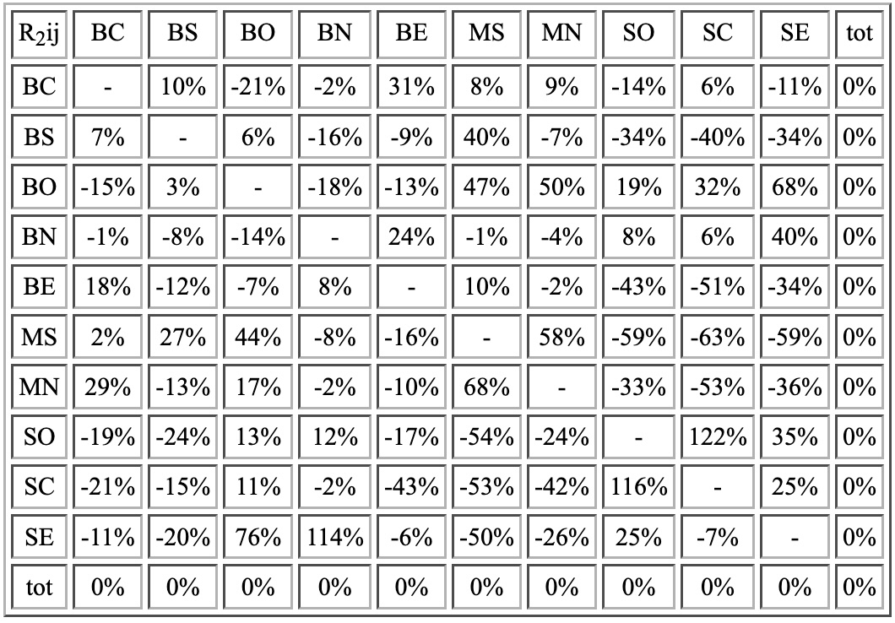{width=400}
$R2_{ij}= (F_{ij} - F^*_{ij})/F^*_{ij}$


Suivant la problématique adoptée, on pourra préférer effectuer l'analyse des résidus sur les écarts relatifs ou les écarts absolus entre flux observés et flux estimés, chacun apportant des renseignements utiles et complémentaires. Dans une perspective statistique, il existe toutefois une troisième possibilité qui est plus satisfaisante que les deux précédentes sur le plan théorique puisqu'elle se fonde explicitement sur la prise en compte de la significativité des résidus.

### Détermination de la matrice des flux résiduels les plus significatifs (R3)

En effet, à partir du moment où l'on a opté pour un critère d'ajustement la solution la plus logique consiste à calculer les résidus en fonction de ce critère d'ajustement et ainsi à examiner quelles sont les couples de régions dont les flux  présentent le plus faible degré d'adéquation avec le modèle et constituent la part du phénomène qui demeure inexpliquée. Cette démarche est d'autant plus satisfaisante que le critère d'ajustement (déviance, chi-2, moindres carrés) est généralement associé à des tests de significativités qui permettent de déterminer les flux pour lesquels les résidus positifs ou négatifs sont significativement différent de zéro pour un seuil donné (1%; 5%).

Dans l'exemple retenu, le critère d'ajustement étant la minimisation du chi-2 des écarts entre flux observés et flux estimés, la manière la plus cohérente de calculer les résidus consiste à mesurer le chi-2 de leur différence (quantité positive à laquelle on peut associer un test à un degré de liberté) et à lui adjoindre le signe de la différence (pour faciliter l'interprétation des écarts).
     

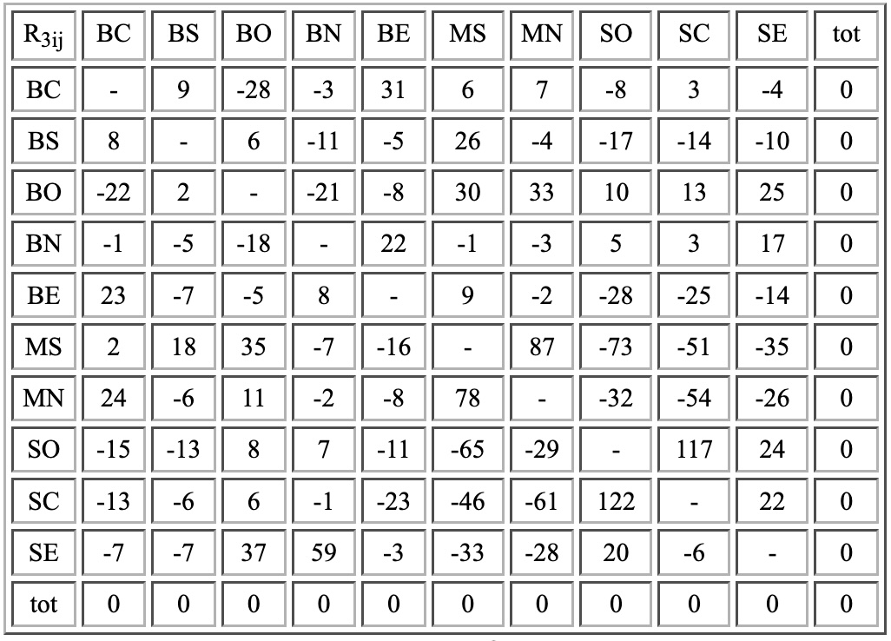{width=400}
$R3_{ij}= (F_{ij} - F^*_{ij})^2/F^*_{ij}$
    

On remarquera que, indépendamment de leurs propriétés statistiques, les résidus mesurées à l'aide du critère du chi-2 définissent une situation intermédiaire entre les résidus bruts et les résidus relatifs puisque les différences sont relativisées par la racine carrée du flux estimé. Si l'on reprend d'exemple de la comparaison des flux dirigés de la Bohême Centre vers la Bohême Nord et la Slovaquie Orientale, on constate que leurs résidus calculés selon le critère du chi-2 sont assez voisins (respectivement -3.2 et -4.4) alors que le premier semblait nettement plus fort que le second pour le critère des différences absolues et nettement plus faible pour celui des différences relatives.

Les trois mesures de résidu proposées s'inscrivent en fait dans un continuum de mesures d'écarts relatifs accordant un rôle plus ou moins important aux grands flux et aux petits flux selon la valeur d'un paramètre a variant entre 0 et l'infini :

$R^a_{ij} = (F_{ij}-F^*_{ij})/(F^*_{ij})^a$

### Conclusion sur le choix des critères de définition des résidus

Les trois solutions proposées pour mesurer les résidus d'un modèle d'interaction spatiale possèdent toutes des justifications théoriques ou empiriques de sorte que c'est en définitive la problématique de recherche et les objectifs de transmission des résultats qui doivent servir de guide au choix de l'une ou l'autre des mesures possibles.

Les critères statistiques tels que le chi-2 ou la déviance semblent les plus pertinents et opèrent un compromis intéressant entre les mesures de dispersion absolue et relative. Mais ils peuvent s'avérer difficile à transmettre à un public peu au fait de ces méthodes,  de sorte que le chercheur aura souvent intérêt à utiliser les critères statistiques dans la construction de sa propre interprétation des résultats mais à utiliser des indicateurs plus simples lorsqu'il construit des documents de synthèse tels que des cartes ou des tableaux des résidus les plus importants.
     

## Attractivité et de mobilité résiduelle 

Comme nous l'avons signalé précédemment, les modèles sans contraintes présentent l'intérêt de produire des matrices de résidus bruts où les sommes marginales ne sont pas nécessairement égales à zéro. On peut donc non seulement analyser les écarts au modèle au niveau des couples de lieux (flux) mais aussi produire des indices synthétiques décrivant les écarts au niveau des lieux émetteurs ou recepteurs. Quatre indices peuvent être produits, ayant trait respectivement à l'émissivité, la receptivité, l'attractivité et la mobilité résiduelle (les deux derniers indices n'étant calculables que dans le cas des matrices carrées).

### Indices d'émissivité résiduelle et de receptivité résiduelle

La comparaison de la somme observée des flux émis par chaque région tchécoslovaque ($O_i$) diffère sensiblement de la somme estimée des flux émis ($O^*_i$) dans le cas du modèle sans contrainte. L'écart entre ces deux sommes, qui correspond à la somme en ligne du tableau des résidus bruts du modèle sans contrainte (Tableau 11) définit donc un excédent ou un déficit des migrations originaires de chaque région.

On constate par exemple que la région de Bohême-Centre n'a envoyé que 80400 émigrants vers les autres régions tchécoslovaques, alors que le modèle sans contrainte prévoyait un total de 89500 émigrants. Il existe donc un déficit brut ($O_i-O^*_i$) de 9100 émigrants que l'on peut exprimer de façon relative sous la forme d'un indice d'émissivité $IO_i = (O_i-O^*_i)/O^*_i$ dont la valeur est ici de -11%. Le même calcul effectué sur la région de Slovaquie Orientale aboutirait à un indice d'émissivité de +41% qui indique que le nombre d'émigrants de cette région est beaucoup plus élevé que ce que prévoyait le modèle sans contrainte.

On peut évidemment définir de la même manière un indice de réceptivité comparant la somme observée des flux reçus par chaque région ($D_j$) et la somme estimée correspondante ($D^*_j$). L'indice de réceptivité sera alors défini par  $ID_j= (D_j-D^*_j)/D^*_j$ . Appliqué aux deux régions précédentes, on constate que sa valeur est de -17% pour la Bohême-Centre et de +42% pour la Slovaquie orientale.

La valeur de ces deux indices dépend toutefois étroitement du choix des masses qui sont introduites dans le modèle gravitaire sans contrainte et, les valeurs obtenues seraient évidemment différentes si l'on avait utilisé les populations totales et non pas les populations migrantes comme facteurs d'émission et de réception. Si tel était le cas, on utilisereait plutôt un rapport entre les sommes marginales des résidus et la population totale comme indices d'émission et de réception. D'une manière générale, si l'on note E le facteur d'émission et R le facteur de réception retenu dans le modèle, ces indices s'écrivent :

$IO_i = (O_i-O^*_i)/E_i$  : indice d'émissivité résiduelle

$ID_j= (D_j-D^*_j)/R_j$  : indice de réceptivité résiduelle
     

### Indices de mobilité résiduelle et d'attractivité résiduelle

Dans le cas particulier ou les origines et les destinations sont confondues (matrice carrée), on peut déduire deux indices supplémentaires mesurant respectivement la mobilité et l'attractivité résiduelle de chaque régions. Dans leur formulation la plus simple, ces indices s'écrivent :

$IM_i = (IO_i + ID_i )/2$  : indice de mobilité résiduelle

$IAi = ( IO_i - ID_i )$  : indice d'attractivité résiduelle

L'indice de mobilité résiduelle mesure si le turnover migratoire d'une région (émigration et immigration confondues) est supérieur ou inférieur à ce que prévoit le modèle. Il permet donc de mesurer le degré d'ouverture ou de fermeture d'une région en prenant comme référence le modèle d'interaction spatiale sans contrainte.

L'indice d'attractivité résiduelle mesure quant à lui l'existence d'une dissymétrie dans le turnover précédent en examinant si les excédents ou déficits de mobilité sont identiques dans les deux dirrections. Une région ayant un indice d'attractivité résiduel positif pourra être considéré comme plus attractive que ce que prévoyait le modèle tandis qu'une région ayant un indice d'attractivité résiduel négatif pourra être considérée comme plus répulsive que ce que prévoyait le modèle.

La combinaison des deux indices permet de définit une typologie des régions combinant leurs degrés d'ouverture ou de fermeture et leur caractère attractif ou répulsif. Appliqué au cas des migrations entre régions Tchécoslovaques en 1961-65 on aboutit aux résultats suivants :

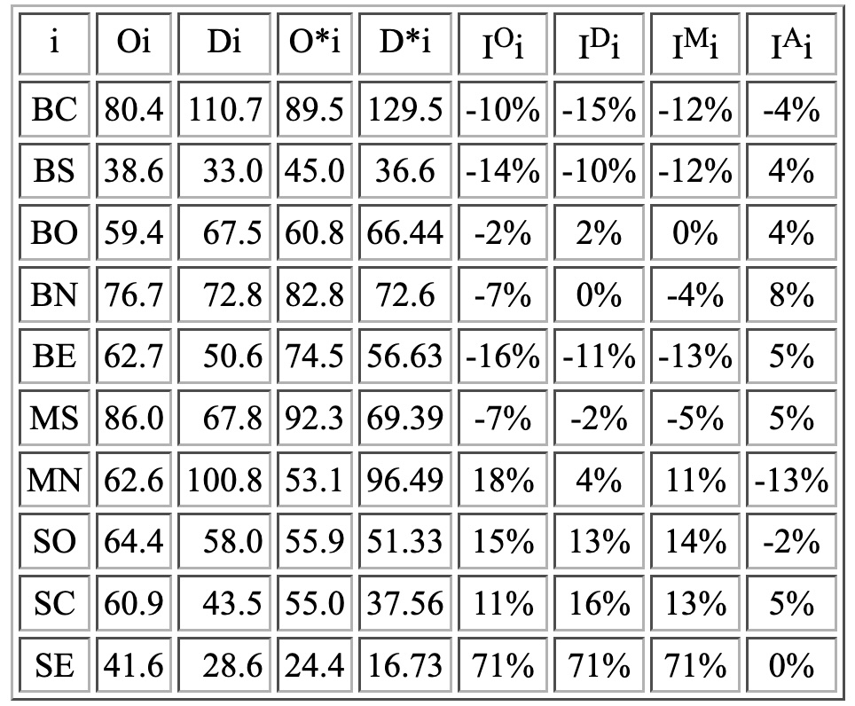{width=400}


Les résultats montrent que la mobilité résiduelle la plus forte s'observe en Slovaquie et plus précisément en Slovaquie occidentale où les mouvements migratoires observés sont supérieurs de 71% à ceux prévus par le modèle gravitaire. La mobilité résiduelle est en revanche négative dans toutes les régions des pays tchèques, à l'exception de la Moravie-Nord et de la Bohême-Ouest.

L'attractivité résiduelle est d'interprétation plus délicate puisque l'on observe que des régions ayant enregistré des gains migratoires considérables telles que la Bohême Centre (+20 300) ou la Moravie-Nord (+38 800) ont cependant des niveaux d'attractivité résiduels qui sont négatifs (respectivement -4% et -13%).   Ces résultats ne sont paradoxal qu'en apparence, le modèle montrant en fait que, compte tenu de leur localisation centrale à l'intérieur de la Tchécoslovaquie, ces deux régions auraient pu bénéficier de gains encore plus importants.Inversement, la Bohême Nord affiche le plus fort niveau d'attractivité résiduelle (+8%) alors que son solde migratoire est légèrement négatif (-3900). Il n'existe en fait pas de relation entre le solde migratoire et le niveau d'attractivité résiduel, comme le montre la comparaison des trois régions slovaques qui ont toutes des soldes migratoires négatifs mais qui ont des attractivités résiduelles positive (Slovaquie Centre), négative (Slovaquie Ouest) ou nulle (Slovaquie Est).
     

## Cartographie des résidus 

Dans le cas des modèles à double contrainte, les effets d'attractivité et de mobilité résiduelle sont totalement absorbés par les paramètres de contrainte de conservation des flux émis ou reçus, ce qui signifie que les résidus du modèle s'entendent toutes choses égales quant aux facteurs d'accroissement ou de réduction globale des échanges d'un lieu par rapport aux autres.

Les modèles de ce type sont donc révélateurs de relations spécifiques entre certains lieux ou certains ensembles de lieux à l'intérieur du territoire considéré et ces relations spécifiques témoignent soit de phénomènes d'intégration (ensemble de lieux ayant des résidus positifs les uns avec les autres) soit de phénomènes de barrières (entre deux ensembles de lieux ayant des résidus négatifs les uns avec les autres).

Si l'on suppose que ces phénomènes de barrière et d'intégration sont de nature territoriale et définissent des ensembles de lieux contigus séparés par des limites précise, alors la cartographie constitue un outil privilégié pour repérer leur localisation. Reste évidemment à choisir le critère le plus pertinent pour définir les résidus qui seront cartographiés.
     

En raison du caractère fréquemment dissymétrique à gauche de la distribution des résidus (résidus négatifs plus nombreux que les résidus positifs, mais de valeur généralement plus faible), il est recommandé d'utiliser un critère ordinal fondé sur les quantiles de la distribution des résidus. On choisira par exemple de représenter les 5% ou les 10% des résidus les plus extrêmes, même si cela conduit à prendre des seuils différents pour les résidus positifs et les résidus négatifs. Dans l'exemple tchécoslovaque nous avons choisi de cartographier 33% des résidus en retenant les 15 résidus ayant les valeurs négatives les plus fortes et les 15 résidus ayant les valeurs positives les plus fortes.

L'intérêt de cette méthode est de faciliter la comparaison des cartes de résidus lorsqu'elles sont fondées sur des critères différents (R1, R2, R3) et de voir ainsi les points communs et les différences qui apparaissent selon que l'on utilise le critère des différences absolues, des différences relatives ou des différences les plus significatives  :
     
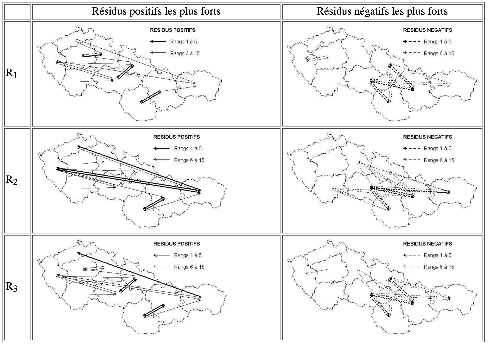{width=800}

La comparaison des différentes cartes de résidus obtenues à l'aide du modèle à double contrainte révèle une assez bonne concordance des résidus négatifs les plus forts mais des divergences assez nettes dans celles des résidus positifs les plus forts.

Les cartes de résidus négatifs signalent toutes l'existence d'une barrière migratoire très nette de part et d'autre de la limite des républiques tchèques et slovaques. Toutes les régions situées de part et d'autre de cette limite ainsi que celles qui en sont peu distantes échangent moins de migrants que prévu avec les régions de l'autre république. Ce phénomène touche particulièrement les deux régions de Moravie d'une part et les régions de Slovaquie Centrale et de Slovaquie Ouest d'autre part.

Les cartes de résidus positifs font toutes apparaître une bonne intégration territoriale de la république tchèque et de la Slovaquie (les régions d'une même république ont fréquemment des échanges plus forts que prévus), mais la carte des résidus relatif souligne également l'existence de résidus positifs très important dirigés de l'est de la Slovaquie vers les périphéries nord et ouest de la Bohême, phénomène qui est beaucoup moins bien souligné par la carte des résidus absolus. Ce phénomène de relations privilégiées entre la partie la moins développée de la Slovaquie et les bassins miniers et sidérurgiques de Bohême est à mettre en rapport avec l'expulsion des Allemands après la seconde guerre mondiale et les mouvements de population consécutifs que cette expulsion a entraîné à l'intérieur de la Tchécoslovaquie. Les transferts de population jeune de Slovaquie vers les Sudètes se sont maintenus durant plusieurs décennies en raison de la pression démographique des zones rurales de l'est de la Slovaquie (facteur push) et du déficit chronique de main d'oeuvre des régions périphériques de Bohême où les conditions de vie étaient défavorables à une installation durable des migrants (pollution, pathologies sociales).

Qualitativement important, ce mouvement de relation migratoire privilégié entre les extrémités occidentale et orientale du pays met en jeu des effectifs de population moins important que les migrations à courte distance et le choix d'un critère de définition des résidus fondé sur les échanges absolus ou sur les échanges relatifs peut soit en majorer, soit en minorer l'importance, ce qui ne peut manquer d'influer sur les commentaires. Avec le critère des différences absolus, on sera tenter d'insister sur l'intégration migratoire des deux républiques et sur la présence d'un effet de barrière entre celles-ci ; avec le critère des différences relatives on adoptera une position plus nuancée en montrant que l'effet de barrière migratoire inter-république existe à courte distance mais disparaît et même s'inverse à longue distance.
     

## Effets de barrière et d'intégration

Si l'on opte pour l'hypothèse de l'existence d'une barrière migratoire réduisant sensiblement les échanges de migrants entre les deux composantes historiques de la Tchécoslovaquie ou pour l'hypothèse inverse mais complémentaire d' une intégration c'est-à-dire une concentration des échanges à l'intérieur des limites de la république tchèque et de la Slovaquie, on peut chercher à en quantifier les effets à l'aide d'indices synthétiques déduit de l'étude des résidus du modèle d'interaction spatiale retenu.

Dans le cas d'un modèle à double contrainte (conservation des flux émis ou reçus par chaque région) un coefficient unique sera suffisant pour résumer l'effet d'une partition territoriale en deux puisque tout accroissement des flux à l'intérieur d'une république se traduira mécaniquement par un accroissement équivalent entre les régions de l'autre république et par une réduction des échanges entre les deux. Un coefficient unique suffira donc à mesurer l'accroissement relatif des flux intra-républiques par rapport aux flux inter-républiques que l'on peut imputer à la présence d'une barrière migratoire.

La solution la plus simple pour obtenir cet indice consiste à calculer le volume des flux intra-républiques et inter-républiques observés et estimés, notés respectivement ($F_{intra}, F_{inter}, F^*_{intra}, F^*_{inter}$) puis à en déduire les coefficients d'accroissement relatif des flux intra et inter républiques, et enfin de calculer le coefficient d'accroissement relatif des flux intra-république par rapport aux flux inter-république qui est une mesure d'intégration ou le rapport inverse qui est une mesure de barrière puisqu'elle évalue la perméabilité de la limite des deux républiques.

### Cas d'une partition en deux

Appliqué au cas de la matrice des échanges migratoires entre les régions Tchécoslovaques au cours de la période 1961-65 et de leur estimation à l'aide d'un modèle à double contrainte, on obtient les étapes de calcul suivantes :
 
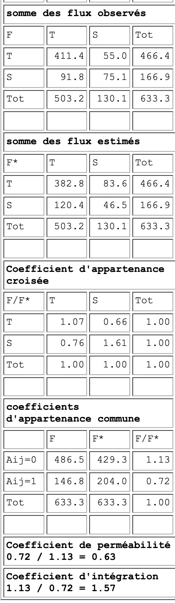{width=300}    
   

Dans l'exemple étudié on aboutit à une mesure synthétique de l'effet de barrière correspondant à un coefficient d'intégration de 1.57 qui indique que l'intensité relative des flux intra-république est supérieure de 57% à celle des flux intra-républiques, toutes choses égales par ailleurs. Ou bien (ce qui revient au même) on peut dire que la perméabilité de la limite des deux républiques n'est que de 63% ce qui implique une réduction relative de 37% des plus inter-républiques par rapport aux flux intra-républiques.

Les effets de barrière, c'est-à-dire les réductions des flux induits par le franchissement d'une limite ne peuvent généralement pas être mesurés dans l'absolu car ils sont le plus souvent étroitement associés à des phénomènes d'intégration territoriale, c'est-à-dire de concentration des échanges à l'intérieur des limites des mailles territoriales. A moins d'avoir une connaissance précise du processus qui a bouti à la configuration actuelle des échanges, il est le plus souvent impossible de déterminer si les effets d'appartenance territoriale que l'on mesure sont le résultat de processus exogènes de réduction des flux (barrière) ou de procesus endogènes de concentration des flux à l'intérieur des mailles territoriales (intégration).

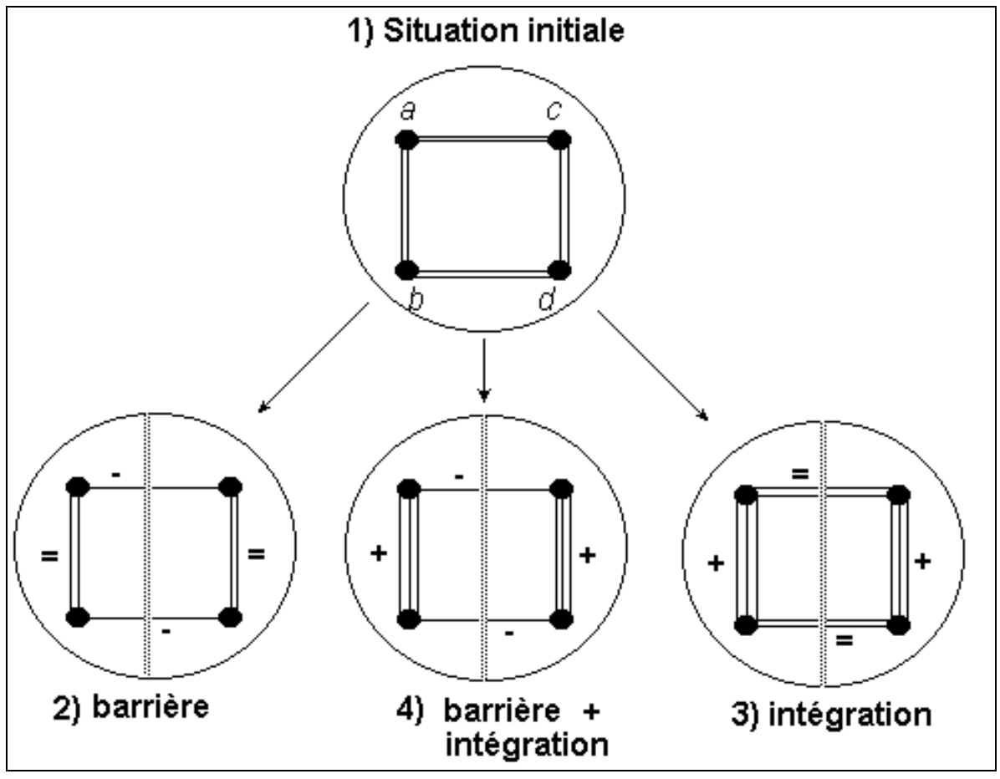{width=500}


Dans l'exemple présenté sur la figure ci-dessus, on considère une situation théorique d'équilibre initial entre 4 unités développant chacune 2 liaisons symétriques d'échange  avec leurs voisins les plus proches. S'il existe une barrière réduisant de moitié les flux qui la traverse, on aboutit à une première situation ou la valeur du coefficient de barrière est  2. S'il n'existe pas de barrière mais un simple effet d'intégration (accroissement de 50% des flux internes à chaque maille, on aboutit à un coefficient de barrière de 1.5. Enfin, si les deux effets agissent de façon concommitente, leurs effets se cumulent et l'on aboutit à un coefficient de barrière de 3. Mais dans les trois situations considérées, on ne peut décomposer le coefficient de barrière en ses deux composantes (intégration & barrière) que si l'on est en mesure de modéliser non seulement l'interaction spatiale mais aussi la mobilité générale de chaque zone (c'est-à-dire le nombre "normal" de flux émis ou reçus par chaque zone). Or, ceci implique des hypothèses beaucoup plus complexes que celles des modèles habituels d'interaction spatiale puisqu'il faut expliquer non seulement la mobilité mais aussi la non-mobilité !
     

## Coefficients d'intéraction terrioriale

Nous avons vu dans l'exemple précédent que le coefficient de barrière résumant l'effet de la division en république sur les échanges migratoires des deux républiques tchèque et slovaque (1.57) pouvait se décomposer en coefficients partiels mesurant l'accroissement relatif des flux intra-républiques (1.12) et la réduction relative des flux inter-républiques (0.57), ces deux coefficients pouvant eux-mêmes être segmentés en coefficient plus précis relatif à chaque république d'origine et de destination. On constate ainsi que, les républiques ayant des effectifs de migrants différents, la redistribution des flux ne franchissant pas la limite des deux républiques provoque un accroissement des flux intra-république qui est beaucoup plus marqué en Slovaquie (1.61) qu'en république tchèque (1.07). On pourrait remarquer également que la réduction relative des échanges inter-républiques semble plus marquer de la république tchèque vers la Slovaquie (0.66) qu'en sens inverse (0.76).

Mais l'analyse de ces différents coefficients n'a pas véritablement d'intérêt ici car l'on a utilisé une partition en deux entités et l'on a utilisé un modèle à double contrainte. Comme ce modèle suppose connue les marges de la matrice, il suffit en effet de connaître l'accroissement relatif entre une paire quelconque de républiques pour en déduire la valeur de l'accroissement relatif de toutes les autres. Dit autrement, le modèle d'appartenance territoriale comporte ici un seul degré de liberté et la connaissance de n'importe lequel des coefficient définis précédemment suffit à retrouver la valeur de tous les autres en raison des contraintes introduites dans le modèle.

La situation serait différente si l'on avait employé un modèle sans contrainte (conservation du total) puisqu'il faudrait alors connaître 3 des coefficients d'accroissement relatif des flux entre républiques pour en déduire la valeur du quatrième (grâce à la contrainte de conservation du total général des flux). Dans ce cas, on prendrait comme référence l'un des couples de républiques (par exemple les échanges internes à la république Tchèque : $I_{TT}=1.00$) et on évaluerait l'intensité des échanges entre les autres paires de républiques ($I_{TS} , I_{ST} ,I _{SS}$ ) par rapport à ce référentiel.

Plus généralement, lorsque l'on a affaire à une partition territoriale en k classes, l'effet de cette partition peut être résumé à l'aide de $(k-1)^2$ coefficients d'interaction territoriale dans le cas d'un modèle à double contrainte, de $k(k-1)$ coefficients dans le cas d'un modèle à simple contrainte et de $k^2-1$ coefficients dans un modèle sans contrainte conservant le total général des flux.

Une conséquence théorique importante de ce résultat est que l'effet d'une partition territoriale ne peut se résumer à l'aide d'un coefficient de barrière unique que dans le cas particulier d'un modèle à double contrainte associé à une partition en deux classes. Dans tous les autres cas (et notamment lorsque le nombre de classes de la partition est supérieur à deux ($k>2$), il est possible d'envisager des modèles plus complexes mettant en jeu des effets de préférence ou de répulsion entre groupes de lieux qui n'impliquent pas nécessairement une concentration des résidus positifs entre les lieux ayant même appartenance.


Si l'on prend l'exemple d'un modèle à double contrainte et que l'on procède à une réorganisation des lignes et des colonnes pour rapprocher les lieux d'origine et de destination ayant les même profils de résidus, on peut distinguer plusieurs configurations possibles associés à différentes situations théoriques d'organisation territoriale des flux dans le cas de partitions en deux ou  trois mailles territoriales.


1. effet de barrière pour k=2

k=2 | A   | B   |
--- | --- | --- |
 A  | +   | -   |
 B  | -   | +   |

>les unités appartenant à une même maille territoriale (A ou B) échangent plus de migrants que les unités appartenant à deux mailles territoriales différentes.

2. effet d'anti-barrière pour k=2

k=2 | A   | B   |
--- | --- | --- |
 A  | -   | +   |
 B  | +   | -   |

>Les unités appartenant à une même maille territoriale (A ou B) échangent moins de migrants que les unités appartenant à deux mailles territoriales différentes.

3. effet de barrière complet pour k=3

k=3 |  A  |  B  | C   |
--- | --- | --- | --- |
 A  | +   | -   |  -  |
 B  | -   | +   |  -  |
 C  | -   | -   |  +  |
 
>Chaque maille terrioriale a des échanges préférentiels avec elle-même et des barrières avec les autres.

4.  effet de barrière incomplet pour k=3
k=3 |  A  |  B  | C   |
--- | --- | --- | --- |
 A  | +   | -   |  0  |
 B  | -   | +   |  0  |
 C  | 0   | 0   |  0  |

>Dans le cas d'une partition en trois mailles territoriales, l'effet de barrière et d'un modèle à double contrainte, l'effet de barrière n'est pas nécessairement complet. Il peut en effet arriver que celui ci ne concerne que deux zones (A et B) et que le reste de l'espace étudié (C) suive le comportement général prévu par le modèle (résidus nul). Dans ce cas, la zone tierce peut jouer un rôle d'intermédiaire entre les deux zones séparées par un effet de barrière.

5. effet d'anti-barrière complet pour k=3

k=3 |  A  |  B  | C   |
--- | --- | --- | --- |
 A  | -   | +   |  +  |
 B  | +   | -   |  +  |
 C  | +   | +   |  -  |
 
>Chaque maille terrioriale a des effets de barrière avec elle-même et des échanges préférentiels avec les autres.

6. effet d'anti-barrière incomplet pour k=3

k=3 |  A  |  B  | C   |
--- | --- | --- | --- |
 A  | -   | +   |  0  |
 B  | +   | -   |  0  |
 C  | 0   | 0   |  0  |

> de la même manière, les effets d'anti-barrière peuvent présenter des configurations incomplètes. Dans l'exemple présenté, les deux zones A et B ont une forte attirance réciproque (complémentarité) qui se traduit par un déficit de leurs échanges internes. Mais leurs relations avec le reste du pays (C) sont conforme aux prévisions du modèle.

7. effet de cycle de complémentarités pour k=3

k=3 |  A  |  B  | C   |
--- | --- | --- | --- |
 A  | 0   | +   |  -  |
 B  | -   | 0   |  +  |
 C  | +   | -   |  0  |


>Ce dernier exemple permet de montrer que des effets de préférence territoriale peuvent apparaître sans qu'il y ait pour autant présence de barrières ou d'anti-barrières. On remarque en effet que les flux intra-maille sont conformes au modèle mais les échanges intermailles ne se distribuent pourtant pas au hasard et on observe un cycle de préférences (A envoit plus que prévu vers B qui envoit plus que prévu vers C qui envoit plus que prévu vers A) associé à un cycle inverse de barrières (A envoit moins que prévu vers C, etc.) qui assure l'équilibre général du modèle à double contraintes.


Des configurations encore plus complexes apparaîtraient si l'on avait examiné les types de configuration possible des résidus en 4 classes ou plus (avec notamment la possibilité d'effets de barrière ou d'anti-barrière emboîtés) mais l'énumération des possibilités d'organisation territoriale des échanges en trois classes suffit à établir le résultat essentiel de la démonstration : l'apparition d'un effet de barrière complet est un cas particulier d'une catégorie plus générale que l'on peut désigner sous le terme d'organisation territoriale des flux. L'existence d'un niveau d'organisation territoriale des flux suppose que deux conditions soient remplies :

- existence d'une partition des unités spatiales associée à une organisation des résidus du modèle d'interaction spatiale sous la forme de "blocs" homogènes (condition d'organisation)
- connexité spatiale des unités appartenant à une même classe de cette partition (condition de territorialité).

 Si seule la première condition est remplie, on dira qu'il existe un niveau d'organisation des flux mais on ne lui attribuera pas le qualificatif de territorial puisqu'il n'est pas associé à une régionalisation de l'espace en aires connexes séparées par des frontières.

On parlera enfin de niveau d'intégration territoriale lorsqu'un niveau d'organisation territoriale est associé à une structure d'effet de barrière, c'est-à-dire lorsque les coefficients d'interaction territoriale intra-maille sont en moyenne supérieurs aux coefficients inter-mailles, ce qui signifie que les lieux situés à l'intérieur d'une même maille échangent plus en moyenne que ceux situés dans deux mailles différentes. On parlera de niveau d'intégration territoriale complet ou incomplet selon que l'effet de barrière est complet (tous les coefficients intra-maille sont supérieurs à 1) ou incomplet (certains coefficients intra-maille sont inférieurs à 1).

Dans la pratique, la  recherche de niveaux d'organisation et de niveau d'intégration territoriaux ou non  peut être menée de façon inductive en examinant la matrice des résidus d'un modèle d'interaction spatiale et en lui faisant subir des traitements appropriés. Sans entrer dans des détails techniques, on peut dire que la recherche d'un niveau d'organisation quelconque est un simple problème de classification visant à minimiser la variance des résidus des flux à l'intérieur de chaque paire de mailles territoriales. La recherche d'un niveau d'organisation territoriale est quant à elle un problème de classification sous contrainte de contiguïté spatiale (deux unités regroupées à l'intérieur d'une même maille territoriale doivent être reliées par un chemin ne traversant que des unités de la même classe). Enfin, la recherche d'un niveau d'intégration territoriale est un problème de diagonalisation de la matrice des résidus puisque l'objectif est de détecter une structure bloc-diagonale telle que les résidus positifs soient regroupés entre des unités appartenant à une même maille territoriale.

Une solution heuristique très intéressante pour détecter des niveaux d'organisation quelconques consiste à calculer la matrice de corrélation des profils résiduels de chaque unité (corrélation des résidus à l'émission et/ou la réception) puis de les cartographier afin de détecter si les unités ayant des profils résiduels corrélés positivement se regroupent à l'intérieur d'entité territoriales connexes plus ou moins vastes. Cette méthode, inspirée de l'étude des réseaux sociaux se fonde sur la recherche de relations d'équivalence structurale entre les lieux. L'équivalence structurale de deux lieux ne signifie pas qu'ils échangent plus de migrants que prévus par le modèle mais simplement qu'ils possèdent les mêmes préférences (résidus positifs avec les même lieux) et subissent les mêmes effets de barrières (résidus négatifs avec les même lieux). C'est la raison pour laquelle le calcul des corrélations entre les profils résiduels de deux lieux (i,j) doit être mesuré sur les résidus des flux avec les n-2 lieux différents de i et j. Différents algorithmes (fondés notamment sur l'établissement de corrélations de corrélations) permettent de définir un arbre de classification correspondant aux niveaux d'organisation les plus pertinents. Ces algortithmes mis au point pour l'étude des réseaux sociaux doivent évidemment être adaptés (contrainte de contiguïté) si on veut les appliquer à la détection de niveaux d'organisation territoriaux.

Lorsque l'on cherche plutôt à déterminer des niveaux d'intégration territoriaux, le critère est différent puisqu'il s'agit de maximiser la somme des résidus intra-classe (concentration des résidus positifs à l'intérieur des mailles) et de minimiser la somme des résidus inter-classe (concentration des résidus négatifs entre les classes). Le critère sociologique implicite n'est donc plus celui de l'équivalence mais de la cohésion (recherche de cliques). Différents algorithmes ont été proposés par différents auteurs pour aboutir à ce résultat (Masser & Brown, Slater), le plus satisfaisant étant celui proposé par M. Poulain et L. Dal dans le programme MIGINTER, car il est l'un des seuls à imposer une contrainte de contiguïté et différentes options de taille maximum ou minimum des classes afin d'éviter l'apparition d'effets de chaînage au cours de la procédure d'agrégation.

### Recherche de la partition optimale

Appliquées au cas tchécoslovaque, les réflexions précédentes conduisent à s'interroger sur la légitimité de la démarche déductive adopté au paragraphe précédent (test de l'effet d'une partition fixée a priori) et à reconsidérer de plus près l'interprétation des résidus du modèle dont on avait souligné qu'elle n'était pas dépourvue d'ambiguïté.

Le calcul des coefficients de corrélation entre les résidus émis ou reçus par chaque zone montre que, dans le cadre d'une approche inductive (examen de l'ensemble des partitions possibles, sans a priori), il n'est pas évident que la partition en deux républiques soit la plus pertinente.
     
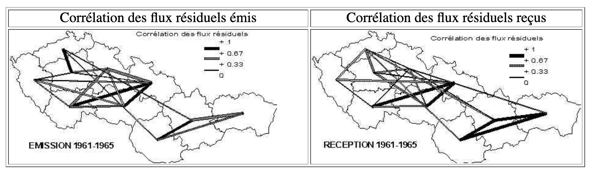{width=500}

On repère certes deux noyaux territoriaux composés de régions dont les résidus ont une forte corrélation positive, tant pour l'émission que la réception, et qui regroupe de ce fait des régions ayant les mêmes préférences migratoires et subissant les mêmes effets de barrière. Ces noyaux correspondent d'un côté à l'ensemble des trois régions slovaques (SO, SC, SE) et de l'autre aux deux régions de Moravie et à la partie orientale de la Bohême (MN, MS, BE, BS). Mais le statut des trois régions restantes est beaucoup plus ambigü car elles sont mal correlées avec toutes les autres  sans pour autant être très fortement corrélées entre elles ou en tout cas pas de façon systématique. On a néanmoins décidé d'en faire une classe à part entière au vu des fortes corrélations qui existent entre Bohême-Nord et Bohême-Centre (pour l'émission et la réception) et entre Bohême-Ouest et Bohême-Nord (pour la réception).

Si l'on réordonne la matrice des résidus de manière à rapprocher les régions appartenant à chacune de ces trois classes, on constate qu'il existe une assez forte homogénéité des résidus à l'intérieur de chacun des neufs blocs définis par les trois classes de région, ce qui confirme l'existence d'un niveau d'organisation territoriale non pas en deux mais en trois mailles.
     
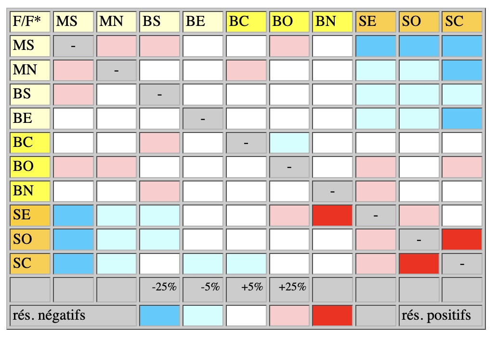{width=500}  
  
  
On peut alors évaluer les coefficients d'interaction territoriale associé à chacune des classes de la partition et définir ainsi le type d'organisation territoriale des flux qui lui est associé en utilisant une procédure analogue à celle qui avait été utilisée pour le calcul de l'effet de barrière :


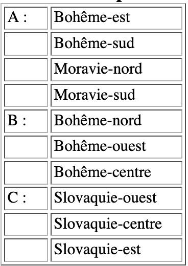{width=150}  

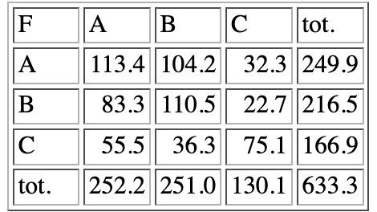{width=150}  

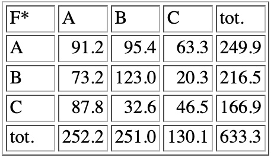{width=150} 

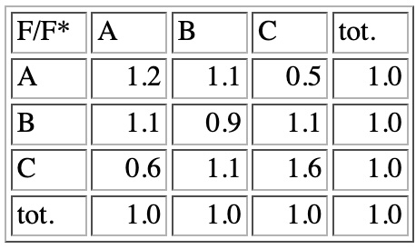{width=150} 

     
La configuration obtenue est un cas théorique particulièrement intéressant qui associé une barrière entre les zones A et C et une anti-barrière entre la zone B d'une part et les zones A et C d'autre part. Dit autrement, on constate qu'il existe un effet de barrière entre la Slovaquie et la partie orientale de la république Tchèque mais les trois régions qui constituent l'ouest de la Bohême jouent un rôle de plaque tournante migratoire pour l'ensemble des deux zones précédentes tout en ayant entre elles moins de relations que prévues.

Cette analyse est tout à fait cohérente avec un certain nombre de faits historiques, économiques et politiques. En particulier, le repeuplement des régions sudètes (Bohême-Nord et Bohême-Ouest) par des migrants venus de l'ensemble du pays (Slovaquie, Moravie, Bohême) et l'auto-entretien ultérieur de ces migrations explique leur rôle de plaque tournante des échanges migratoires à l'intérieur du pays. Le fait que la Bohême-Centre joue un rôle équivalent de médiateur s'explique par la fonction de capitale nationale de Prague et l'attraction qu'elle exerce sur l'ensemble de la population nationale. Quant aux résidus négatifs observés entre Prague et les régions Sudètes, il tiennent aux différences de composition sociale et économique des deux espaces. Les bassins industriels sudètes polarisent davantage une main d'oeuvre ouvrière issue de l'exode rural tandis que la région capitale attire une main d'oeuvre plus qualifié, et notamment les élites économiques et politiques.

Au total, on peut considérer qu'en 1965 l'effet de barrière opposant les deux républiques est incomplet et partiellement compensé par le rôle de médiateur (plaque tournante migratoire) que jouent les régions occidentales et centrales de Bohême. On retrouve en fait un schéma bien connu des sociologues qui est celui du tiers-parti et de sa fonction régulatrice dans un contexte d'opposition ou tout au moins d'absence de communication entre deux interlocuteurs potentiels. Transposé à l'analyse géographique on peut dire que la partie occidentale de la Tchécoslovaquie assurait une fonction de médiation territoriale qui a lontemps compensé les effets de barrière territoriale opposant les régions situées de part et d'autre de la limite tchéco-slovaque.

Cette médiation territoriale imputable au rôle politique central de Prague et aux complémentarités économiques entre la Slovaquie rurale et la Bohême industrielle s'est toutefois affaiblie progressivment au cours du temps sous le double mouvement d'affirmation politique de la Slovaquie (mise en place du système fédéral après la crise de 1968), de recomposition du tissu économique national (industrialisation de la Slovaquie et entrée en crise des vieux bassins industriels de Moravie et de Bohême), et de réduction plus générale des différentiels démographiques entre l'ouest et l'est du pays (homogénisation des taux d'accroissement naturel, épuisement du réservoir de l'exode rural en Slovaquie).

Au total, on remarque dans le cas tchécoslovaque un phénomène très intéressant de contradiction entre les logiques d'homogénisation territoriale (réduction des différences de tous ordres entre les deux républiques) et les logiques d'intégration territoriale (réduction des échanges migratoires et accroissement de l'effet de barrière) dans la mesure où le principal moteur des échanges migratoires semble avoir été liée aux dissymétries et aux complémentarités entre les territoires composant l'état tchécoslovaque. Plus précisément le fait que l'homogénéisation territoriale n'ait porté que sur les aspects économiques et sociaux sans se traduire par un mouvement comparable d'homogénéisation culturelle (identité nationale, langue) et d'intégration politique (formation d'élites affranchies de l'origine ethno-linguistique) a conduit ces derniers facteurs à jouer un rôle croissant dans la dynamique des échanges migratoires et à affaiblir de façon conséquente les effets intégrateurs du brassage migratoire (mariages mixtes, cohabitation sur les lieux de travail et de résidence, etc).

Une étude déductive qui se focaliserait sur l'étude d'un indicateur quantitatif unique (l'effet de barrière inter-république) et de son évolution au cours du temps resterait donc à la surface des choses et aurait tendance à sous-estimer la complexité des inter-dépendances territoriales à l'intérieur de la Tchécoslovaquie et la multiplicité des facteurs, tant qualitatifs que quantitatifs qui ont aboutit à une réduction progressive des échanges inter-républiques.

Mais l'évaluation même de l'effet de barrière qui a été proposée au cours de ce chapitre est sujette à caution car elle se fonde sur l'analyse des résidus d'un modèle d'interaction spatiale, ce qui revient à postuler le primat du facteur spatial par rapport au facteur territorial et, plus généralement, à supposer que les deux peuvent être dissociés dans l'explication des migrations. Or, comme nous allons le montrer au cours du chapitre suivant, ce postulat n'a rien d'évident et des estimations plus correctes des effets de barrière peuvent être obtenues lorsque les effets des proximités spatiales et territoriales sont évalués simultanément et non pas successivement. 


# LA MESURE DES EFFETS DE BARRIERE

    
La partie précédente a permis de montrer la complexité des formes d'organisation territoriale susceptible d'interagir avec la distance dans la définition de l'intensité des flux. Elle a surtout montré que la présence d'un effet de barrière complet (structure bloc-diagonale des résidus) constituait au fond un cas particulier à l'intérieur de la famille des modèles d'interaction territoriale.

Il n'en demeure pas moins que ce cas particulier revêt une importance théorique et pratique particulière puisqu'il correspond à la présence de phénomènes d'intégration/fragmentation à l'intérieur d'un système d'échange et permet de mettre en évidence l'existence de niveaux territoriaux d'organisation des flux.

Il justifie donc d'une analyse plus détaillée d'autant que, comme nous allons le montrer, les procédures d'estimation de l'effet de barrière présentées dans la partie précédentes sont fortement biaisées sur le plan statistique et reposent sur une hypothèse théorique discutable d'indépendance entre les phénomènes d'interaction spatiale et d'interaction territoriale.

Après avoir rappelé les hypothèses théoriques fondatrices des modèles d'interaction spatiale et montré qu'elles s'appliquent tout aussi bien aux modèles d'interaction territoriale, nous examinerons les modèles permettant de proposer des estimations correctes de l'effet de barrière induit par une partition connue de l'espace, puis nous discuterons les solutions possibles pour déterminer l'existence d'une partition inconnue de l'espace engendrant un effet de barrière  et enfin nous examinerons le cas de modèles plus complexes où l'effet de barrière n'est pas constant varie en fonction de la distance entre les lieux d'origine et de destination
     

1. Interaction spatiale et interaction territoriale
2. Estimation déductive des effets de barrière
3. Estimation inductive des effets de barrière
4. Estimation d'effets de barrière complexes

         

## Interaction spatiale et interaction territoriale

     
Tout le raisonnement développé dans la partie précédente pour mesurer les effets de barrière à l'aide des résidus d'un modèle d'interaction spatiale est fondé sur l’hypothèse que le principal déterminant géographique des échanges est la distance (interaction spatiale) et que les effets de barrière ou d’appartenance (interaction territoriale) ne sont qu’un déterminant secondaire, une composante résiduelle.

Or, cette hypothèse du primat de la distance sur l’appartenance n’a rien d’évident sur le plan théorique et que, du coup, l’évaluation des effets de barrière ou d’appartenance à l’aide des résidus d’un modèle d’interaction spatiale peut apparaître incorrecte sur le plan méthodologique. Un examen rapide des principales théories permettant de rendre compte de la décroissance des probabilités de relation avec la distance (interaction spatiale) montre qu’elles pourraient s’appliquer tout aussi bien à la décroissance des probabilités de relation en fonction de l’appartenance (interaction territoriale).
     
### Le paradigme économique : distance, coût, utilité.
     
L’explication économique de la mobilité, tout d’abord, se fonde sur l’hypothèse d’une relation entre la probabilité de relation et le coût de déplacement. Quelle que soit la mesure du coût de déplacement retenue (monétaire, psychologique, temporel), on suppose que le migrant est un être rationnel qui cherche à optimiser le rapport entre les avantages apportés par la mobilité et son coût. Si les opportunités de mobilité localisées en différents points de l’espace présentent les mêmes avantages pour le migrant, celui-ci cherchera uniquement à minimiser la fonction d’utilité constituée par le coût de déplacement. A priori, chaque migrant devrait donc choisir la destination qui correspond au coût de déplacement le plus faible, mais il se trouve en concurrence avec d’autres acteurs ce qui produit des effets de déséquilibre entre l’offre et la demande de mobilité pour certaines destinations. Il peut donc être amené, par le jeu de la concurrence à accepter une destination correspondant à un coût plus élevé ou à renoncer à son déplacement si le coût dépasse les avantages escomptés. Au total, la régulation opérée entre l’offre et la demande de mobilité doit conduire à un équilibre qui se traduit par une décroissance de la probabilité de relation en fonction du coût de déplacement. Ainsi formalisée, l’explication économique ne préjuge pas de la nature du coût de déplacement et de sa relation avec la localisation géographique des individus. Il faut donc introduire une hypothèse supplémentaire pour transformer le déterminant économique (coût de déplacement) en déterminant géographique.

Dans le cas des modèles d’interaction spatiale, on introduit l’hypothèse que les coûts de déplacement supportés par le migrants sont proportionnels à une certaine distance qui est supposé résumer un ensemble de contraintes pesant sur la décision de mobilité. Ainsi, dans le cas d’un changement de domicile, le choix d’une destination éloignée entraîne un coût monétaire (prix du déménagement), un coût psychologique (rupture des relations sociales avec les personnes du lieu d’origine), un coût relationnel (temps de déplacement entre le lieu d’origine et le lieu de destination, si le migrant décide d’y revenir périodiquement), etc. Dans le cas de transports de marchandises, le coût principal est l’énergie dépensée et le prix du transport en tonnes par kilomètres.

Or, ces différentes hypothèses peuvent tout aussi bien s’appliquer à un modèle d’interaction territoriale où le coût dépend non pas du nombre de kilomètres parcourus mais du franchissement de limites de mailles territoriales. Ceci est particulièrement évident pour les flux de marchandises ou le franchissement d’une frontière politique entraîne le payement de taxes (coût monétaire) et un délai d’attente plus ou moins long au poste frontière (coût temporel). Mais on peut montrer qu’il en va de même pour la mobilité des personnes. Une personne qui change de régions ou de pays doit souvent s’acquitter d’un certain nombres de formalités administratives qui impliquent des dépenses de temps, d’énergie ou d’argent.. Enfin, si les limites de mailles territoriales correspondent à des territoires auxquels les personnes s’identifient, le fait de quitter son territoire d’appartenance implique un coût psychologique non négligeable (attachement du migrant à son lieu d’origine, hostilité éventuelle des habitants du lieu de destination, etc.). On voit donc que les explications économique de la mobilité par le coût de déplacement peuvent s’appliquer indifféremment à des modèles d’interaction spatiale ou à des modèles d’interaction territoriale.
     
     
### Le paradigme de la circulation imparfaite de l’information

La théorie de la diffusion de l’information proposée par Hägerstrand permet de compléter l’explication économique en s’interrogeant sur l’information dont disposent les acteurs sur les différentes opportunités de destination. Le paradigme économique classique suppose en effet que chaque acteur est rationnel et pleinement informé, ce qui suppose qu’il connaît le coût et les avantages de chacune des relations qu’il peut éventuellement nouer. Or, dans les situations concrètes, ce paradigme n’est jamais vérifié. Tout flux matériel est en effet précédé par un contre-flux d’information qui permet à l’acteur d’opérer un choix rationnel entre plusieurs destinations mais dans un contexte d’information limitée. L’hypothèse centrale d’Hägerstrand est donc que la probabilité de relation matérielle entre deux personnes ou deux groupes dépend de la quantité d’information qui circule entre ces personnes ou ces groupes. Cette théorie permet par exemple de rendre compte du phénomène de l’auto-entretien des filières migratoires à longue distance. L’installation des premiers migrants génère un flux d’information entre le lieu d’origine et le lieu de destination, ce qui facilité l’arrivée de nouveaux migrants qui vont eux-mêmes générer à leur tour un flux d’information plus important, etc. Tout comme dans le cas du paradigme économique, l’existence d’une relation entre les flux de relation matérielles et les flux d’information ne préjuge pas du rôle des déterminants géographiques dans la circulation de l’information.

Dans le cas des modèles d’interaction spatiale, c’est l’hypothèse d’une dégradation de l’information en fonction de la distance qui permet de comprendre la décroissance des probabilités de relation avec la distance. Ainsi, la personne qui souhaite changer de domicile est beaucoup mieux informé des opportunités de migration dans son environnement proche que dans son environnement éloigné. A courte distance, elle peut disposer de relais locaux (parents, amis, journaux, petites annonces, ...) qui facilitent son choix. A longue distance, elle doit au contraire consentir une dépense plus ou moins importante pour acquérir de l’information sur les opportunités de destination. Confronté à deux opportunités équivalentes de relation (e.g. deux opportunités d’emploi correspondant au même salaire), l’acteur choisira souvent la plus proche car il dispose de plus d’information à son sujet et pense ainsi pouvoir lever un certain nombre d’incertitudes et agir " en connaissance de cause ".

La théorie de la circulation de l’information d’Hägerstrand permet d’expliquer dans une certaine mesure la décroissance des probabilités de relations avec la distance, mais elle s’applique autant si ce n’est mieux aux modèles d’interaction territoriale. C’est en effet Hägerstrand (1952, 1953) qui a formalisé le premier la notion de barrière faisant obstacle à la diffusion des innovations et à la circulation de l’information . Les obstacles à la vie de relation, qu’ils soient physiques (chaîne de montagne, lacs, fleuves), politiques (frontières, limites administratives) ou sociaux (limite linguistique, discontinuité socio-culturelle) se traduisent en effet souvent par une réduction des échanges d’information entre les habitants situés de part et d’autre. Les effets de ces barrières sur la circulation des informations peuvent être multiples. Parmi les barrières qui empêchent totalement la circulation des messages entre deux entités territoriales, on peut distinguer des barrières super-absorbantes, qui détruisent le message et l’émetteur, des barrières absorbantes, qui détruisent simplement le message, et des barrières réfléchissantes qui renvoient le message dans sa direction d’origine mais sans le détruire. Mais ces situations de barrière hermétique sont relativement rare. En général, on a plutôt affaire à des barrières perméables qui laissent passer une part plus ou moins importante des messages en fonction de leur perméabilité . L’effet des barrières est donc d’une part une concentration des messages et de l’information à l’intérieur des mailles territoriales et d’autre part une faiblesse relative des échanges d’information entre les mailles territoriales. Concrètement, cela signifie qu’à distance égale, un acteur dispose de plus d’information sur les opportunités de relation avec les habitants de sa propre maille territoriale qu’avec ceux de mailles territoriales différentes. Il aura donc tendance à privilégier ces relations, même si elles se traduisent par un coût de relation plus élevé. En outre, si la limite territoriale correspond à un obstacle à l’acquisition de l’information (langues différentes), le migrant doit dépenser une énergie plus importante pour acquérir des renseignements sur les opportunités de mobilité dans ce nouvel environnement. Le paradigme économique et le paradigme de la circulation de l’information tendent donc à se renforcer et à se compléter dans la justification des hypothèses des modèles d’interaction territoriale.
         
### Le paradigme sociologique  des opportunités interposées
     
Parmi les nombreuses critiques qu’a suscité l’application du paradigme économique à l’étude des relations sociales, l’une des plus importantes porte sur la nature de la distance utilisée pour décrire les probabilités de relation. La plupart des modèles d’interaction spatiale recourent à une mesure continue de la distance, censée refléter l’influence du coût de déplacement sur la décision d’établir ou non une relation. L’utilisation d’une fonction de décroissance de la probabilité de relation en fonction de la distance laisse supposer que la perception du coût de la distance est la même pour tous les habitants ou, à tout le moins, qu’il existe un comportement moyen décrivant de façon continue la mobilité en fonction de la distance. Or, cette hypothèse n’est valable que si les opportunités de relation sont disposées de façon homogène dans l’espace, c’est-à-dire si chaque acteur dispose d’autant d’opportunités de relation à courte, moyenne ou longue distance. En général, ce n’est pas le cas, ce qui signifie que les personnes situées dans des zones à faible potentiel de relation doivent soit accepter un coût de relation plus élevé, soit réduire leur mobilité. Il est toutefois évident que lorsque la mobilité répond à un besoin minimum de relations, c’est la première solution qui sera adoptée et non pas la seconde.

La solution proposée par Stouffer pour lever cette difficulté consiste à modifier le rôle de la distance et à ne la faire intervenir que comme un critère ordinal permettant à l’acteur de classer les opportunités de relations. D’une manière générale, l’acteur procède donc à un classement des destinations possibles en fonction de leur rapport avantage/coût, puis il les examine de façon séquentielle. La probabilité de nouer une relation à longue distance ne dépend donc pas de la valeur absolue de cette distance mais du nombre d’opportunités situées à une distance inférieure. En effet, plus il y a d’opportunités interposées (situées à une distance plus courte), plus il est probable que le migrant aura déjà obtenu satisfaction et renoncé à examiner les opportunités éloignées.

On peut illustrer la solution de Stouffer à l’aide de l’exemple présenté sur la Figure suivante :

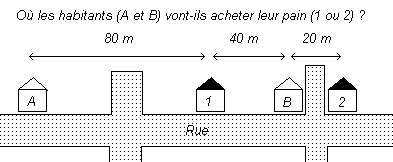{width=500}
 

Deux personnes localisées en des points A et B doivent aller acheter leur pain dans l’une des deux boulangeries localisées en 1 et en 2. Si l’on appliquait strictement la logique gravitaire, on serait amené à dire que la personne localisée en B a une plus forte probabilité de fréquenter la boulangerie 1 que la personne localisée en A, car elle est située à une distance deux fois plus faibles. Mais la personne localisée en B dispose d’une opportunité de relation plus proche et, si elle décide de minimiser son coût de déplacement, elle choisira de préférence la boulangerie n°2. Au contraire, la personne localisée en A ne dispose pas d’alternatives et la boulangerie n°1 est la plus proche de son domicile (pas d’opportunités interposées). Sauf à renoncer à manger du pain, elle acceptera donc un coût de déplacement plus élevé. Au total, contrairement à ce que laisserait présager le modèle gravitaire, la personne localisée en A a une plus forte probabilité de fréquenter la boulangerie n°1 que la personne localisée en B, si les deux acteurs adoptent une stratégie de minimisation de la distance. En fait, si l’on remplace la distance à vol d’oiseau par la distance ordinale (rang des opportunités) le comportement des acteurs apparaît bien conforme à la logique du modèle d’interaction spatiale.

 
Le modèle de Stouffer permet donc non seulement d’améliorer les modèles d’interaction spatiale mais aussi de les rendre plus réalistes en démystifiant le rôle de la distance. La décroissance des probabilités de relation avec la distance ne correspond en effet pas nécessairement à un effet mécanique mais peut-être interprétée à l’aide d’une hypothèse psychologique de comportement. La critique de Stouffer porte d’ailleurs essentiellement sur les modèles de type gravitaire mais elle ne remet pas véritablement en cause les modèles à double contrainte. Ceux-ci incorporent en effet une situation de concurrence pour les destinations qui permet de prévoir des situations du type de celle qui est présentée sur la Figure 1. En effet, si l’on suppose que chaque habitant fréquente une seule boulangerie et que chaque boulangerie a un seul client (double contrainte), la situation la plus probable dans une perspective de minimisation du coût de déplacement est bien que l’habitant A fréquente la boulangerie n°1 et que l’habitant B fréquente la boulangerie n°2.

Le modèle de Stouffer permet donc de valider les hypothèses des modèles d’interaction spatiale et de les dédouaner de l’accusation de projeter des hypothèses mécanistes sur le comportement spatial des individus. Toutefois, il reste à démontrer la validité de l’hypothèse de comportement des acteurs qui est sous-jacente à la théorie de Stouffer. Les modèles d’interaction spatiale postulent en effet que les acteurs ordonnent les opportunités de relation en fonction de la distance, supposée refléter le coût de réalisation des relations. Ceci revient donc à reprendre le paradigme économique dont nous avons vu précédemment qu’il s’appliquait tout aussi bien aux modèles d’interaction territoriale. Ceci suppose également que l’acteur est pleinement informé de l’ensemble des opportunités de relation et que le classement qu’il opère tient compte de l’ensemble de l’information. Or, comme nous l’avons montré à propos du modèle d’Hägerstrand, il n’est pas obligatoire que l’acteur dispose d’une information exhaustive et le classement des opportunités qui sert de base à son choix peut être le résultat d’une information incomplète. Toutes choses égales quant à la distance, l’acteur peut disposer sur une information plus complète concernant les opportunités de relation situées à l’intérieur de sa propre maille territoriale que sur les opportunités de relation situées dans des mailles territoriales différentes. Il peut donc effectuer un classement qui dépende non seulement de la distance mais aussi de l’appartenance, ce qui le conduira à adopter un comportement à la fois spatial et territorial. Il peut aussi arriver que le migrant choisisse délibérément de privilégier l’appartenance territoriale comme critère de choix dans ses destinations. Ainsi, on peut imaginer des formes de classement emboîtés ou un migrant décide (1) de migrer si possible à l’intérieur de sa maille d’appartenance et (2) de prendre la destination la plus proche, toutes choses égales quant à l’appartenance.

Dans l’exemple des deux boulnageries on peut imaginer que ce sont les enfants qui vont chercher le pain et que les parents souhaitent éviter qu’ils traversent des rues. La règle de décision fixée par les parents est donc bien un choix emboîté qui consiste (1) à traverser le moins de rues possibles (effet territorial) et (2) à choisir la boulangerie la plus proche, toutes choses égales quant au nombre de rues traversées. Dans ce cas, les habitants de la maison B se rendront de préférence à la boulangerie n°1 qui, bien que plus éloigné, à l’avantage de se trouver dans le même pâté de maison (appartenance) et d’éviter d’avoir à traverser une rue (limite territoriale). Pour les habitants de la maison A, il faudra de toute manière franchir au moins une rue pour aller chercher le pain, et il sera peut-être même nécessaire de se rendre à la boulangerie n°2 car les habitants de A, qui sont plus proche, auront pu plus facilement saisir les opportunités situés dans la boulangerie n°1 (baguette).
         
         
### Les modèles d’interaction "géographique".
     
L’examen des fondements théoriques des modèles d’interaction spatiale montre donc que les hypothèses théoriques qui justifient leur emploi en sciences sociales s’appliquent tout aussi bien au modèle d’interaction territoriale. Il n’y a donc pas de raison théorique valable de privilégier la distance par rapport à l’appartenance dans la recherche des déterminants géographiques des relations sociales. Bien au contraire, il apparaît que dans chacune des théories proposées, les deux facteurs sont complémentaires et étroitement imbriqués sur le plan conceptuel. Analyser séparément les deux effets de distance et d’appartenance, comme nous l’avons fait dans la partie précédente, risque donc de faire manquer une dimension fondamentale du phénomène et de conduire à des conclusions incorrectes sur les rôles respectifs de la proximité spatiale et de l’appartenance territoriale dans le comportement des acteurs.

Aussi, nous proposons de rassembler sous le terme général de modèles d’interaction géographique l’ensemble des modèles qui proposent de décrire l’intensité des relations sociales en fonction de la proximité spatiale ou de l’appartenance territoriale. Les modèles d’interaction géographique regroupent donc les modèles d’interaction spatiale (probabilité de relation en fonction de la distance), les modèles d’interaction territoriale (probabilité de relation en fonction de l’appartenance) et les modèles d’interaction spatiale et territoriale qui prennent simultanément en compte les deux effets de distance et d’appartenance.

     
     
## Estimation déductive des effets de barrière (test d'une partition connue)


En nous limitant au cas des modèles multiplicatifs d’interaction migratoire à double contrainte et à diagonale vide, nous allons essayer de définir une famille de modèle d’interaction géographique comprenant des modèles d’interaction spatiale (vus au chapitre précédent), des modèles d’interaction territoriale et des modèles d’interaction spatiale et territoriale. Nous nous limiterons dans un premier temps au cas des modèles d’interaction territoriale les plus simples, c’est-à-dire ceux qui étudient l’effet de l’appartenance commune et ne dépendent que d’un seul paramètre (le coefficient de perméabilité des limites territoriales). Les autres formes de modèles d’interaction territoriale seront brièvement évoquées mais ne seront pas développées.
     
### Les modèles d’interaction territoriale
         
Si l’on repart du modèle d’interaction à double contrainte défini au chapitre précédent, on voit que le passage d’un modèle d’interaction spatiale à un modèle d’interaction territoriale consiste simplement à modifier l’hypothèse faite sur le facteur d’éloignement (matrices d'appartenance $A$) et sur la fonction d’interaction $f(A_{ij})$ s’appliquant à ce facteur d’éloignement.

Si l’on suppose connue l’appartenance des unités territoriales à différentes mailles territoriales, la manière la plus simple de définir un modèle d’interaction territoriale est de supposer que l’intensité des relations dépend de la distance d’appartenance commune, c’est-à-dire de l’appartenance des unités territoriales à une même maille territoriale (Aij=0) ou à deux mailles territoriales différentes ($A_{ij}=1$). Le facteur d’éloignement comportant deux modalités, on peut donc définit un modèle à deux paramètres indiquant l’accroissement relatif des flux intra-maille ($\gamma_0$) et la réduction relative des flux inter-mailles ($\gamma_1$) :
         

$F_{ij} = a_i.O_i.b_j.D_j. \gamma_0^{1-Aij} . \gamma_1^{Aij}$
         

Toutefois, dans la mesure où le modèle est à double contrainte, l’un des deux paramètres va être absorbé par les contraintes de conservation des lignes et des colonnes et il est plus simple d’introduire un seul paramètre correspondant à la valeur de l’effet de barrière ($\gamma$) ou du coefficient de perméabilité ($1/\gamma$ ):

$F_{ij} = a_i.O_i.b_j.D_j. (\gamma)^{Aij}$

Le modèle postule donc simplement que les flux dépendent des capacités d’émission et de réception des lieux d’origine et de destination et que les flux franchissant une limite de maille territoriale subissent une réduction moyenne correspondant à une division par $\gamma$ . L’hypothèse sous-jacente à ce modèle est l’existence d’un effet de barrière complet et homogène, c’est-à-dire d’une réduction de tous les flux qui franchissent une limite territoriale par un même facteur.

On peut naturellement construire des modèles d’interaction territoriale plus complexe. Ainsi, si l’on suppose que l’effet d’appartenance ne correspond pas nécessairement à un effet de barrière complet, il faudra définir autant de paramètres qu’il y a de couples d’appartenances possibles. Par exemple, si l’on a défini une partition en 3 classes d’appartenance X, Y et Z, on doit théoriquement estimer neuf coefficients d’interaction $\gamma_{XX}, \gamma_{XY}, \gamma_{XZ}, \gamma_{YX}, \gamma_{YY}, \gamma_{YZ}, \gamma_{ZX}, \gamma_{ZY}, \gamma_{ZZ}$.En réalité, certains de ces paramètres seront absorbés par les contraintes de conservation des flux imposées aux modèles et, dans le cas d’une partition en k mailles territoriales, il n’y aura que (k-1)2 paramètres à estimer. Ainsi, dans le cas d’une partition en trois classes, il suffit d’ajuster les quatre paramètres $\gamma_{XX}, \gamma_{XY},\gamma_{YX}$ et $\gamma_{YY}$ pour obtenir un ajustement optimal du modèle. On définira donc quatre matrices XX, YY, XY et XY composées de 0 et de 1 et telles que (par exemple) $XX_{ij}$ =1 si i appartient à X et j appartient à X. Le modèle d’interaction territoriale sera alors de la forme :
         

$F_{ij} = a_i.O_i.b_j.D_j. \gamma_{1}^{XX_{ij}}. \gamma_{2}^{XY_{ij}}. \gamma_{3}^{YX_{ij}}. \gamma_{4}^{YY_{ij}}$
         
  
On peut remarquer que, dans le cas d’un modèle à double contrainte et d’une partition en deux classes, le calcul des coefficients d’appartenance est inutile puisqu’il suffit de calculer un seul paramètre pour que tous les autres soient absorbés par les contraintes du modèle. Il est donc plus intéressant de calculer la valeur de l’effet de barrière plutôt que celle d’un des quatre coefficients d’appartenance.

Une troisième possibilité d’enrichissement des modèles d’interaction territoriale consiste à prendre en compte l’effet simultané de plusieurs partitions. Ces partitions peuvent être indépendantes (par exemple une division nord-sud et une division est-ouest) ou bien correspondre à un emboîtement de maillages hiérarchisés (par exemple l’appartenance au républiques et aux régions). Dans ce dernier cas, les effets de barrière sont cumulatifs puisque tout effet de barrière concernant un niveau territorial supérieur (les républiques) implique nécessairement une valeur supérieur ou égale à l’effet de barrière subit au niveau territorial inférieur. Ainsi, si l’on définit par $REP_{ij}$ l’appartenance de deux districts à une même république et par $REG_{ij}$ l’appartenance de deux districts à une même région (les républiques étant composées de régions), le modèle d’interaction territoriale permettra d’estimer deux paramètres d’effet de barrière :

$F_{ij} = a_i.O_i.b_j.D_j. \gamma_{1}^{REG_{ij}}. \gamma_{2}^{REP_{ij}}$
         
         

Le paramètre $\gamma_{1}$ correspondra à l’effet de barrière lié au franchissement des limites régionales tandis que le paramètre $\gamma_{2}$ définira l’effet de barrière spécifique lié au franchissement des limites de républiques. L’effet de barrière global lié au franchissement des limites de républiques sera égale au produit des deux effets ($\gamma_{1}.\gamma_{2}$ ) puisque toute limite de république est aussi une limite de région dans le cas d’un maillage strictement emboîté. On peut également calculer un effet de barrière régional spécifique en ne retenant dans le calcul de que les limites de régions situées à l’intérieur de la même république. Il est ainsi possible de décomposer les effets de barrière induits par une hiérarchie de maillages emboîtés et de déterminer à quel niveau d’organisation territoriale s’observent les plus forts effets d’appartenance.
         

A titre d’exemple, nous avons pu montrer à travers l’étude des migrations entre les 109 districts de Tchécoslovaquie en 1989  (Grasland C., 1994) que l’effet de barrière inter-république était de 2.7 et l’effet de barrière inter-régional était de 1.6. L’influence spécifique du franchissement de la limite des deux républiques correspond donc à un effet de barrière de 2.7/1.6 = 1.7. Par la suite, si on calcule l’effet de barrière inter-régional à l’intérieur de chacune des deux républiques, on voit qu’il est de 1.3 en république tchèque et de 1.1 en Slovaquie .
         

Même dans leur formulation la plus simple (calcule d’un seul paramètre mesurant l’effet de barrière associé à une partition), les modèles d’interaction territoriale fournissent souvent des descriptions des relations sociales dont la qualité est voisine de celle des modèles d’interaction spatiale. Ainsi, dans le cas des migrations entre les 10 régions de Tchécoslovaquie en 1985-90, le pouvoir explicatif d’un modèle d’interaction territoriale fondé sur l’appartenance aux deux républiques est de 71.6% (critère $r^2$ mesurant le pouvoir explicatif du modèle une fois pris en compte l'effet des marges) alors que les modèles d’interaction spatiale sur la distance ont un pouvoir explicatif de 67.8% (modèle exponentiel) ou 71.6% (modèle Paréto). Naturellement cette équivalence des modèles d’interaction spatiale et des modèles d’interaction territoriale n’est pas une règle absolue. Le pouvoir explicatif de l’appartenance dépend de l’importance de l’effet de barrière et peut donc varier au cours du temps. Ainsi, si l’on considère les migrations entre les 10 régions de Tchécoslovaquie en 1961-65, le pouvoir explicatif du modèle d’interaction territoriale n’est que de 55 .7% alors que celui des modèles d’interaction spatiale est nettement supérieur (64.4 % pour le modèle exponentiel et 72.5 % pour le modèle Paréto). Ceci semble indiquer que le pouvoir explicatif de la distance est demeuré relativement stable au cours du temps, alors que l’influence de l’appartenance sur le comportement des migrants s’est renforcée.
         

L’examen des coefficients de barrière calculés directement à l’aide du modèle d’interaction territoriale ou indirectement à l’aide des résidus des modèles d’interaction spatiale confirme ce renforcement de l’effet de barrière en Tchécoslovaquie entre 1961 et 1990, mais elle met en évidence un problème particulièrement gênant : les coefficients de barrière calculés directement à l’aide du modèle d’interaction territoriale sont considérablement plus élevés que ceux obtenus à l’aide des résidus des modèles d’interaction spatiale. Ainsi, en 1961-65, l’effet de barrière estimé par le modèle d’interaction territoriale est de 3.27 alors que celui que nous avions estimé dans le chapitre précédent à l’aide des résidus d’un modèle d’interaction spatiale était deux fois plus faible (1.58). De même, en 1986-1990 l’effet de barrière estimé par le modèle d’interaction territoriale est de 4.55 alors que celui estimé à l’aide des résidus d’un modèle d’interaction spatiale n’est que de 1.96.
         

Le fait que les effets de barrière calculés à l’aide des résidus d’un modèle d’interaction spatiale soient plus faible que les effets de barrière calculés directement à l’aide d’un modèle d’interaction spatiale s’explique par l’existence d’une forte corrélation entre la proximité et l’appartenance. Dans le cas de la Tchécoslovaquie, la disposition des deux républiques et l’allongement du territoire génèrent une forte dépendance entre la proximité de deux régions et leur appartenance à la même république ou, symétriquement, entre l’éloignement de deux régions et la probabilité qu’elles ont d’appartenir à deux républiques différentes. La faiblesse des flux à longue distance peut donc s’expliquer aussi bien par l’effet de la distance (interaction spatiale) que par l’effet de l’appartenance (interaction territoriale). Du coup, un modèle qui ne prend en compte qu’un seul des deux effets (la distance ou l’appartenance) risque de prendre en compte tout ou partie de ce qui est imputable à l’autre facteur. Le modèle d’interaction territorial génère des coefficients de barrière très élevés car il impute à l’appartenance territoriale (républiques différentes) des effets qui sont peut être simplement liés à l’éloignement. Quant au modèle d’interaction spatiale, il risque de surestimer l’effet de la distance en lui attribuant une partie des effets de l’appartenance. Les effets d’appartenance étant partiellement pris en compte par la distance, les résidus du modèle d’interaction spatiale auront donc tendance à sous-estimer l’effet de barrière.

On peut donc conclure que, lorsqu’il existe une corrélation entre la distance et l’appartenance, les deux effets d’interaction spatiale et d’interaction territoriale doivent être estimés simultanément et non pas séparément. Plus la corrélation entre les deux facteurs est importante, plus l’estimation séparée des paramètres de distance et d’appartenance risque de faire apparaître des biais et de conduire à des erreurs d’interprétation. Le cas des migrations entre les 11 provinces de Belgique en fournit d’ailleurs une preuve a contrario. Si l’on examine l’effet de barrière correspondant à une division entre les provinces néerlandophones et les provinces francophones de 1964 à 1989, on observe assez peu de différences entre les coefficients de barrière estimés à l’aide du modèle d’interaction territoriale et ceux déduits de l’analyse des résidus d’un modèle d’interaction spatiale. Cette stabilité s’explique par la configuration particulière du pays (allongement dans le sens des unités linguistiques) et par la très faible dépendance entre la proximité spatiale et l’appartenance territoriale.

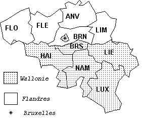{width=500}
         

Le cas de la Belgique est cependant très particulier et, dans l’immense majorité des cas, il existe une forte corrélation entre la distance séparant deux unités spatiales et le fait qu’elles appartiennent à une même maille territoriale ou à deux mailles territoriales différentes. Cette corrélation s’explique très simplement par la contrainte de contiguïté politico-administrative, c’est-à-dire par le fait que les unités composant une maille territoriale forment en général un ensemble connexe et sont donc en moyenne plus proches les unes des autres que deux unités spatiales prises au hasard.
         
         
## Les modèles d’interaction spatiale et territoriale
         
Les modèles d’interaction spatiale et territoriale partent de l’hypothèse que les relations qui se nouent entre les habitants dépendent simultanément de la distance et de l’appartenance. L’hypothèse la plus simple que l’on puisse formuler est que les deux effets se combinent de façon multiplicative, c’est-à-dire que l’effet de barrière lié au franchissement d’une limite territoriale est le même, quelle que soit la distance de relation. Si l’on admet cette hypothèse de proportionnalité, on peut définir comme suit un modèle d’interaction spatiale et territoriale à double contrainte de type puissane ou exponentiel 
     
$F_{ij} = a_i.O_i.b_j.D_j. d_{ij}^{-\alpha}. (\gamma)^{Aij}$  (modèle puissance)

     
$F_{ij} = a_i.O_i.b_j.D_j. exp( -\alpha.d_{ij}). (\gamma)^{Aij}$  (modèle exponentiel)
         

L’ajustement de ces modèles est relativement complexe car il suppose le recours à deux procédures itératives emboîtées, l’une pour l’estimation des paramètres de double contrainte (a_i et b_j) et l’autre pour la détermination du couple de paramètre ($\alpha ,\gamma$ ) assurant la meilleure qualité d’ajustement (critère de minimisation du chi-2). En effet, l’ajustement des paramètres de freinage de la distance ($\alpha$) et d’effet de barrière ($\gamma$) étant effectué de façon simultanée, il faut examiner l’ensemble de la surface d’ajustement ($r^2$) correspondant à ces deux paramètres pour déterminer la valeur de l’optimum global. Des méthodes d’ajustement non-linéaire permettent de faciliter la recherche de cet optimum global mais il faut vérifier que la solution obtenue corresponde bien à un optimum global et non pas à un optimum local. Il est toutefois possible de trouver rapidement des solutions approximativement juste en utilisant les modèles de régression de Poisson. 


Les résultats sont toutefois à la hauteur de l’effort consenti car les modèles d’interaction spatiale et territoriale se révèlent nettement plus performants que les simples modèles d’interaction spatiale ou d’interaction territoriale. Dans le cas des migrations en Tchécoslovaquie, l’estimation simultanée des effets de proximité et d’appartenance conduit à des qualités d’ajustement r*2 de l’ordre de 90 %, alors que les modèles qui séparent les deux effets ont des qualités d’ajustement qui ne dépassent guère les 70 %. Ce gain explicatif considérable montre que les effets d’appartenance et de proximité ne sont pas redondants mais complémentaires. Les modèles d’interaction spatiale et territoriale semblent donc très utile pour décrire et prévoir le comportement des populations et ils semblent particulièrement adapté à la situation des échanges à l’intérieur de territoires présentant de forts clivages historiques, politiques, sociaux ou culturels .

Toutefois, plus que leur intérêt opérationnel, c’est l’intérêt théorique des modèles d’interaction spatiale et territoriale pour la connaissance des phénomènes d’intégration sociale que nous voudrions souligner. Les paramètres de réduction des interactions en fonction de la distance ($\alpha$) et de l’appartenance ($\gamma$) sont en effet estimés simultanément, de sorte que leur dépendance réciproque est contrôlée. Leur valeur est donc beaucoup plus fiable que précédemment et l’interprétation que l’on peut en faire sera beaucoup plus précise. En effet, dans un modèle d’interaction spatiale et territoriale le paramètre ($\alpha$) mesure la décroissance des relations avec la distance toutes choses égales quant à l’appartenance tandis que le paramètre ($\gamma$) mesure l’importance de l’effet de barrière toutes choses égales quant à la distance. L’exemple des migrations entre les 11 régions de Tchécoslovaquie montre que les valeurs correctes de ces paramètres sont parfois très éloignées de celles qui avaient été obtenues à l’aide d’une estimation séparée. Ainsi, pour les migrations en Tchécoslovaquie de 1961 à 1965, le frein de la distance toutes choses égales quant à l’appartenance est de -1.02 pour le modèle Paréto et de -0.0036 pour le modèle exponentiel. La même estimation faite à l’aide d’un simple modèle d’interaction spatiale (donc, ne tenant pas compte de l’appartenance) conduisait à une nette surestimation de cet effet de la distance (respectivement -1.34 et -0.0064). Quant à l’effet de barrière sa valeur correcte (toutes choses égales quant à la distance) est environ de 2.1, alors que les estimations obtenues précédemment étaient soit trop élevés (modèle d’interaction territoriale), soit trop faible (résidus d’un modèle d’interaction spatiale).
         

L’estimation simultanées des paramètres de distance et d’appartenance par un modèle d’interaction spatiale et territoriale apparaît d’autant plus nécessaire que les biais introduit par les autres méthodes ne sont pas systématiques. Ainsi, dans le cas de la Belgique, les paramètres de barrière estimés par le modèle d’interaction territoriale sont plus faibles que ceux estimés par le modèle complet alors que, dans le cas de la Tchécoslovaquie c’est l’inverse qui se produit. Une comparaison valable de l’effet de barrière dans les deux pays suppose donc que l’on recoure dans chacun des cas à un même modèle prenant simultanément en compte les effets d’appartenance et de proximité.


         
         
### Exemple d’application : l’évolution de l’effet de barrière en Tchécoslovaquie et en Belgique (1961-1990)
         
Si l’on prend comme référence le modèle qui fournit le meilleur ajustement (Paréto), on peut montrer que l’effet de barrière était sensiblement du même ordre de grandeur dans les deux pays au début des années 1960 et correspondait à une division par deux des flux entre les deux républiques de Tchécoslovaquie ou entre les deux régions linguistiques de Belgique. La comparaison des situations à la fin des années 1980 montre que l’accroissement de l’effet de barrière a été plus marqué en Belgique (+ 55 %) qu’en Tchécoslovaquie (+35 %). Le rythme temporel de cet accroissement de l’effet de barrière apparaît également différent. En Belgique, on observe deux phases d’accroissement rapide de l’effet de barrière (1964-1974 et 1979-1984) séparées par un palier. Entre 1984 et 1989, l’effet de barrière migratoire entre les deux régions linguistiques de Belgique semble s’être stabilisé. En Tchécoslovaquie on observe une seule phase d’accroissement rapide de l’effet de barrière entre 1970 et 1980. Au cours des années 1980, l’effet de barrière entre les deux républiques de Tchécoslovaquie tend à se stabiliser voire à diminuer légèrement. Les deux pays montrent donc un renforcement similaire de l’opposition entre deux composantes territoriales ayant des comportement migratoires de plus en plus autonomes. Cette accroissement de la division du champ migratoire national s’est opéré dans les deux pays de façon précoce et a peut être été influencé par la mise en place d’une reconnaissance administrative des entités territoriales : réforme linguistiques en Belgique (1963) ; mise en place du système fédéral en Tchécoslovaquie (1969). Il est toutefois difficile de tirer des conclusions trop radicale d’une simple analyse de la mobilité des populations. La fragmentation du champ migratoire n’est qu’une composante, un marqueur, des divisions croissantes du corps social qui se sont opérées dans les deux pays et qui trouvent leur racine dans la résurgence de divisions historiques et culturelles plus profondes. Il semble d’ailleurs exister un décalage entre la modification du comportement des habitants (accroissement de l’effet de barrière) et la sanction politique de ces divisions sociales par un changement de maillage : mise en place du système fédéral en Belgique (1993) ; séparation de la Tchécoslovaquie en deux Etats (1993). Dans les deux cas, la réforme politique ou administrative s’est opérée dans un contexte de stabilité (Belgique) voire de réduction (Tchécoslovaquie) des divisions sociales, telles que l’on peut les mesurer à l’aide des données migratoires.

        
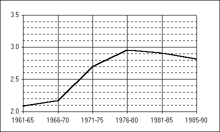

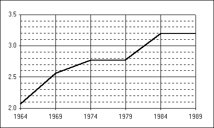

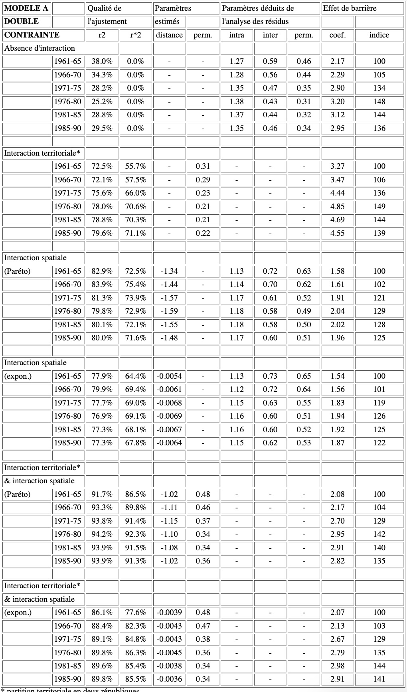{width=600}

> Partition en deux républiques 

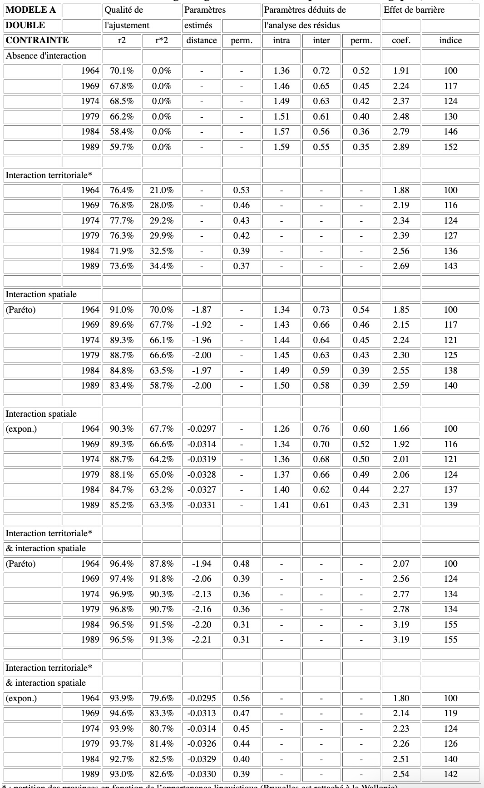{width=600}

> Partition en fonction de l’appartenance linguistique (Bruxelles est rattaché à la Wallonie)
     
     
## Estimation inductive des effets de barrière (recherche d'une partition inconnue)


La mise en évidence d’une dépendance entre les phénomènes d’interaction spatiale et d’interaction territoriale nous a conduit à proposer un modèle général d’analyse de l’interaction spatiale et de l’interaction territoriale qui est plus satisfaisant que les modèles fondés sur l’analyse des résidus d’un modèle d’interaction spatiale. Mais du coup, nous nous trouvons confronté à une difficulté majeure car les méthodes développées dans le chapitre précédent pour mettre en évidence des structures territoriales à partir de l’analyse des résidus apparaissent incorrectes. En effet, comme les modèles d’interaction spatiale sont biaisés (surestimation de l’effet de la distance), les résidus qu’ils produisent le sont également. Du coup, les structures territoriales que l’on peut mettre en évidence à partir de ces résidus (effets de barrière complets ou incomplets, effets d’appartenance) ne sont pas nécessairement celles qui traduisent le mieux le comportement territorial des migrants.

En d’autres termes, la partition territoriale optimale, c’est-à-dire celle qui, couplée avec l’effet d’une distance, permet de décrire le mieux possible le comportement des migrants ne peut pas être déduite de l’analyse des résidus d’un modèle d’interaction territoriale mais doit être directement évaluée à l’aide d’un modèle complet d’interaction spatiale et d’interaction territoriale. Ceci nous conduit à la définition d’un problème méthodologique d’une complexité redoutable : le problème de la partition inconnue.
              
### Définition du problème de la partition inconnue


Le problème de la partition inconnue est à la fois d’une grande simplicité conceptuelle et d’une grande complexité mathématique. Un territoire composé de n unités territoriales peut en effet être subdivisé en un nombre fini de partition territoriales. En l’absence de contraintes particulières (nombre de classes, contrainte de contiguïté, etc.) le nombre maximum de partitions différentes est égal à nn . Chacune de ces partitions peut servir de base au calcul d’un modèle d’interaction spatiale et territoriale et, après ajustement des paramètres de distance et de barrière, on peut lui attribuer un pouvoir explicatif qui correspond à la qualité de l’ajustement réalisé à l’aide de ce modèle. Les partitions étant en nombre fini, il existe donc nécessairement une partition optimale, c’est-à-dire un découpage du territoire en classes qui permet d’obtenir une description optimale de l’influence de la distance et de l’appartenance sur le comportement des migrants. C.Q.F.D.

Il faut toutefois faire d’emblée deux réserves sur le caractère optimal de la partition obtenue.
     
La partition optimale ne l’est qu’au sens d’un certain modèle et d’un certain critère d’ajustement. Si l’on change la forme du modèle (e.g. utilisation de plusieurs coefficients d’appartenance à la place d’un seul coefficient de barrière) ou si l’on change le critère de mesure de la qualité d’ajustement (e.g. utilisation du maximum de vraisemblance ou des moindres carrés à la place du critère du chi-deux), le classement des partitions risque d’être modifié et la partition "optimale " ne sera plus nécessairement la même.

Même si l’on fixe la forme du modèle comme nous l’avons fait précédemment (recherche de deux paramètres $\alpha$ et $\gamma$  à l’aide d’un modèle à double contrainte visant à minimiser le chi-2 de l’erreur), il n’est pas obligatoire que la partition optimale corresponde à une division de l’espace en unités territoriales fortement intégrées et séparées par des effets de barrière. Il est en effet possible que la partition optimale corresponde à un effet d’anti-barrière, c’est-à-dire à une division de l’espace en entités territoriales ou la probabilité de relation intra-maille est plus forte que la probabilité de relation inter-maille, toutes choses égales quant à la distance. Ce résultat n’est paradoxal qu’en apparence. En effet, une partition conduisant à une valeur de g supérieure à 1 (anti-barrière) correspond bien à une forme d’intégration sociale puisqu’elle définit des entités territoriales qui maximisent les relations entre les personnes ayant des appartenances différents. Un Etat qui souhaite développer des relations entre des groupes qui s’ignorent pourrait très bien choisir de fragmenter ces groupes et de les regrouper dans des mailles administratives différentes afin de créer de nouvelles opportunités de brassage social. Les partitions débouchant sur des anti-barrières correspondent donc à une stratégie d’intégration territoriale globale (renforcement des échanges entre toutes les composantes du système) tandis que les partitions fondées sur des barrières correspondent à une stratégie de renforcement de l’intégration territoriale locale (renforcement des échanges entre des sous-systèmes déjà constitués). En tout état de cause, il existe un lien entre les deux formes de partition puisque toute partition correspondant à des barrières territoriales implique l’existence de partition perpendiculaires générant des anti-barrières. Ce n’est que si un système est faiblement structuré que l’on ne peut pas mettre en évidence de partition territoriales de type barrière ou anti-barrière se détachant nettement des autres.

     
### Un exemple d’application du problème de la partition inconnue


Supposons que nous voulions vérifier si la division en deux républiques correspond à la partition qui donne le meilleur ajustement des flux entre les 10 régions tchécoslovaques en 1961-65 à l’aide d’un modèle d’interaction spatiale et territoriale. La seule façon de s’en assurer est de tester l’ensemble des partitions et de mesurer leur qualité d’ajustement. Toutefois, même avec 10 régions, le nombre de partition possible est très élevé. On peut donc poser un certain nombre de conditions restrictives afin de n’examiner que les partitions qui sont comparables à la division en deux républiques. On limitera donc la recherche aux partitions qui vérifient les conditions suivantes :
     
- partition en deux entités spatiales (fixation du nombre de classes)
- entités spatiales composées de régions connexes (contrainte de continuité territoriale)


Seules 48 partitions vérifient ces deux conditions et l’on peut alors procéder à un examen exhaustif de leurs paramètres ($\alpha, \gamma$) et de leur qualité d’ajustement ($r^2$). L’examen du paramètre de barrière montre que 25 partitions correspondent à des effets de barrière ($\gamma > 1$) et 23 à des effets d’anti-barrière ($\gamma< 1$). Le classement des partitions en fonction de la qualité d’ajustement des modèles d’interaction spatiale et territoriale  montre que la division en deux républiques (partition B1) n’arrive qu’en deuxième position avec une qualité d’ajustement de 93.1% . La partition optimale (A1) a une qualité d’ajustement légèrement supérieure (93 .2%) et correspond à un modèle d’anti-barrière dont les paramètres sont $\alpha = -1.82$ et $\gamma =0.57$. Elle oppose quatre régions de Bohême (nord, centre, ouest et sud) au reste du pays. Comme il s’agit d’un effet d’anti-barrière, les flux intra-maille sont proportionnellement plus faibles que les flux inter-mailles, toutes choses égales quant à la distance. En effet, cette partition regroupe des régions qui échangent moins de migrant que ce que laisserait présager leur proximité (e.g. Bohême-nord et Bohême-centre ou Moravie-sud et Slovaquie-ouest) tandis qu’elle sépare des régions qui échangent plus que ce que laisserait prévoir leur proximité (e.g. Slovaquie-ouest et Bohême-nord ou Bohême-centre et Bohême-sud). Il n’y a donc rien de paradoxal au fait que le meilleur modèle descriptif soit un modèle d’anti-barrière regroupant les régions qui sont les moins intégrées.

L’examen de l’histogramme des qualités d’ajustement montre d’ailleurs que 6 des 7 meilleures partitions correspondent à des modèles de type anti-barrière et se détachent nettement des partitions suivantes dont les qualités d’ajustement sont équivalentes et beaucoup plus faibles. Les meilleures partitions avec effet d’anti-barrière présentent d’ailleurs de fortes ressemblances entre elles (e.g. A1 et A2 ou A3 et A5) puisqu’elles visent toutes à regrouper les régions proches qui échangent moins de migrant que ce que laisserait prévoir leur proximité. Ceci explique sans doute pourquoi les meilleures partitions avec effet d’anti-barrière ont des qualités d’ajustement assez voisine, aucune ne se détachant nettement des autres.


Il n’en va pas de même pour les partitions avec effet de barrière  où la division en deux républiques (B1) a une qualité d’ajustement nettement meilleure que les suivantes (B2 à B6). En effet, dès que l’on permute une ou plusieurs régions pour les faire passer dans l’autre république, on observe une chute très importante de la valeur du coefficient de barrière et de la qualité d’ajustement. On peut donc affirmer que dès la période 1961-65, la division en deux républiques est incontestablement celle qui permet de constituer les entités territoriales les plus intégrées sur le plan migratoire, tout au moins par rapport aux contraintes qui ont été fixées en ce qui concerne le nombre de classes et leur contrainte de contiguïté .
     
     


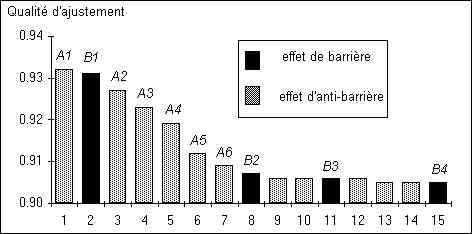{width=400}

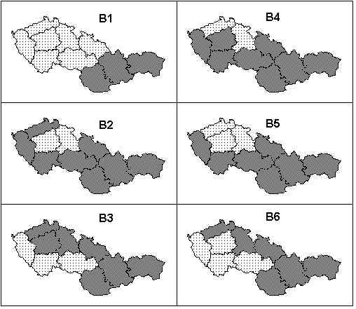{width=400}
     
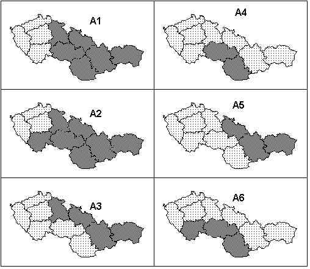{width=400}

    
Si l'on reprend le même protocole d’analyse pour la période 1986-90, on observe un bouleversement très important de la hiérarchie des partitions .En effet, la partition en deux républiques (B1) apparaît désormais nettement comme la partition optimale et son pouvoir explicatif est très nettement supérieure à l’ensemble des autres, qu’elles correspondent à des barrières ou des anti-barrières. L’augmentation de l’effet de barrière entre les deux républiques s’est donc accompagné d’une induration de la structure territoriale des échanges où, si l’on préfère d’une homogénéisation et d’une généralisation de l’effet de barrière qui exclue tout autre structure descriptive alternative. Par rapport au système descriptif adopté, la partition en deux républiques est incontestablement celle qui permet le mieux de rendre compte de l’organisation des échanges entre les dix régions de Tchécoslovaquie.


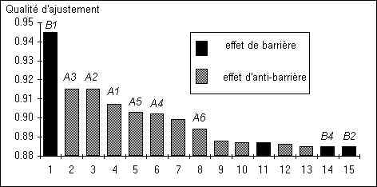{width=400}
     
     
Il convient également d’ajouter que la méthode retenue dans l’exemple précédent (examen exhaustif de l’ensemble des partitions) n’est applicable actuellement qu’à des matrices de migrations de tailles très réduites (25 x25). Mais le programme de recherche que nous avons développé avec le LMC-IMAG devrait bientôt permettre des applications sur des matrices de taille beaucoup plus  importante.
     
     
### Le problème de la partition inconnue et l ‘étude de la dynamique des fragmentations territoriales


Si le problème de la partition inconnue possède une incontestable " beauté mathématique " en raison de sa complexité et du fait qu’il existe " au moins une solution ", il est également du plus haut intérêt sur le plan empirique et sur le plan théorique pour l’analyse géographique des fragmentations socio-territoriales.

D’un point de vue empirique, tout d’abord, la recherche d’une partition optimale permet d’améliorer les modèles de prévisions puisqu’elle permet de déterminer la combinaison de paramètre qui donne l’ajustement le plus efficace compte tenu de l’information disponible. Après avoir déterminé la partition optimale sur un ensemble de périodes, on peut examiner l’évolution temporelle des paramètres correspondant d’interaction spatiale ($\alpha$) et d’interaction territoriale ($\gamma$) à différentes dates et essayer d’extrapoler les tendances de leur évolution. On a ainsi de fortes chances d’obtenir une prévision plus juste que celle qui aurait été réalisée à l’aide d’une simple analyse des variations de la mobilité générale et du frein de la distance. On peut également - mais c’est beaucoup plus compliqué - examiner l’évolution de la partition optimale à différentes dates et essayer d’analyser si son évolution obéit à certaines règles. En effet, un effet de barrière ne correspond pas nécessairement à une limite stable mais peut se déplacer selon un front de progression, certaines unités territoriales voyant leur appartenance se modifier ou s’inverser au cours du temps. Ainsi, dans le cas tchécoslovaque nous avons pu observer qu’il existait deux effets de barrières en 1961-65 (l’un entre la Bohême et la Moravie, l’autre entre la Moravie et la Slovaquie) qui se sont progressivement fondus en un seul à partir de 1970 (entre la république Tchèque et la Slovaquie). Nous avons également pu montrer dans le cas de la Belgique que les sous-provinces de Brabant-Nord et de Bruxelles qui faisaient office de zone-tampon au début des années 1960 se sont progressivement rattachées, l’une au domaine migratoire flamand et l’autre au domaine migratoire wallon.

Ceci nous amène à l’intérêt non plus empirique mais théorique du problème de la partition inconnue qui est de ne pas préjuger a priori de la forme et de la localisation des effets de barrière existant à l’intérieur d’un certain espace. En effet lorsque l’on adopte une démarche déductive (fixation d’une partition a priori), la modélisation tend souvent à conforter l’hypothèse initiale en montrant que la partition choisie correspond bien à un effet de barrière et fournit une bonne description du comportement des migrants. Mais ce résultat, s’il démontre que l’hypothèse retenue est acceptable, ne prouve pas que c’est la meilleure hypothèse possible. Il est donc nécessaire de valider l’hypothèse initiale (e.g. " les migrations en Tchécoslovaquie sont influencées par l’appartenance aux deux républiques tchèque et slovaque ") en comparant son pouvoir explicatif à celui d’hypothèses alternatives (e.g. " les migrations en Tchécoslovaquie sont influencées par l’appartenance aux trois régions historiques de Bohême, Moravie et Slovaquie "). L’intérêt central de la méthode de la partition inconnue est d’adopter une démarche inductive et de ne privilégier a priori aucune hypothèse quant à la localisation précise des barrières. Tout au plus doit-on spécifier quelles sont les contraintes retenues pour trouver la solution optimale (e.g. " quelle partition en deux classes territoriales contiguës influence le plus le comportement migratoire des populations en Tchécoslovaquie ").

Du coup, le problème de la partition inconnue suggère une autre approche de la mesure des barrières qui consiste non pas à déterminer un coefficient de réduction des échanges mais à comparer le pouvoir explicatif de la meilleure partition et des suivantes. En effet, on peut considérer qu’une structure territoriale est d’autant plus pertinente qu’elle se démarque nettement des autres structures territoriales susceptibles de rendre compte du même phénomène.
     
## Estimation d'effets de barrière complexes (interaction entre distance et appartenance territoriale)

L’amélioration théorique et méthodologique apportée par la famille des modèles d’interaction spatiale et territoriale multiplicatifs développés précédemment ne doit pas dissimuler le fait qu’il ne s’agit toujours que d’une solution particulière. En effet, le choix d’une forme multiplicative dans la modélisation des relations entre distance et appartenance est fondé sur un postulat d’homogénéité de l’effet de barrière. Plus précisément, la forme multiplicative présuppose que l’importance de l’effet de barrière est indépendante de la distance de relation. Par exemple, si l’on a trouvé que l’effet de barrière à une valeur moyenne de 2, on suppose que tous les flux franchissant une limite territoriale subissent en moyenne une réduction de moitié, qu’il s’agisse de flux à courte, moyenne ou longue distance. Or, rien n’indique que ce postulat soit vérifié. On peut au contraire imaginer que les personnes situés à très courte distance d’une frontière subissent moins l’effet de barrière car ils sont mieux informés de la situation dans la maille territoriale voisine, connaissent mieux sa langue, etc. Ainsi, le fait que beaucoup d’Alsaciens aillent travailler en Allemagne s’explique non seulement par leur proximité spatiale mais aussi par leur proximité culturelle et linguistique qui permet de lever un certain nombre d’obstacles. Toutefois, on pourrait imaginer des situations différentes où l’effet de barrière diminue avec la distance. Ainsi, dans le cas où une limite territoriale marque la trace d’un conflit entre les peuples situés de part et d’autres, on peut supposer que les facteurs psychologiques d’hostilité ou de méfiance réciproque sont davantage marqués à courte distance qu’à longue distance. Bref, on peut imaginer toutes sortes de théories qui conduisent à supposer que l’effet de barrière varie en fonction de la distance, quel que soit le sens de cette variation.

Si tel est le cas, il convient de réviser nos hypothèses sur la forme multiplicative du modèle d’interaction géographique et de rechercher des formes plus complexes de relation entre la distance et l’appartenance. De plus, si l’effet de barrière varie en fonction de la distance, les mesures qui pourront en être faite vont subir fortement l’influence du niveau d’observation retenu (taille des unités spatiales) puisque la taille du maillage d’observation conduit à majorer ou au contraire à minorer l’importance des relations à courte distance par rapport aux relations à longue distance. De la même manière, les critères d’ajustement peuvent influer sur le calcul de l’effet de barrière si celui-ci varie en fonction de la distance. En effet, les différentes méthodes d’ajustement accordent un poids plus ou moins important aux flux en fonction de leur volume. Or, le volume est généralement corrélé avec la distance, les flux les plus important en volume se nouant en général entre des régions proches. Du coup, un changement de pondération correspond à un changement du poids relatif des relations à courte, moyenne ou longue distance dans l’évaluation des effets de distance et d’appartenance.

D’une manière générale, si l’on observe une instabilité de l’effet de barrière en fonction du choix de la méthode d’ajustement ou du choix du niveau d’observation, il y a de fortes chances que cette instabilité soit liée à une variation de l’effet de barrière en fonction de la distance, c’est-à-dire à une hypothèse incorrecte sur le lien entre distance et appartenance.
     
### Définition d’un modèle général


Que l’on utilise un modèle gravitaire ou un modèle à double contrainte le calcul d’un coefficient de barrière unique dérive de l’hypothèse d’une relation simple entre l’effet de la proximité spatiale et l’effet de la proximité territoriale. Dans un modèle multiplicatif, les deux effets sont combinés sous la forme d’un produit, ce qui revient à dire que la fonction d’interaction géographique G (effet combiné de la proximité spatiale et de la proximité territoriale) est décomposable en deux termes indépendants exprimant l’interaction spatiale S et l’interaction territoriale T.

$G(D_{ij}, A_{ij}) = S(D_{ij}) . T(A_{ij})$

Supposons maintenant que cette hypothèse ne soit pas vérifié, c’est-à-dire qu’il y ait une interaction entre la proximité spatiale et la proximité territoriale. Le nombre de modalités de la variable $A_{ij}$ étant fini, on peut exprimer la fonction d’interaction géographique comme la combinaison de fonction d’interaction spatiales particulières correspondant aux différentes modalités de $A_{ij}$. Si on note $A_1..A_z$ les différentes modalités de $A_{ij}$ et $A^1_{ij}...A^z_{ij}$ des variables booléennes prenant la valeur $A^k_{ij}$ si $A_{ij}=A^k$ et 0 dans le cas contraire on peut écrire la fonction d’interaction géographique sous la forme de fonctions d'interaction complexe où l'effet de la distance varie en fonction de l'appartenance croisée des lieux. 

Les différentes fonctions de la distance expriment le comportement spatial des migrants appartenant à chacune des classes d’appartenance territoriales. Il y a donc a priori autant de fonctions d’interaction spatiales qu’il y a de types de proximité territoriale. 

### Comportement spatial général & comportements spécifiques

Dans le cas particulier où l’on utilise une distance d’appartenance prenant les modalités $A_{ij}=0$ (même appartenance) et $A_{ij}=1$ (appartenance différente), on peut distinguer deux fonctions d’interaction spatiale $S_0$ et $S_1$ qui décrivent respectivement les flux intra-maille et les flux inter-mailles. La déviation relative des flux intra-mailles ou inter-mailles par rapport au comportement général est donnée par les fonctions $\gamma_0 = S_0/S$ et $\gamma_1 = S_1/S$. On en déduit la fonction $\gamma = S_0 /S_1$ qui décrit la déviation des flux intra-mailles par rapport aux flux inter-mailles, c’est-à-dire la variation de l’effet de barrière en fonction de la distance. La fonction d’interaction géographiques correspondant à la présence d’un effet de barrière peut donc s’écrire sous l’une des trois formes équivalentes :

     
### Application du modèle général au cas des fonctions d’interaction spatiale de type Paréto


Nous partirons d de l’hypothèse qu’il existe deux lois d’interaction spatiale $f_0(d_{ij})$ et $f_1(d_{ij})$ décrivant respectivement la décroissance des flux intra-maille et des flux inter-mailles en fonction de la distance. On se place dans le cas d’un modèle gravitaire sans contraintes, et on suppose que les deux fonctions d’interaction spatiales obéissant à une loi de Paréto :

$F^0_{ij} = k_0. E_i . R_j . d_{ij}^{-\alpha_0}$ (relations intra-mailles)

$F^1_{ij} = k_1. E_i . R_j . d_{ij}^{-\alpha_1}$ (relations inter-mailles)

On en déduit une équation générale décivant le comportement de l’ensemble des relationsintra-mailles ou inter-mailles :

$F_{ij} = k_0. E_i. R_j . d_{ij}^{\alpha_0}. [(k_1/k_0). d_{ij}^{(\alpha_1-\alpha_0)}]^{A_{ij}}$

La fonction décrivant la variation de l’effet de barrière en fonction de la distance est donc :

$\gamma(d_{ij}) = (k_1/k_0). d_{ij}^{(\alpha_1-\alpha_0)}$

Cette fonction n’est constante que si ($\alpha_1 = \alpha_0$), ce qui montre clairement que l’hypothèse d’un effet de barrière homogène (indépendant de la distance parcourue) n’est valide que si la vitesse de décroissance des interactions avec la distance est la même pour les flux intra-maille et pour les flux inter-mailles. Si la décroissance des interactions avec la distance est plus rapide pour les flux inter-maille que pour les flux intra-maille ($\alpha_1 > \alpha_0$) l’effet de barrière aura tendance à s’accroître avec la distance. Inversement, si la décroissance des interactions avec la distance est plus rapide pour les flux intra-mailles que pour les flux inter-mailles ($\alpha_1 < \alpha_0$), l’effet de barrière aura tendance à diminuer avec la distance.
     

Si l’on définit maintenant X comme le logarithme de la distance, on peut montrer que le modèle de Paréto correspond à une fonction d’interaction spatiale définie par l’exponentiel d’un polynome P1(X) de degré 1.

Si la décroissance des relations avec la distance obéit à une loi plus complexe que la loi de Paréto, on pourra tenter de l’approcher en recourant à une polynôme Pn(X) de degré n, le degré du polynôme étant fonction de la complexité de la fonction de décroissance des interactions en fonction de la distance. La détermination des fonctions d’interaction spatiales intra-maille et inter-mailles peut alors être entreprise par ajustement de deux polynômes

L’effet de barrière peut donc être non seulement variable avec la distance, mais aussi présenter des minima et des maxima si les degrés du polynôme supérieur ou égaux à 2 ne sont pas nuls. Il convient toutefois de préciser que les valeurs de l’effet de barrière ne sont significatives que sur l’intervalle de distance commun aux flux intra-mailles et aux flux inter-mailles.  L’intervalle d’étude de g (d) risque d’être encore plus réduit si l’on tient compte du fait que son incertitude de mesure dépend à la fois de l’incertitude d’estimation de la fonction d’interaction intra-maille et de celle de la fonction d’interaction inter-mailles. Au total, il peut donc arriver que l’estimation des variations de l’effet de barrière en fonction de la distance soit impossible ou peu fiable car on ne dispose pas d’échantillons suffisant de flux intra-mailles et de flux inter-mailles pour les mêmes gammes de distance.
     
     
### Typologie des variations de l’effet de barrière en fonction de la distance
     
L'analyse des paramètres du modèle polynomial suggère que, d'un point de vue théorique, on peut donc définir cinq grandes familles de situations en ce qui concerne la variation de l'effet de barrière en fonction de la distance. Si on note k le degré minimum du polynôme rendant compte de la variation de l'effet de barrière en fonction de la distance et $g_0, g_1,...g_k$ les paramètres de ce polynome on peut distinguer les cas suivants :


1. **Barrière homogène (k=0 ; g0>1)** : le rythme de décroissance des interactions en fonction de la distance est le même pour les flux intra-maille et les flux inter-mailles. L’effet de barrière peut être résumé à l’aide d’une constante qui indique la réduction relative des flux traversant une limite territoriale par rapport à ceux qui restent à l’intérieur de la même maille territoriale.

2.  **Barrière croissante (k=1;  g0>1; g1>0 )**  : La décroissance des interactions en fonction de la distance est plus rapide pour les flux intra-mailles que pour les flux inter-mailles et l’effet de barrière tend à diminuer quant la distance augmente.

3. **Barrière décroissante  (k=1;  g0>1; g1<0 )** : La décroissance des interactions en fonction de la distance est plus rapide pour les flux inter-mailles que pour les flux intra-mailles et l’effet de barrière tend à augmenter avec la distance

4.**Barrière complexe (k>1;  g0>1)**  : La fonction exprimant l’importance de l’effet de barrière en fonction de la distance présence au moins un minimum ou un maximum sur son domaine de définition. L’effet de barrière augmente ou diminue, selon les intervalles de distance considérés.
5. **Barrière non-définie** Les flux intra-maille et inter-mailles sont définis sur des gammes de distance qui ne se recouvrent pas ou bien leur intersection ne comporte pas un échantillon suffisant de flux intra-maille et inter-mailles. L’effet de barrière ne peut donc pas être estimé, sauf en extrapolant les tendances observées pour les flux intra-mailles et inter-mailles.

Il va de soi qu'une typologie équivalente pourrait être établie pour les anti-barrières en remplaçant la condition  g0>1 par la condition  g0<1 dans les expressions précédentes.
     


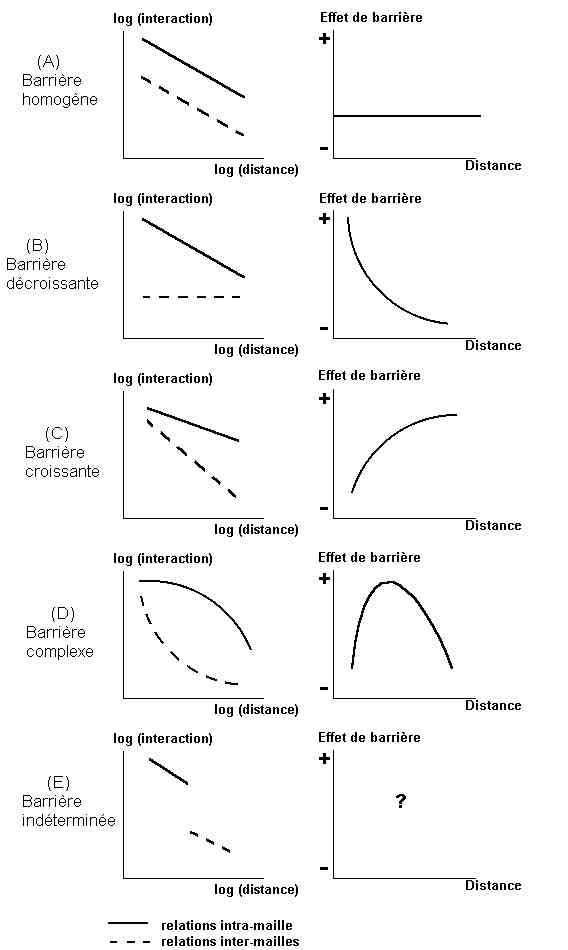{width=700}


     


### Exemple d'application empirique : les migrations entre les provinces Belges en 1989


Partant d'un modèle gravitaire simple et sans contrainte, on constate que les flux migratoires entre les provinces belges varient en fonction de l'appartenance linguistique (Flandres / Wallonie+Bruxelles). Mais la forme du graphique d'interaction suggère que l'effet de barrière n'est pas indépendant de la distance parcourue par les migrants.


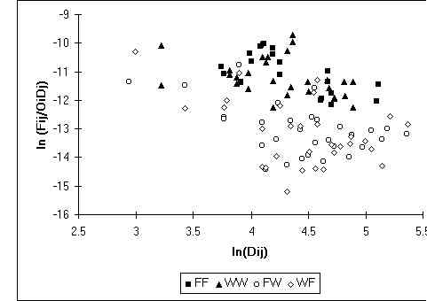{width=500}

    On procède donc à un ajustement séparé des fonctions d'interaction spatiale décrivant le comportement migratoire intra-linguistique et inter-linguistique à l'aide d'un polynôme du logarithme de la distance. Les tests d'ajustement montrent qu'un polynôme de degré 2 assure un ajustement optimal pour les flux inter-linguistiques comme pour les flux intra-linguistiques (alors que le comportement général de l'ensemble du pays s'ajuste le mieux à un polynôme de degré 1, c'est-à-dire à une loi de Paréto classique).

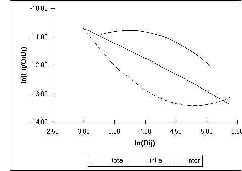{width=500}

On déduit de l'équation des polynômes décrivant les comportements intra- et inter-linguistique la forme générale de la variation de l'effet de barrière en fonction de la distance.

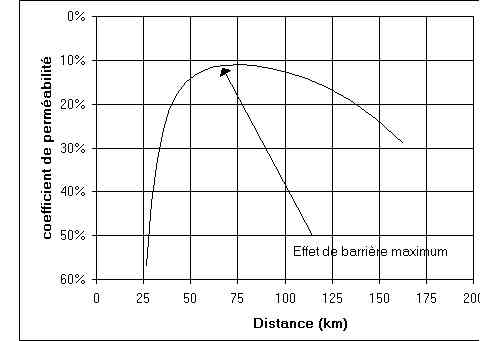{width=500}

Le graphique obtenu permet de montrer que l'effet de barrière varie très fortement en fonction de la distance. Faible pour les migrations à courte distance (division par 2 à 30 km) il culmine à moyenne distance (division par 9 à 75 km)  et diminue ensuite régulièrement pour les distances les plus grandes (division par 3 à 160 km).

Plusieurs facteurs expliquent ces variations, notamment le rôle de l'agglomération bruxelloise située à cheval sur la limite linguistique (et qui favorise les transgressions de la limite linguistique à courte distance) ou celui des aires de villégiature situées aux extrémités opposées du pays (côte de la Mer du Nord en Flandres et région des Ardennes en Wallonie) et qui attirent des migrants de l'ensemble du pays à longue distance.

Mais la forme en cloche de l'effet de barrière observée en Belgique ne constitue pas un cas isolé et on l'observe également pour les migrations inter-républiques en Tchécoslovaquie ou pour les échanges internationaux de marchandise entre les régions de France et de Belgique.

Il semble exister certaines explications théoriques de portée générale permettant de rendre compte de la non-linéarité des effets de barrière et de l'apparition d'un maximum de l'effet de barrière à moyenne distance. Toutefois, leur discussion nécessiterait une discussion détaillée qui dépasse le cadre du présent exposé.

On se bornera donc à rappeler la fréquence de ce type de situation et de mettre en garde l'utilisateur des modèles d'interaction spatiale contre les formulations de l'effet de barrière multiplicative simples, ne prenant pas en compte les variations possibles de l'effet de barrière en fonction de la distance. Un simple graphique, du type de celui que nous avons utilisé pour caractériser les interactions en Belgique, suffit souvent à repérer le type de la relation barrière-distance et permet de suggérer la forme de modélisation la plus appropriée. 

