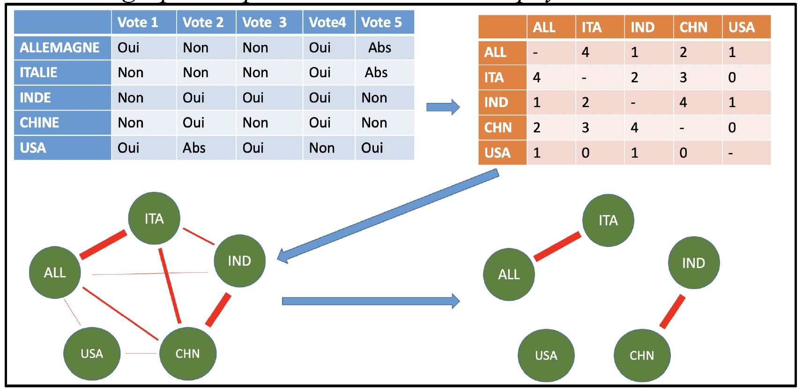

## Exemple des résolutions aux Nations-Unies

On souhaite mesurer la similarité des votes aux Nations-Unies. On repart de l'exemple fictif vu en cours 



### Tableau de données

Ici on crée directement le tableau :

```{r}
# Crée les variables
pays <-  c("Allemagne","Italie","Inde","Chine","USA")
vote1 <- c("Oui","Non","Non","Non","Oui")
vote2 <- c("Non","Non","Oui","Oui","Abs")
vote3 <- c("Non","Non","Oui","Non","Oui")
vote4 <- c("Oui","Oui","Oui","Oui","Non")
vote5 <- c("Abs","Abs","Non","Non","Oui")


# Transforme en tableau
df <- data.frame(pays, vote1,vote2,vote3,vote4,vote5)

# Vérifie le type d'objet (data.frame)
class(df)

# Affiche (si pas trop grand)
df

```


### Transformation en matrice

Avant de calculer une matrice de dissimilarité il est préférable de transformer le tableau en matrice, c'est-à-dire retirer la colonne identifiant (ici, le nom des pays) et l'ajouter comme label des lignes de la matrice. 


```{r}
# Crée une matrice en retirant la colonne identifiant
mat <- as.matrix(df[,-1]) 

# Ajoute l'identifiant comme label des lignes
row.names(mat) <- df$pays

# Contrôle le type
class(mat)

# Affiche (si la matrice n'est pas trop grande ...)
mat
```


## La distance de Hamming

La **distance de Hamming** est utilisée pour mesurer la similarité entre deux vecteurs de type caractère, typiquement, des lettres de l'alphabet. On peut la calculer notamment à l'aide de la fonction *hamming.distance()* du package *e1071*.

Par exemple, la dissimilarité entre vote1 et vote2 donnera 3 puisque c'est le nombre de différences entre les deux colonnes

```{r}
library(e1071)
vote1
vote2
hamming.distance(vote1,vote2)

```

Si on veut mesurer la distance entre deux pays on fera le même calcul après avoir extrait les vecteurs correspondants. Soit par exemple la France et l'Italie, on trouve une dissimilarité de 1

```{r}
all <- mat[1,]
ita <- mat[2,]
all
ita
hamming.distance(all,ita)
```


### Calcul sur l'ensemble de la matrice

Plutôt que de calculer les dissimilarités entre vecteurs, on peut le faire sur l'ensemble de la matrice d'un seul coup. 

```{r}
dissim_pays <-hamming.distance(mat)
dissim_pays
```

On obtient une **matrice de dissimilarité** puisque la distance de Hammings est une mesure de distance. Mais on peut facilement passer à une matrice de **similarité** en soustrayant le nombre maximal de vote commun :

```{r}
sim_pays <- 5 - dissim_pays
sim_pays
```

On peut également passer ensuite en pourcentage de similarité :

```{r}
sim_pays_pct <- 100*sim_pays/5
sim_pays_pct
```


### Transformation en graphe booléen

Que l'on parte de la matrice de similmarité ou de dissimilarité, on peut ensuite transfomer la matrice en graphe booléen en choisissant un seuil. Supposons par exemple qu'on retienne les pays qui ont plus de 70% de votes communs

```{r}
sim_sup_70 <-sim_pays_pct > 70
sim_sup_70
```

Si on préfère des 0 et des 1 on effectue un changement de classe pour passer du type *boolean* au type *numeric* ce qui convertit les TRUE en 1 et les FALSE en 0

```{r}
class(sim_sup_70)<-"numeric"
sim_sup_70
```


### Visualisation rapide du graphe

On peut ensuite exporter les données ou visualiser le graphe dans R. utilisons par exemple le package igraph

```{r}
library(igraph)

net<-graph_from_adjacency_matrix(sim_sup_70,
                                 diag = FALSE,
                                 mode = "undirected")
plot(net)
```


## Variante : décomposition des votes

On peut également décomposer les votes afin de mettre à part les réponses de type abstention ou ne prend pas part au vote. On crée alors des matrices séparées qu'on pourra additionner. 

### Nb de votes oui communs

On calcule le nombre de votes oui commun en faisant un **produit de matrice**

```{r}
mat_oui<- mat=="Oui"
mat_oui
nb_oui <- mat_oui %*% t(mat_oui)
nb_oui
```


### Nb de votes non communs

On calcule le nombre de votes oui commun en faisant un **produit de matrice**

```{r}
mat_non<- mat=="Non"
mat_non
nb_non <- mat_non %*% t(mat_non)
nb_non
```


### Nb de votes oui ou non communs

On additionne les deux matrices

```{r}
sim_oui_non <- nb_oui + nb_non
sim_oui_non
```


Ceci donne une matrice légèrement différente puisque les abstentions sont retirées du calcul et ne comptent pas dans le total des votes communs.


