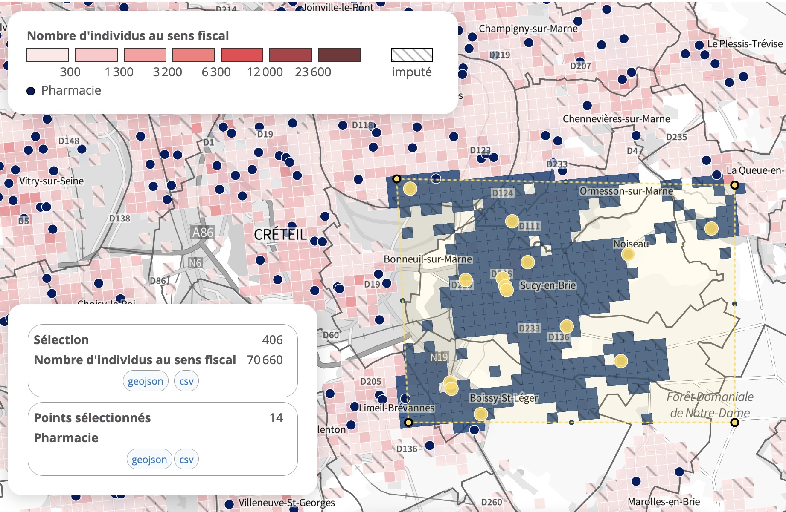

```{r}
library(sf)
library(dplyr)
library(mapview)
```


## Données

On souhaite mesurer l'accessibilité des habitants de la commune de Sucy-en-Brie à une pharmacie. On a extrait de la base de données INSEE Inracommunal des données relatives à l'offre et la demande



### Données sur l'offre

Le fichier comporte la localisation des pharmacies extraites du site de l'INSEE. On le lit à l'aide de la fonction *st_read()* du package **sf**. 

```{r}
offre <- st_read("exo2/bpe.geojson")
class(offre)
head(offre)
st_crs(offre)
```

La projection est de type EPSG=4326, c'est-à-dire latitudes et longitudes non projetées. On peut en effectuer une visualisation rapide avec le package **mapview** : 

```{r}
mapview(offre)
```


### Données sur grille

On procède de la même façon pour le fichier relatif à la population sur grille de 200 m :


```{r}
grille <- st_read("exo2/grille.geojson")
class(grille)
head(grille)
st_crs(grille)
```

La projection est de toujours type EPSG=4326, c'est-à-dire latitudes et longitudes non projetées. On peut en effectuer une visualisation rapide avec le package **mapview** : 

```{r}
mapview(grille)
```


### Données sur la demande

On va transformer le fonds de carte pour obtenir les centroïdes et afficher des cercles proportionnels à la population des carreaux. Ici on choisit de prendre comme demande le nombre total d'individus et on negarde que les carreaux de Sucy-en-Brie

```{r}
demande <- grille %>% st_centroid() %>%
                      filter(substr(lcog_geo,1,5)=="94071")%>%
                      select(id=GEO, size=ind)
```

On représente sur une même carte l'offre et la demande :


```{r}
map1 <- mapview(offre, 
                col.regions="red", 
                alpha.regions=1)
map2 <- mapview(demande, 
                cex="size", 
                col.regions="blue", 
                legend = F)
map<-map1+map2
map
```

## Calcul de l'accessibilité


### Utilisation de metric.osrm

On utilise le package metric.osrm pour calculer la distance routière en temps entre toutes les origines et toutes les destinations. Voici le programme typique de calcul :

```{r}
library(metric.osrm)

# Choix du serveur
options(osrm.server = "https://metric-osrm-backend.lab.sspcloud.fr/")

# Specification du profil
options(osrm.profile = "driving")

# préparation des données
# (Osrm attends des fichiers de type id/lat/lon)
#coo <-st_coordinates(offre)
#offre$lon<-coo[,1]
#offre$lat <- coo[,2]

coo <-st_coordinates(demande)
demande$lon<-coo[,1]
demande$lat <- coo[,2]


# Requête
tab<-metricOsrmTable(src = demande,
                       dst = offre,
                       duree = TRUE,
                       faceAFace = F,
                       distance = TRUE, 
                       allerRetour = FALSE,
                       optiMeasure = "duree",
                       nbDstVolOiseau =  3,  # Nb de dist. euclidiennes présélectionnées
                       nbDstMeasure = 1,  # Nb de dist routières retenues  
                       exclude ="ferry")

head(tab)
```

A noter que la requête peut prendre plus ou moins de temps selon la taille du calcul (nb origines x nb destinations).

### Jointure avec la grille

On effectue une jointure avec les données de grille

```{r}
grille <- merge(grille, tab, by.x="GEO",by.y="idSrc")
```


### Calcul des fréquences cumulées

On choisit une population et une distance puis on construit la courbe indiquant la part des personnes ayant accès au service en dessous d'une certaine distance.


```{r}
# Choix de la population et de la distance
pop <- grille$ind
dis <- grille$duree

# Ajout de labels
nompop <- "% des individus"
nomdis <- "distance routière en minutes"

# Création d'un tableau
tab<-data.frame(pop,dis)

# Transformation de la population en fréquence
tab$pct <- 100*tab$pop/sum(tab$pop)

# Tri du tableau par distances croissantes
tab <- tab[order(tab$dis),]

# Calcul de la fréquence cumulée ascendante
tab$pctcum <- cumsum(tab$pct)

# Affichage du tableau
head(tab)
```


### Graphique d'accessibilité


#### Avec R-base

```{r}
plot(tab$dis,tab$pctcum, 
     type="l",
     col="red",
     xlab = nomdis,
     ylab = nompop,
     main = "Courbe d'accessibilité au service",
     sub = "Source : INSEE, RP2022 et BPE")
grid()
```


#### Avec ggplot

```{r}
library(ggplot2)
g<- ggplot(tab) + aes(x=dis, y=pctcum) +
                  geom_line() +
                  scale_x_continuous(nomdis) +
                  scale_y_continuous(nompop) +
                  ggtitle(label = "Courbe d'accessibilité au service",
                          subtitle = "Source : INSEE, RP2022 et BPE")
g
```


## Cartographie

On peut l'effectuer sur les supports de son choix (Qgis, Magrit, etc, ...)
